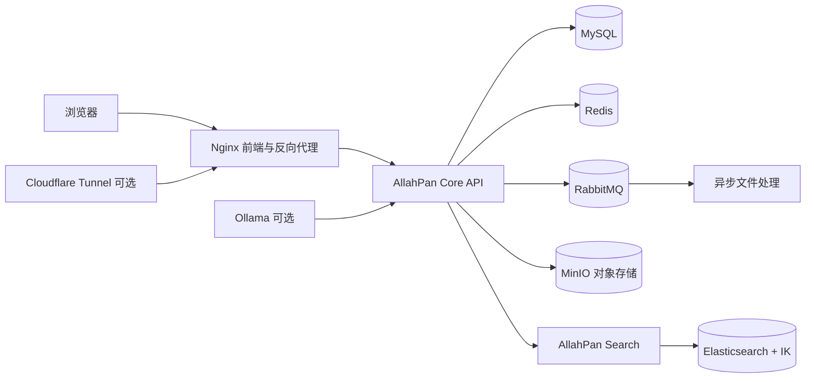

# AllahPan

一个基于 Spring Boot、Vue 3 和 Docker 的个人共享云盘系统，提供文件管理、分片上传、全文搜索、在线预览、收藏、回收站和分享链接等能力。

## 项目特点

- 文件夹和文件的统一管理，支持列表视图与网格视图
- 普通上传与分片上传，支持大文件传输、断点续传相关能力和传输进度展示
- 基于 Elasticsearch 的文件名全文搜索
- 支持图片、视频、音频、PDF、表格以及 DOC/DOCX 文档预览
- 文件收藏、回收站、删除和恢复
- 创建公开分享链接，并支持分享文件预览与下载
- 基于 JWT 的登录认证和 Spring Security 访问控制
- 使用 MinIO 保存文件对象、缩略图和回收站对象
- 使用 RabbitMQ 异步处理文件解析、缩略图和索引任务
- 使用 SSE 推送文件处理状态和目录变化
- 可选接入 Ollama，为文件处理流程提供本地 AI 能力
- Docker Compose 一键启动完整运行环境

## 技术栈

| 层级 | 技术 |
| --- | --- |
| 前端 | Vue 3、Vue Router、Pinia、Element Plus、Vite、Axios |
| 核心后端 | Java 17、Spring Boot 3.5、Spring Security、MyBatis、MySQL |
| 搜索服务 | Spring Boot、Spring Data Elasticsearch、Elasticsearch 8.11 |
| 缓存与消息 | Redis 7、RabbitMQ 3.12 |
| 对象存储 | MinIO |
| 反向代理 | Nginx |
| 外网访问 | Cloudflare Tunnel（可选） |
| 部署方式 | Docker Compose |

## 系统架构



## 目录结构

```text
.
├── allahpan-common/       # 通用返回体、异常、Redis 和日志能力
├── allahpan-mbg/          # MyBatis 实体、Mapper 和 XML
├── allahpan-security/     # JWT 与 Spring Security 集成
├── allahpan-core/         # 文件、用户、分享、收藏和异步处理核心服务
├── allahpan-search/       # Elasticsearch 搜索服务
├── allahpan-web/          # Vue 3 前端
├── docker/                # 后端、搜索、前端和 Elasticsearch 镜像构建文件
├── db/migrations/         # 数据库增量迁移脚本
├── cloudflared/           # Cloudflare Tunnel 配置模板
├── docker-compose.yml     # 完整运行环境编排
├── init.sql               # 数据库初始化脚本
└── start-all.ps1         # Windows 一键构建与启动脚本
```

## 环境要求

完整 Docker 部署需要：

- Docker Desktop 或兼容 Docker Compose 的 Docker 环境
- Maven 3.9+ 和 Java 17（Docker 镜像构建后端 JAR 时需要）
- Node.js 20+ 和 npm（前端 Docker 多阶段构建会自动使用 Node 20）

本地开发还建议安装：

- Git
- IntelliJ IDEA、VS Code 或其他 Java/Vue 开发工具
- Ollama（仅在需要本地 AI 文件处理时安装）

## 快速开始：Docker Compose

### 1. 获取代码

```bash
git clone https://github.com/AfterMaxQ/AllahPan.git
cd AllahPan
```

### 2. 准备可选的 Cloudflare Tunnel 配置

如果不使用 Cloudflare Tunnel，可以跳过此步骤。使用 Tunnel 时，将凭据模板复制为实际凭据文件，并填入自己的配置：

```bash
cp cloudflared/credentials.json.example cloudflared/credentials.json
```

`cloudflared/credentials.json` 已被 Git 忽略，请勿提交真实凭据。

### 3. 构建后端并启动服务

```bash
mvn package -DskipTests
docker compose up -d --build
```

Windows PowerShell 也可以直接使用项目脚本：

```powershell
.\start-all.ps1 -Build
```

### 4. 访问服务

启动完成后，默认访问地址如下：

| 服务 | 地址 | 说明 |
| --- | --- | --- |
| Web 前端 | <http://localhost:88> | 推荐入口 |
| 核心 API | <http://localhost:8088> | 文件和用户服务 |
| 搜索服务 | <http://localhost:8081> | Elasticsearch 搜索 API |
| MinIO 控制台 | <http://localhost:9001> | 对象存储管理 |
| RabbitMQ 控制台 | <http://localhost:15672> | 消息队列管理 |
| Swagger UI | <http://localhost:8088/swagger-ui/index.html> | API 文档 |

查看容器状态和日志：

```bash
docker compose ps
docker compose logs -f core
docker compose logs -f search
docker compose logs -f nginx
```

停止服务：

```bash
docker compose down
```

上述命令不会删除 Docker 数据卷。若要连同数据卷一起删除，请先确认数据已备份，再执行：

```bash
docker compose down -v
```

## 默认本地配置

Docker Compose 默认使用以下本地开发凭据和端口：

| 配置项 | 默认值 |
| --- | --- |
| MySQL 数据库 | `allahpan` |
| MySQL root 密码 | `123456` |
| MySQL 宿主机端口 | `3307` |
| Redis 端口 | `6379` |
| RabbitMQ AMQP 端口 | `5672` |
| RabbitMQ 管理端口 | `15672` |
| MinIO API 端口 | `9000` |
| MinIO 控制台端口 | `9001` |
| MinIO 用户名 | `minioadmin` |
| MinIO 密码 | `minioadmin` |
| 核心 API 端口 | `8088` |
| 搜索服务端口 | `8081` |
| Web 端口 | `88` |

这些默认值只适合本地开发。部署到公网前，请修改数据库、MinIO、RabbitMQ、JWT、邮件和 Tunnel 凭据，并通过环境变量或安全配置注入，不要把真实密码提交到仓库。

## 前端本地开发

```bash
cd allahpan-web
npm ci
npm run dev
```

Vite 开发服务器默认运行在 <http://localhost:5173>，`/api` 请求会代理到 `http://localhost:8088`。

构建前端生产资源：

```bash
npm run build
```

本地预览生产构建：

```bash
npm run preview
```

## 后端本地开发

项目默认使用 `dev` Spring profile。请先启动 MySQL、Redis、RabbitMQ、MinIO 和 Elasticsearch，然后在仓库根目录执行：

```bash
mvn package -DskipTests
mvn -pl allahpan-core spring-boot:run
```

另开一个终端启动搜索服务：

```bash
mvn -pl allahpan-search spring-boot:run
```

如果只需要编译而不启动服务：

```bash
mvn package -DskipTests
```

## 配置说明

核心服务配置位于 `allahpan-core/src/main/resources/`：

- `application.yml`：公共配置和默认 profile
- `application-dev.yml`：本地开发配置
- `application-docker.yml`：Docker 服务间连接配置
- `application-prod.yml`：生产环境变量化配置

搜索服务配置位于 `allahpan-search/src/main/resources/`，包含对应的 Docker 和生产配置。

生产环境建议至少配置以下环境变量：

```text
SERVER_PORT
MYSQL_HOST
MYSQL_PORT
MYSQL_USER
MYSQL_PASSWORD
REDIS_HOST
REDIS_PORT
RABBITMQ_HOST
RABBITMQ_PORT
RABBITMQ_USER
RABBITMQ_PASSWORD
JWT_SECRET
MINIO_ENDPOINT
MINIO_ACCESS_KEY
MINIO_SECRET_KEY
MINIO_BUCKET
SEARCH_SERVICE_URL
MAIL_USERNAME
MAIL_PASSWORD
OLLAMA_BASE_URL
```

文件上传临时目录、缩略图参数、日志路径和文件处理参数也可以在 `application-prod.yml` 中通过环境变量覆盖。

## 主要 API

核心 API 默认前缀为 `/api`，完整接口说明可通过 Swagger UI 查看。

| 模块 | 示例接口 | 说明 |
| --- | --- | --- |
| 认证 | `/api/auth/login-by-password` | 密码登录 |
| 文件 | `/api/file/list` | 文件列表 |
| 文件 | `/api/file/upload` | 普通文件上传 |
| 分片上传 | `/api/chunk/*` | 分片上传与合并 |
| 预览下载 | `/api/file/{id}/preview`、`/api/file/{id}/download` | 文件预览和下载 |
| 搜索 | `/api/search?keyword=...` | Elasticsearch 文件搜索 |
| 收藏 | `/api/favorite/*` | 收藏管理 |
| 分享 | `/api/share/{fileId}` | 创建和管理分享链接 |
| 公开分享 | `/api/share/{code}` | 获取公开分享内容 |

## 数据与持久化

Docker Compose 会创建以下命名卷：

- `mysql-data`：业务数据库
- `redis-data`：缓存和会话数据
- `rabbitmq-data`：消息队列数据
- `es-data`：Elasticsearch 索引数据
- `minio-data`：文件对象、缩略图和回收站对象

数据库首次启动时执行根目录的 `init.sql`。后续结构变更放在 `db/migrations/`，请在生产环境按发布流程执行迁移并做好数据库备份。

## 构建检查

提交前建议执行：

```bash
mvn package -DskipTests

cd allahpan-web
npm ci
npm run build
```

## 安全注意事项

- 不要在生产环境使用 Compose 中的默认密码。
- 必须替换 `JWT_SECRET`，并使用足够长度和随机性的值。
- `cloudflared/credentials.json`、邮件密码和其他密钥不要提交到 Git。
- 对公网开放前，请限制 MinIO、RabbitMQ、Elasticsearch 和数据库的外部访问。
- 定期备份 MySQL、MinIO 和 Elasticsearch 数据卷。
- 分享链接是公开访问入口，请根据业务需要设置合理的过期时间。

## 许可证

当前仓库未提供单独的许可证文件。若要公开发布或允许第三方使用，请根据项目实际授权策略补充 `LICENSE` 文件。
