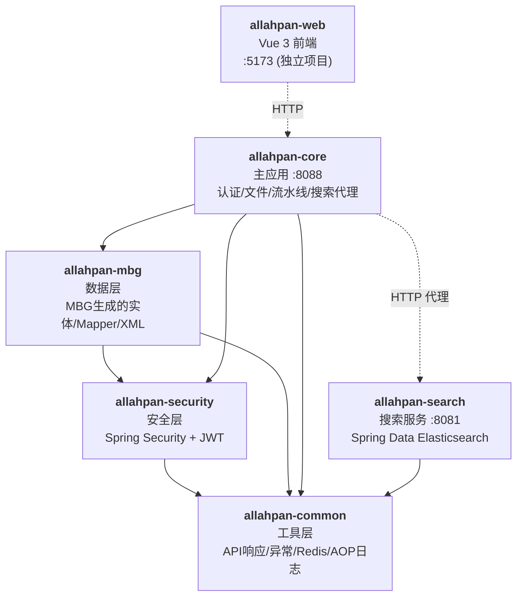
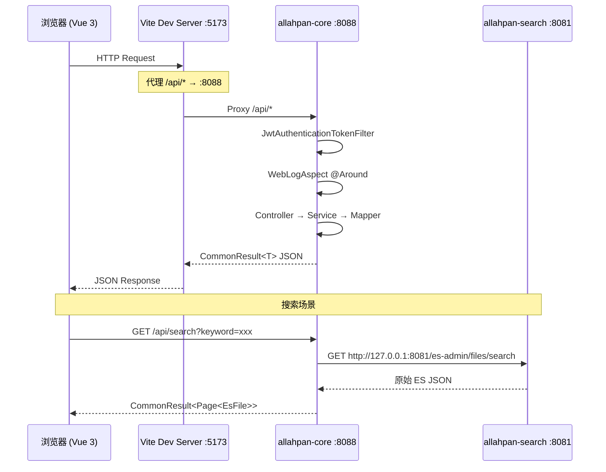
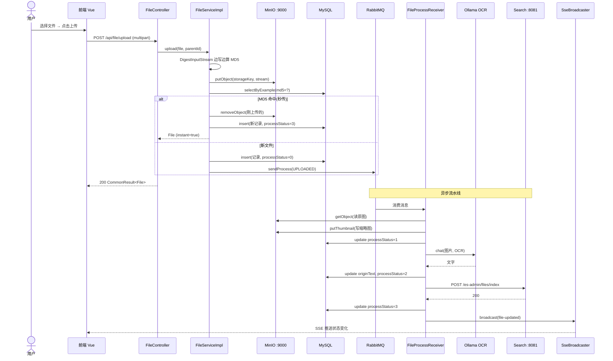
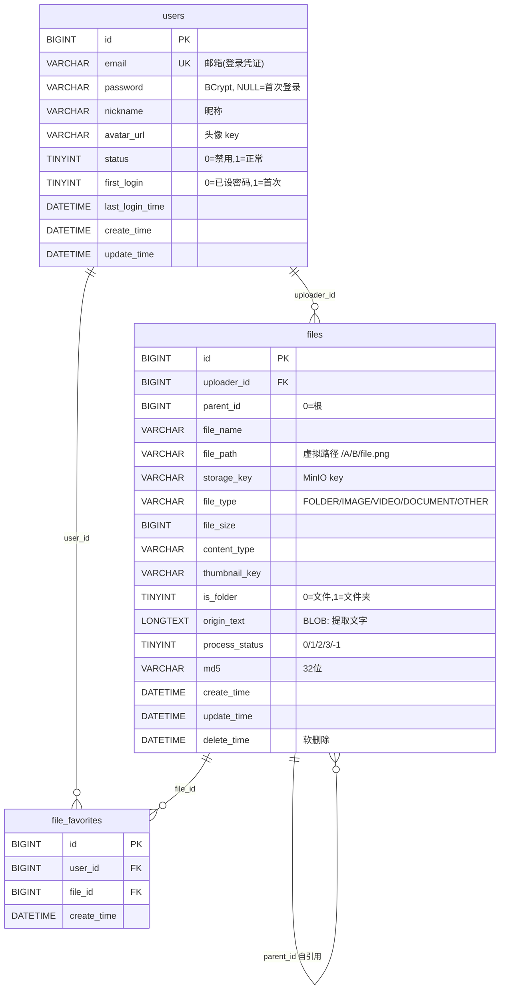

# 00 — AllahPan 项目技术文档（总览）

> 本文档为新成员快速理解项目全貌而编写，涵盖架构设计、数据流程、技术栈、接口规范、数据存储、关键难点及性能安全策略。建议结合 `docs/architecture/` 目录下各专题文档与 `docs/api/` API 文档共同阅读。

---

## 1. 项目架构设计

### 1.1 整体架构模式

AllahPan 是一个**前后端分离的多模块单体 + 单体微服务混合架构**。系统分为 5 个 Maven 模块和 1 个独立前端项目，通过清晰的依赖链组织：

| 维度 | 模式 |
|------|------|
| 前端 ↔ 后端 | 前后端分离（SPA + RESTful API） |
| 后端内部 | 多模块单体（Maven 父子模块） |
| 服务间通信 | HTTP REST + RabbitMQ 消息队列 |
| 业务拆分 | 核心服务（:8088） + 搜索服务（:8081）物理隔离 |
| 部署形态 | Docker Compose 编排基础设施 + 本地 Maven 启动应用 |

### 1.2 系统分层结构

整体采用经典的 **"网关 → 控制器 → 服务 → 持久化"** 分层架构，并在此基础上引入 **AOP 横切（缓存、日志）** 与 **异步流水线（消息队列）**：

```
┌──────────────────────────────────────────────────────────────┐
│  浏览器 (Vue 3 SPA @ 5173)                                   │
│  └─ Axios → Vite Proxy → 8088                                │
└──────────────────────┬───────────────────────────────────────┘
                       │ HTTPS/HTTP + JWT
┌──────────────────────▼───────────────────────────────────────┐
│  Spring Security 过滤器链                                     │
│  ├─ JwtAuthenticationTokenFilter  (提取 JWT, 注入上下文)      │
│  └─ WebLogAspect (AOP @Around 控制器)                         │
└──────────────────────┬───────────────────────────────────────┘
                       │
┌──────────────────────▼───────────────────────────────────────┐
│  Controller 层 (REST API)                                     │
│  Auth / User / File / Search / Favorite / Share / Chunk       │
└──────────────────────┬───────────────────────────────────────┘
                       │
┌──────────────────────▼───────────────────────────────────────┐
│  Service 层 (业务逻辑)                                        │
│  └─ 注入 RedisCacheAspect 拦截 *CacheService.* 缓存调用       │
└────────┬─────────────────────────────────────┬────────────────┘
         │                                     │
┌────────▼────────────┐              ┌─────────▼──────────────┐
│  MyBatis Mapper     │              │  异步流水线             │
│  (User/File/...)    │              │  FileProcessSender      │
└────────┬────────────┘              │   → RabbitMQ            │
         │                            │  FileProcessReceiver    │
┌────────▼────────────┐              │   → Thumbnail/Text/ES   │
│  MySQL 8.0 (3307)   │              └─────────┬───────────────┘
│  Redis 7.0 (6379)   │                        │
│  MinIO (9000)       │              ┌─────────▼───────────────┐
│  ES 8.11 (9200)     │              │  Ollama (可选, qwen3.5)  │
└─────────────────────┘              │  Search 服务 (8081) → ES│
                                     └─────────────────────────┘
```

**生产环境流量路径**（开发环境走 Vite Proxy :5173 → :8088）：

```
┌────────────────────────────────────────────────────────────────┐
│  公网 HTTPS                                                    │
│  https://allahpan.cn  /  https://api.allahpan.cn               │
└──────────────────────┬─────────────────────────────────────────┘
                       │ HTTPS (Cloudflare 边缘节点，SSL 终止)
┌──────────────────────▼─────────────────────────────────────────┐
│  cloudflared (Windows 服务)                                     │
│  ├─ allahpan.cn     → http://localhost:88                      │
│  └─ api.allahpan.cn → http://localhost:8088                    │
│  (出站 WebSocket 隧道，无需开放入站端口)                          │
└───────┬──────────────────────────────────┬──────────────────────┘
        │ :88                              │ :8088 (直连，向后兼容)
┌───────▼──────────────────────┐  ┌────────▼──────────────────────┐
│  Nginx 1.26.3 :88            │  │                              │
│  ├─ /            → SPA 静态  │  │  allahpan-core :8088          │
│  ├─ /api/*       → :8088     │  │  (Spring Boot)               │
│  └─ /assets/*    → 30d 缓存  │  │                              │
│  (gzip, 2G upload, SSE)      │  │                              │
└──────────────────────────────┘  └──────────────────────────────┘
```

### 1.3 核心模块划分

后端 Maven 严格分层，依赖链 `common ← security ← mbg ← core(:8088)`，搜索服务 `:8081` 仅依赖 `common`：



### 1.4 模块职责矩阵

| 模块 | 端口 | 职责 | 关键类 |
|------|------|------|--------|
| **allahpan-common** | — | 统一响应包装、全局异常处理、Redis 服务、AOP 日志、ResultCode 枚举 | `CommonResult<T>`, `ApiException`, `GlobalExceptionHandler`, `RedisService`, `WebLogAspect` |
| **allahpan-security** | — | JWT 生成/校验、Spring Security 配置、Redis 缓存切面 | `JwtTokenUtil`, `JwtAuthenticationTokenFilter`, `SecurityConfig`, `RedisCacheAspect` |
| **allahpan-mbg** | — | MyBatis Generator 自动生成的实体/Mapper/XML | `User`, `File`, `FileFavorite` + Example + Mapper + XML |
| **allahpan-core** | 8088 | 业务主入口：认证、文件 CRUD、流水线、搜索代理、收藏、分享 | `AuthController`, `FileController`, `FileProcessSender/Receiver`, `MinioUtil`, `OllamaService`, `SseBroadcaster` |
| **allahpan-search** | 8081 | 独立 ES 索引与搜索服务（仅监听 127.0.0.1） | `EsFileController`, `EsAdminController`, `EsFileServiceImpl`, `EsFileRepository` |
| **allahpan-web** | 5173 | Vue 3 SPA（Vite 构建），Element Plus UI | `views/FileBrowser.vue`, `composables/useChunkUpload.js`, `stores/file.js` |

### 1.5 关键组件职责说明（allahpan-core）

| 组件 | 职责 |
|------|------|
| `FileProcessSender` | RabbitMQ 生产者，将上传/缩略图/文本提取消息序列化后投递到 `allahpan.file.process` 交换机 |
| `FileProcessReceiver` | `@RabbitListener` 消费者，按 Stage 状态机执行缩略图 → 文本提取 → ES 索引三阶段处理，含 30s/60s/120s TTL+DLX 重试机制 |
| `ThumbnailGenerator` | IMAGE 缩放到 300px、JPEG 编码；PDF 走 PDFBox 渲染首帧（150 DPI） |
| `TextExtractor` | 文档分发器：IMAGE → Ollama OCR，PDF/DOCX/XLSX/PPTX → PDFBox + POI，TXT → UTF-8 |
| `OllamaService` | `@Service` — 调用本地 Ollama `/api/chat` 接口，qwen3.5:2b 模型，`think=false`，`num_predict=16384`，timeout=120s |
| `MinioUtil` | MinIO 对象存储 I/O，封装 3 个 bucket：`allahpan-files`、`allahpan-thumbnails`、`allahpan-trash` |
| `SseBroadcaster` | 管理 SSE 长连接，广播 `file-created`、`file-updated`、`file-deleted` 事件 |
| `EsIndexService` | 通过 RestTemplate HTTP 调用 `:8081/es-admin/files/index` 写入 ES 索引 |
| `TrashCleanupTask` | `@Scheduled(cron="0 0 3 * * ?")` 每天凌晨 3 点清理过期垃圾站文件 |
| `BloomFilterInitializer` | `ApplicationRunner` — 启动时将所有用户邮箱加载到 Redis bitmap 布隆过滤器，加速用户查询 |
| `BloomFilterService` | Redis bitmap 布隆过滤器（10000 预期 / 1% FPP / 7 哈希），用于邮件存在性预检 |
| `ChunkUploadService` | 大文件分片上传：init→upload→complete，Redis 会话管理，断点续传 |
| `MinioOrphanCleanupTask` | `@Scheduled(cron="0 0 4 * * ?")` — 每天 4AM 双向扫描 MinIO↔DB 孤儿对象 |

### 1.6 基础设施组件（生产环境）

| 组件 | 位置/版本 | 职责 |
|------|----------|------|
| **Nginx** | `C:\nginx-1.26.3\` (v1.26.3) | 反向代理 (:88)：前端静态文件 + `/api/` 反代到 `:8088`；gzip 压缩、静态资源缓存、SPA 路由回退、SSE 支持 |
| **cloudflared** | Windows 服务 (Cloudflare Tunnel) | 出站 WebSocket 隧道：`allahpan.cn` → `localhost:88`，`api.allahpan.cn` → `localhost:8088`；无需开放入站端口，Cloudflare 边缘节点处理 SSL 终止、证书续签、DDoS 防护 |

---

## 2. 数据流程分析

### 2.1 前端 ↔ 后端交互流程



**关键约定**：
- 前端通过 `Authorization: Bearer <jwt>` 头传递 token，Vite 配置 `server.proxy` 将 `/api` 代理到 `:8088`。
- 除登录外所有请求必须携带 JWT；`/api/auth/send-code`、`/api/auth/login-by-code`、`/api/file/watch`（SSE，token 走 query 串）、`/api/share/access/**` 为公开路径。
- 后端统一返回 `CommonResult<T>` 包装 `{code, message, data}`。

### 2.2 核心业务流程：文件上传 + 异步处理



### 2.3 认证流程

验证码登录三层防护（详见 [docs/architecture/02-authentication-flow.md](02-authentication-flow.md)）：

```
发送验证码 → Redis 三层限流（30s 间隔 / 小时 50 次上限）
           → 6 位随机码写入 Redis (TTL 5min)
           → QQ 邮箱 SMTP 发送

登录 → 校验验证码 → 查/建用户 → 写 User 缓存 (TTL 24h)
     → JwtTokenUtil.generateToken(userId, email, hasPassword)
     → HS512 签名, 7 天有效期

后续请求 → JwtAuthenticationTokenFilter 解析 → 注入 SecurityContext
         → 缓存/DB 加载 UserDetails → 验证 token → 放行
```

### 2.4 数据存储与读取流程

| 数据类型 | 存储位置 | 读取方式 |
|---------|---------|---------|
| 用户基本信息 | MySQL `users` 表 | 通过 `UserMapper`；优先读 Redis 缓存（24h TTL） |
| 文件元数据 | MySQL `files` 表（含 BLOB `origin_text`） | `FileMapper.selectByExampleWithBLOBs` |
| 原文件 | MinIO `allahpan-files` bucket | `MinioUtil.getObject(storageKey)` |
| 缩略图 | MinIO `allahpan-thumbnails` bucket | `MinioUtil.getThumbnail(thumbnailKey)` |
| 垃圾站文件 | MinIO `allahpan-trash` bucket | `copyToTrash()` / `restoreFromTrash()` |
| 全文索引 | Elasticsearch 索引 `allahpan_files` | `EsFileRepository`（Spring Data ES） |
| 验证码 | Redis `allahpan:authCode:{email}` | TTL 5 分钟自动过期 |
| 用户对象 | Redis `allahpan:member:{email}` | TTL 24 小时，缓存击穿由 `RedisCacheAspect` 兜底 |
| 消息队列 | RabbitMQ 队列 `allahpan.file.process` | 主队列 + TTL 重试队列 + DLX 回环 |
| 分享链接 | Redis `allahpan:share:{code}` | 8 位 hex 码，TTL 最大 168h，纯 Redis 无 MySQL 表 |
| 分片会话 | Redis `chunk:upload:{uploadId}` (Hash + Set) | 大文件分片上传状态，TTL 24h |
| 布隆过滤器 | Redis bitmap `allahpan:bloom:user:email` | ~12KB，预检用户邮箱是否存在 |

### 2.5 关键节点说明

| 节点 | 关键处理 |
|------|---------|
| 上传入口 | `POST /api/file/upload`（multipart），MD5 秒传，秒传时 processStatus 直接置 3 |
| 流水线入口 | `FileProcessSender.sendProcess(stage)` 投递到 `allahpan.file.process` direct exchange |
| 缩略图阶段 | IMAGE 走 `ThumbnailGenerator` 缩放至 300px JPEG，PDF 走 PDFBox 渲染首帧 |
| OCR 阶段 | IMAGE 走 `OllamaService.ocr()`；文档走 `TextExtractor`（PDFBox + Apache POI） |
| ES 索引阶段 | `EsIndexService.index()` 通过 RestTemplate 调用 `:8081` HTTP 接口 |
| 状态推送 | 每阶段完成后 `SseBroadcaster.broadcast("file-updated", payload)` |
| 错误降级 | 基础设施错误（Ollama/ES/MinIO 不可达）重试耗尽后降级，文件保持当前 processStatus；仅致命错误标 `-1` |
| 垃圾站清理 | `TrashCleanupTask` 每天 3:00 删除 60 天前软删除记录 |
| 孤儿清理 | `MinioOrphanCleanupTask` 每天 4:00 双向扫描 3 个 bucket，清理无 DB 引用的 MinIO 对象 |
| 分片上传 | `ChunkController` init→upload→complete，Redis 会话 + 断点续传，每小时清理过期临时文件 |

---

## 3. 技术栈详解

### 3.1 后端技术栈

| 类别 | 技术 | 版本 | 用途 |
|------|------|------|------|
| 语言 | Java | 17 | 编译目标 |
| 框架 | Spring Boot | 3.5.14 | 应用框架 |
| 持久化 | MyBatis | 3.5.19 | ORM |
| 持久化 | MyBatis Spring Boot Starter | 3.0.4 | 集成 |
| 代码生成 | MyBatis Generator | (Spring Boot starter 内置) | 自动生成 Entity/Mapper/XML |
| 数据库 | MySQL | 8.0 | 主数据存储（端口 3307） |
| 连接池 | Alibaba Druid | 1.2.24 | 数据库连接池 |
| 分页 | PageHelper Spring Boot Starter | 2.1.1 | MyBatis 分页 |
| 缓存 | Redis | 7.0-alpine | 分布式缓存（端口 6379） |
| 消息队列 | RabbitMQ | 3.12-management-alpine | 异步流水线（端口 5672） |
| 搜索引擎 | Elasticsearch | 8.11.0 + IK Analysis | 全文搜索（端口 9200） |
| 对象存储 | MinIO | (latest) | 文件/缩略图/垃圾站（端口 9000） |
| 安全 | Spring Security | (随 Boot) | 鉴权/授权 |
| 认证 | JWT (Hutool) | 5.8.40 | 无状态 Token，HS512，7 天 |
| 邮件 | Spring Mail | (随 Boot) | QQ 邮箱 SMTP 验证码 |
| 文档处理 | Apache PDFBox | 3.0.7 | PDF 文本提取/缩略图 |
| 文档处理 | Apache POI | 5.5.1 | Office 文档 (DOCX/XLSX/PPTX) |
| 文档处理 | Apache POI Scratchpad | 5.5.1 | 旧版 Office (DOC/XLS/PPT) |
| AI/OCR | Ollama | (latest) | 图片 OCR（qwen3.5:2b 模型） |
| API 文档 | springdoc-openapi | 2.8.17 | Swagger UI |
| 工具库 | Hutool | 5.8.40 | JWT、工具集 |
| JSON | Jackson | (随 Boot) | JSON 序列化 |
| 构建 | Maven | 3.6+ | 项目构建 |
| 测试 | JUnit 5 + Mockito | (随 Spring Boot Test) | 单元测试 |

### 3.2 前端技术栈

| 类别 | 技术 | 版本 | 用途 |
|------|------|------|------|
| 框架 | Vue | 3.5.34 | SPA 框架 |
| 路由 | Vue Router | 4.6.4 | 客户端路由 |
| 状态管理 | Pinia | 3.0.4 | 全局状态（替代 Vuex） |
| UI 组件库 | Element Plus | 2.14.1 | 设计系统 |
| 图标 | @element-plus/icons-vue | 2.3.2 | 图标库 |
| HTTP | Axios | 1.17.0 | API 请求 |
| 哈希 | spark-md5 | 3.0.2 | 分片 MD5 计算 |
| 构建工具 | Vite | 8.0.12 | 开发服务器/打包 |
| Vue 插件 | @vitejs/plugin-vue | 6.0.7 | Vue SFC 支持 |
| CSS 预处理器 | Sass (sass-embedded) | 1.100.0 | 样式预处理 |

### 3.3 开发与部署工具

| 类别 | 工具 | 用途 |
|------|------|------|
| 版本控制 | Git | 源码管理 |
| 容器化 | Docker + Docker Compose | 基础设施编排（MySQL/Redis/RabbitMQ/ES/MinIO） |
| 构建 | Maven | 后端多模块构建 |
| 构建 | Vite | 前端构建 |
| 脚本 | PowerShell (`start-prod.ps1`) | Windows 一键启动 |
| IDE | IntelliJ IDEA / Trae IDE | 开发环境 |
| 操作系统 | Windows (开发) | 跨平台兼容 |
| AI 模型 | Ollama + qwen3.5:2b | 可选 OCR 引擎 |
| 文档 | Mermaid | 架构图渲染 |
| 反向代理 | Nginx 1.26.3 | 静态文件 + API 反代 (:88)，SSL 由 Cloudflare 处理 |
| 公网隧道 | Cloudflare Tunnel (cloudflared) | HTTPS 公网访问，零端口暴露，自动 SSL/TLS |

### 3.4 关键依赖说明

**`pom.xml` 顶层版本管理**：
```xml
<spring.boot.version>3.5.14</spring.boot.version>
<java.version>17</java.version>
<mybatis.version>3.5.19</mybatis.version>
<mysql-connector.version>9.3.0</mysql-connector.version>
<druid.version>1.2.24</druid.version>
<pagehelper.version>2.1.1</pagehelper.version>
<hutool.version>5.8.40</hutool.version>
<springdoc.version>2.8.17</springdoc.version>
<pdfbox.version>3.0.7</pdfbox.version>
<poi.version>5.5.1</poi.version>
```

---

## 4. 系统接口说明

### 4.1 服务清单

| 服务 | 端口 | 绑定 | 上下文 |
|------|------|------|--------|
| allahpan-core | 8088 | 0.0.0.0 | `/api/**` |
| allahpan-search | 8081 | 127.0.0.1（仅本机） | `/es-admin/**` |
| allahpan-web (dev) | 5173 | 0.0.0.0 | Vite Dev Server |
| nginx (prod) | 88 | 0.0.0.0 | 静态文件 + API 反代 |
| MySQL | 3307 | 0.0.0.0 | 数据库 `allahpan` |
| Redis | 6379 | 0.0.0.0 | DB 0 |
| RabbitMQ | 5672/15672 | 0.0.0.0 | guest/guest |
| Elasticsearch | 9200 | 0.0.0.0 | IK 分词器 |
| MinIO | 9000/9001 | 0.0.0.0 | minioadmin/minioadmin |

### 4.2 内部服务接口（模块间通信）

| 调用方 | 被调用方 | 方式 | 路径/队列 | 说明 |
|--------|---------|------|-----------|------|
| core → search | HTTP GET | `http://127.0.0.1:8081/es-admin/files/search` | 搜索代理 |
| core → search | HTTP POST | `http://127.0.0.1:8081/es-admin/files/index` | 单文件索引 |
| core → search | HTTP DELETE | `http://127.0.0.1:8081/es-admin/files/{id}` | 删除索引 |
| core → search | HTTP POST | `http://127.0.0.1:8081/es-admin/rebuild` | 全量重建 |
| core → MinIO | MinIO SDK | `MinioClient` 直接调用 | 3 个 bucket |
| core → RabbitMQ | AMQP | Exchange `allahpan.file.process` | 消息序列化 `Jackson2JsonMessageConverter` |
| core → Ollama | HTTP | `http://localhost:11434/api/chat` | `think=false`, `num_predict=4096` |

### 4.3 外部 API 接口

**完整 API 列表见 [docs/api/](.) 共 39 个端点（core 34 + search 5）**。下面给出端点分类总览：

| 分类 | 路径前缀 | 端点数 | 文档 |
|------|---------|--------|------|
| 认证 | `/api/auth` | 3 | [01-auth.md](api/01-auth.md) |
| 用户 | `/api/user` | 2 | [02-user.md](api/02-user.md) |
| 文件 | `/api/file` | 16 | [03-file.md](api/03-file.md) |
| 分片上传 | `/api/file/chunk` | 4 | [03-file.md](api/03-file.md) |
| 收藏 | `/api/favorite` | 4 | [04-favorite.md](api/04-favorite.md) |
| 搜索代理 | `/api/search` | 2 | [05-search-core.md](api/05-search-core.md) |
| 搜索服务 | `/es-admin` | 5 | [06-search-service.md](api/06-search-service.md) |
| 分享 | `/api/share` | 3 | [07-share.md](api/07-share.md) |

### 4.4 认证方式

所有受保护接口需要 **JWT Bearer Token**：

```
Authorization: Bearer <token>
```

JWT 由 `JwtTokenUtil.generateToken(userId, email, hasPassword)` 生成，HS512 对称签名，有效期 **7 天**。Claims 中包含 `sub`（email）、`userId`、`hasPassword` 等。

**特殊接口**：
- `GET /api/file/watch`（SSE）：token 通过 query 参数 `?token=xxx` 传递（因 `EventSource` 不支持自定义头）。
- `GET /api/share/access/{token}`：分享公开访问，无 JWT 要求。

### 4.5 统一响应格式

core 模块所有 API 返回 `CommonResult<T>`：

```json
{
  "code": 200,
  "message": "操作成功",
  "data": { ... }
}
```

search 模块（`:8081`）返回原始 `Map<String, Object>`，不包装。

### 4.6 错误码

| code | 常量 | 说明 |
|------|------|------|
| 200 | `SUCCESS` | 操作成功 |
| 400 | `VALIDATE_FAILED` | 参数校验失败 |
| 400 | `CODE_ERROR` | 验证码错误 |
| 400 | `CODE_EXPIRED` | 验证码过期 |
| 401 | `UNAUTHORIZED` | 未登录或 token 过期 |
| 403 | `FORBIDDEN` | 无权限 |
| 429 | `TOO_MANY_REQUESTS` | 频率过快 |
| 429 | `CODE_SEND_LIMIT` | 验证码发送间隔不足 |
| 500 | `FAILED` | 操作失败 |

---

## 5. 数据存储设计

### 5.1 数据库选型依据

| 存储 | 选型 | 理由 |
|------|------|------|
| 关系数据 | MySQL 8.0 | 强一致事务、成熟稳定、SQL 友好；适合用户/文件元数据/收藏 |
| 缓存 | Redis 7.0 | 内存 KV 高性能、TTL 原生、限流计数器、Session 替代 |
| 对象存储 | MinIO | S3 兼容、用户自托管、私有化、节省成本；适合大文件/二进制 |
| 全文搜索 | Elasticsearch 8.11 + IK | 中文分词、高亮、模糊匹配、近实时索引 |

### 5.2 数据模型 ER 图



### 5.3 表结构详细

#### 5.3.1 `users` 用户表
- 主键 `id` 自增
- 唯一索引 `email`（登录凭证）
- `password` BCrypt 密文，**首次登录前为 NULL**（邮箱验证码登录后引导设密）
- `first_login` 标记是否需要引导设置密码
- `status` 0 禁用 1 正常

#### 5.3.2 `files` 文件表（核心）
- 关键索引：
  - `PRIMARY KEY (id)`
  - `KEY (parent_id, delete_time)` — 目录列表查询
  - `KEY (md5, delete_time)` — **秒传检测**
  - `KEY (delete_time)` — 垃圾站查询
  - `UNIQUE KEY (parent_id, file_name, delete_time)` — 同目录唯一文件名（MySQL UNIQUE 视 NULL 不同，已删除文件可重名）
- `process_status` 枚举：`0` 待处理 / `1` 缩略图完成 / `2` 文本提取完成 / `3` 全部完成 / `-1` 失败
- `origin_text` **LONGTEXT 类型**，MBG 视为 BLOB，必须使用 `selectByExampleWithBLOBs()` 读写
- `storage_key` 格式：`{userId}/{yyyy/MM}/{UUID}{ext}`（用户隔离 + 时间分片）
- 软删除：`delete_time IS NULL` 为正常记录

#### 5.3.3 `file_favorites` 收藏表
- `UNIQUE KEY (user_id, file_id)` 防止重复收藏

### 5.4 索引策略总结

| 查询场景 | 索引 | 优化效果 |
|---------|------|---------|
| 同目录文件列表 | `(parent_id, delete_time)` | 覆盖目录树查询 |
| 秒传检测 | `(md5, delete_time)` | MD5 哈希秒级定位 |
| 垃圾站列表 | `(delete_time)` | 软删除时间索引扫描 |
| 同目录重名校验 | `UNIQUE (parent_id, file_name, delete_time)` | 唯一约束 DB 兜底 |
| 用户登录 | `UNIQUE (email)` | O(log n) 定位 |
| 收藏去重 | `UNIQUE (user_id, file_id)` | 应用层无重复 |

### 5.5 数据备份方案

**当前实现**：
- MySQL：`mysql-data` Docker Volume 持久化（推荐生产环境挂载 NAS/S3 备份）
- Redis：纯缓存，可重建，`redis-data` Volume
- MinIO：`minio-data` Volume；生产建议配置 `mc mirror` 异步复制到异地
- Elasticsearch：`es-data` Volume；可通过 `elasticsearch-exporter` 定期快照
- RabbitMQ：队列可重建，`rabbitmq-data` Volume

**生产建议**：
1. MySQL 启用 binlog 增量备份 + 每日全量 `mysqldump`
2. MinIO 启用 bucket 复制（site-to-site）
3. ES 配置 `path.repo` 定期快照到 MinIO
4. Redis 启用 RDB + AOF 双持久化

---

## 6. 关键技术难点与解决方案

### 6.1 文件秒传（MD5 去重）

**难点**：大文件上传时计算 MD5 占用大量内存。

**解决方案**：
- 使用 `DigestInputStream` 包装输入流，**边上传边算 MD5**，避免将整个文件加载到堆内存。
- 上传完成后用 MD5 查询 `files` 表（`md5 + delete_time IS NULL` 复合索引），命中则**清理刚上传的 MinIO 对象**，复用 `storageKey` 创建新元数据（`processStatus=3`，跳过流水线）。

### 6.2 RabbitMQ 异步流水线重试

**难点**：缩略图、OCR、ES 索引任一环节可能因基础设施抖动失败，需要可靠重试而不阻塞用户。

**解决方案**：**TTL + DLX 回环模式**
```
主队列 ──失败──→ 重试交换机 ──→ TTL 队列（30s/60s/120s） ──DLX 转发──→ 主交换机
```
- `FileProcessSender.sendRetry(message, delayMs)` 发送时设置 `expiration` 头为动态 TTL。
- 最多重试 3 次（30s/60s/120s），第 4 次失败触发**错误分级**：
  - 基础设施错误（`ConnectException` / `SocketTimeoutException` / `IOException` / `MinioException`）：**降级**，文件保持当前 processStatus 不标记失败。
  - 致命错误（`DataAccessException`）：标记 `processStatus=-1`。

### 6.3 Ollama OCR 调用稳定性

**难点**：
- Ollama 默认 `think` 模式会输出推理过程，污染 OCR 结果。
- Jackson 序列化 `Map<String,Object>` 时**会丢失嵌套 `options` 字段**，导致模型参数失效。

**解决方案**：
- 调用时显式设置 `think=false`，`num_predict=4096`，`num_ctx=8192`。
- 用 `String.format` 手动构建 JSON 请求体（包含 `options` 嵌套），不依赖 Jackson 序列化嵌套对象。
- 60s HTTP timeout 避免长时间阻塞消费者线程。

### 6.4 大文件分片上传

**难点**：超过单次 HTTP 请求体限制的文件无法直接上传。

**解决方案**（详见 `ChunkController` + `composables/useChunkUpload.js`）：
- 前端使用 `spark-md5` 计算分片 MD5，断点续传
- 后端 `ChunkUploadService` 接收分片、合并、触发 MD5 秒传检测
- 详细方案见代码注释与 `docs/architecture/03-file-upload-flow.md`

### 6.5 ES 与 MySQL 数据一致性

**难点**：文件删除/重命名后，ES 中残留旧文档，搜索返回已删除文件。

**解决方案**：
- `EsIndexService.delete(fileId)` 在软删除时同步调用 `:8081/es-admin/files/{id}` 移除 ES 文档。
- `processStatus=3` 之前不写入 ES，避免半成品被搜索到。
- 提供 `POST /api/search/rebuild-index` 端点全量重建（`EsAdminController`）。

### 6.6 SSE 跨层依赖与连接管理

**难点**：流水线消费者（`FileProcessReceiver`）需要向前端推送状态变更，但 Spring AMQP 监听器与 REST 控制器不在同一上下文。

**解决方案**：
- 提取 `SseBroadcaster` 组件为单例 Bean（`CopyOnWriteArrayList<SseEmitter>`），用 `SseEmitter` 无限超时。
- 流水线每完成一阶段调用 `SseBroadcaster.broadcast("file-updated", payload)`。
- 自动清理断开/超时连接（`onCompletion` / `onTimeout` / `onError` 回调）。
- SSE 端点 `/api/file/watch` 接受 query 串 token（`EventSource` 限制）。

### 6.7 验证码登录安全防护

**难点**：邮箱验证码登录需防止恶意刷接口、暴力破解。

**解决方案**：Redis **三层限流**：
1. **发送间隔**：`allahpan:sendLimit:{email}` TTL 30s，30s 内重复发送拒绝。
2. **单次有效期**：`allahpan:authCode:{email}` TTL 5min，过期失效。
3. **小时上限**：`allahpan:attempts:{email}` `INCR` 计数，> 50 次/小时拒绝。

### 6.8 Spring Security 无状态集成

**难点**：传统 Spring Security 基于 Session，云盘系统需支持多端（Web/移动端）无状态认证。

**解决方案**：
- `SecurityConfig` 配置 `SessionCreationPolicy.STATELESS`。
- 自定义 `JwtAuthenticationTokenFilter`（`OncePerRequestFilter`）从 Header 提取 JWT，注入 `SecurityContext`。
- 白名单（`/api/auth/**`、`/api/share/access/**`、`/api/file/watch`）直接放行。
- 自定义 `RestAuthenticationEntryPoint` / `RestfulAccessDeniedHandler` 返回 JSON 错误。

### 6.9 文件夹递归软删除

**难点**：文件夹删除需级联处理所有子文件和子文件夹。

**解决方案**：`FileServiceImpl` 递归遍历子节点，统一设置 `delete_time`，原文件 `copyToTrash` 到 MinIO 垃圾站 bucket。`TrashCleanupTask` 定时清理 30 天前记录。

---

## 7. 性能与安全策略

### 7.1 性能优化措施

| 层级 | 优化措施 | 效果 |
|------|---------|------|
| **前端** | Vite 8 构建 + ESM 原生按需加载 | 首屏 < 1s |
| **前端** | `spark-md5` Web Worker 分片 MD5 | 不阻塞主线程 |
| **前端** | SSE 实时推送 + 本地状态合并 | 避免轮询 |
| **后端** | MD5 秒传 | 重复文件上传 < 100ms |
| **后端** | 流式 MD5（`DigestInputStream`） | O(1) 内存占用 |
| **后端** | Redis 用户缓存（24h TTL） | 登录态查询从 ~5ms 降至 < 1ms |
| **后端** | `RedisCacheAspect` best-effort | 缓存挂掉不影响业务 |
| **后端** | PageHelper 自动分页 | 避免大表全量扫描 |
| **后端** | MyBatis 二级缓存（按需启用） | Mapper 层缓存 |
| **存储** | MinIO 分片上传/下载 | 大文件吞吐提升 |
| **存储** | ES IK 中文分词 | 中文检索毫秒级 |
| **异步** | RabbitMQ 流水线解耦 | 上传响应 < 500ms，处理在后台 |
| **异步** | TTL+DLX 智能重试 | 避免雪崩 |
| **GC** | JVM `-Xms512m -Xmx512m`（ES）/ 合理堆 | 减少 STW |
| **网络** | Vite Proxy 转发 + keep-alive | 减少握手延迟 |

### 7.2 缓存策略

```
┌────────────────────────────────────────────────────────┐
│  L1: 浏览器内存 (Pinia)                                 │
│       stores/user.js, stores/file.js                    │
│       失效: 页面刷新 / 主动 reset                        │
└──────────────────┬─────────────────────────────────────┘
                   │ HTTP
┌──────────────────▼─────────────────────────────────────┐
│  L2: Redis (TTL)                                        │
│       allahpan:member:{email} (24h)  — 用户对象         │
│       allahpan:authCode:{email} (5min) — 验证码          │
│       allahpan:sendLimit:{email} (30s) — 发送间隔        │
│       allahpan:attempts:{email} (1h)   — 频率计数         │
│  AOP: *CacheService.* 默认吞异常 + @CacheException 透传  │
└──────────────────┬─────────────────────────────────────┘
                   │ 查询未命中
┌──────────────────▼─────────────────────────────────────┐
│  L3: MySQL (持久化)                                      │
│       users / files / file_favorites                    │
└────────────────────────────────────────────────────────┘
```

**缓存策略要点**：
- **读穿透**：先查 Redis，未命中查 MySQL 并回填 Redis。
- **TTL 策略**：用户 24h、验证码 5min、限流 30s/1h。
- **Best-effort**：`RedisCacheAspect` 默认吞异常，缓存挂掉不阻断业务。
- **强一致场景绕过**：`AuthCodeServiceImpl` 不走缓存切面（验证码是核心业务，Redis 挂了必须报错）。

### 7.3 负载均衡方案

**当前实现**：
- 单实例 `allahpan-core` :8088 + 单实例 `allahpan-search` :8081（开发与单机部署）
- 前端 Vite Dev Server :5173
- 基础设施（MySQL/Redis/RabbitMQ/ES/MinIO）由 Docker Compose 编排

**生产扩展建议**：
```
                ┌─→ core instance 1 :8088 ─┐
Nginx (L7 LB) ──┼─→ core instance 2 :8088 ─┤
                └─→ core instance 3 :8088 ─┘
                          │
                          ▼
              Redis 集群（主从 + Sentinel）
              RabbitMQ 集群（镜像队列）
              MinIO 集群（纠删码 EC:4）
              ES 集群（3 master + N data）
              MySQL 主从（一主多从 + MHA）
```

### 7.4 安全防护机制

| 维度 | 措施 |
|------|------|
| **认证** | JWT HS512 签名，7 天过期，支持 `JWT_SECRET` 环境变量配置 |
| **授权** | Spring Security 无状态过滤器链，BCrypt 密码哈希 |
| **传输** | 生产建议 HTTPS（开发环境 HTTP） |
| **限流** | 验证码三层 Redis 限流（30s/5min/1h-50次） |
| **CORS** | Vite 代理规避跨域；生产建议 Nginx 同源部署 |
| **CSRF** | 无状态 JWT 默认禁用 CSRF（API 无 Cookie） |
| **SQL 注入** | MyBatis `#{}` 参数化（不拼接 `${}`） |
| **XSS** | 前端 Vue 自动转义；后端不渲染 HTML |
| **文件上传** | Content-Type 校验、`fileSize` 限制（待配置最大） |
| **路径遍历** | `filePath` 仅作展示；`storageKey` 由后端生成 UUID |
| **共享** | 分享 token UUID 不可枚举，可设置过期时间 |
| **SSE 安全** | SSE token 通过 query 串单次使用或短期 |
| **密码存储** | BCrypt（`BCryptPasswordEncoder`） |
| **敏感配置** | `JWT_SECRET` / `MAIL_PASSWORD` 通过环境变量注入 |
| **审计日志** | `WebLogAspect` 自动记录所有 Controller 请求 |
| **错误暴露** | `GlobalExceptionHandler` 统一处理，不暴露堆栈 |
| **依赖安全** | 锁定版本号，定期升级 Spring Boot 补丁 |

### 7.5 可观测性

| 维度 | 实现 |
|------|------|
| **请求日志** | `WebLogAspect` @Around 切面打印 method/args/result/耗时 |
| **异常日志** | `GlobalExceptionHandler` + 业务日志 SLF4J |
| **缓存日志** | `RedisCacheAspect` 记录异常堆栈 |
| **RabbitMQ** | 管理界面 :15672（guest/guest） |
| **MinIO** | 管理界面 :9001（minioadmin/minioadmin） |
| **ES** | :9200/_cat/indices 查询索引状态 |
| **未来** | Micrometer + Prometheus + Grafana 监控面板 |

---

## 8. 部署与运维

### 8.1 生产部署架构

生产环境通过 **Nginx 反向代理 + Cloudflare Tunnel** 对外提供服务，无需开放宿主机入站端口（80/443）：

```
公网 HTTPS (allahpan.cn / api.allahpan.cn)
        │
        ▼
┌────────────────────────────────────────────┐
│  Cloudflare Edge (SSL/TLS 终止、DDoS 防护) │
└──────────────────┬─────────────────────────┘
                   │ 出站 WebSocket (cloudflared)
┌──────────────────▼─────────────────────────┐
│  cloudflared (Windows 服务)                 │
│  配置: C:\Users\ray\.cloudflared\config.yml │
│  ├─ allahpan.cn     → localhost:88         │
│  └─ api.allahpan.cn → localhost:8088       │
└──────────────────┬─────────────────────────┘
                   │
          ┌────────┴──────────┐
          ▼ :88               ▼ :8088
┌──────────────────┐  ┌──────────────────────┐
│  Nginx 1.26.3    │  │  allahpan-core       │
│  静态 + API 反代  │  │  api.allahpan.cn     │
│  /api/* → :8088  │  │  (向后兼容)           │
└──────────────────┘  └──────────────────────┘
```

#### 8.1.1 Nginx 配置 (`C:\nginx-1.26.3\conf\nginx.conf`)

| 配置项 | 值 | 说明 |
|--------|-----|------|
| 监听端口 | `88` | 本地 HTTP，SSL 由 Cloudflare 处理 |
| server_name | `localhost allahpan.cn` | 接受本地和域名请求 |
| 静态根目录 | `F:/Java/allahpan/allahpan-web/dist` | Vue SPA 构建产物 |
| `client_max_body_size` | `2048m` (2GB) | 大文件上传支持 |
| `gzip` | `on`，1KB 起压缩 | 文本/html/js/css/json/xml/svg |
| `/api/` | `proxy_pass http://127.0.0.1:8088` | API 反代，3600s 超时 |
| SSE 支持 | `proxy_buffering off` | 关闭缓冲，实时推送文件变更 |
| `/assets/` | `expires 30d`，`Cache-Control: public, immutable` | 带 hash 的构建产物长期缓存 |
| `\.(ico\|svg)$` | `expires 7d` | 静态图标缓存 |
| SPA 路由 | `try_files $uri $uri/ /index.html` | Vue Router history 模式回退 |

#### 8.1.2 Cloudflare Tunnel 配置 (`C:\Users\ray\.cloudflared\config.yml`)

```yaml
tunnel: 657ffa4e-7122-4730-974d-6cc5631ff1e9
credentials-file: C:\Users\ray\.cloudflared\657ffa4e-7122-4730-974d-6cc5631ff1e9.json

ingress:
  - hostname: allahpan.cn
    service: http://localhost:88       # → nginx（SPA + API）
  - hostname: api.allahpan.cn
    service: http://localhost:8088     # → Spring Boot 直连（向后兼容）
  - service: http_status:404           # 默认拒绝
```

**Cloudflare Tunnel 核心优势**：

| 特性 | 说明 |
|------|------|
| **零端口暴露** | 无需在路由器/防火墙开放 80/443 端口，cloudflared 主动发起出站 WebSocket 连接 |
| **自动 SSL/TLS** | Cloudflare 边缘节点自动处理证书签发、续签和 HTTPS 终止 |
| **DDoS 防护** | Cloudflare 全球网络在边缘拦截攻击流量 |
| **隐藏源站 IP** | 外部无法直接访问宿主机公网 IP，所有流量经 Cloudflare 中转 |
| **零成本** | Cloudflare Free Plan 支持 Tunnel，无需购买服务器或负载均衡 |

#### 8.1.3 生产环境域名路由总览

| 域名 | 入口 | 目标 | 说明 |
|------|------|------|------|
| `https://allahpan.cn` | Cloudflare → cloudflared | `localhost:88` (nginx) | 主站：SPA 前端 + `/api/` 反代 |
| `https://allahpan.cn/api/*` | Cloudflare → cloudflared → nginx | `127.0.0.1:8088` | API 请求（经 nginx 代理） |
| `https://api.allahpan.cn/*` | Cloudflare → cloudflared | `localhost:8088` | API 直连（向后兼容，无 nginx 中间层） |

### 8.2 开发环境启动顺序

```powershell
# 1. 启动基础设施（一次性）
docker compose up -d

# 2. 等待健康（MySQL 健康检查通过后会自动执行 init.sql）
docker compose ps

# 3. 构建后端
mvn clean install -pl allahpan-common,allahpan-security,allahpan-mbg,allahpan-core,allahpan-search -DskipTests

# 4. 启动主应用
mvn spring-boot:run -pl allahpan-core     # :8088

# 5. 启动搜索服务
mvn spring-boot:run -pl allahpan-search   # :8081

# 6. 启动前端
cd allahpan-web
npm install
npm run dev                                # :5173

# 7. (可选) 启动 Ollama
ollama serve                               # :11434
ollama pull qwen3.5:2b
```

#### 生产环境一键启动

```powershell
# 使用 start-prod.ps1 启动全部服务
.\start-prod.ps1

# 该脚本执行流程：
#  [0] 检查 Docker 基础设施 (MySQL/Redis/RabbitMQ/ES/MinIO)
#  [1] 启动 allahpan-search (:8081)
#  [2] 启动 allahpan-core (:8088)
#  [3] 启动/重载 nginx (:88)
#  [4] 检查 cloudflared 服务状态
```

### 8.3 端口分配

| 端口 | 服务 |
|------|------|
| 3307 | MySQL 8.0 |
| 6379 | Redis 7.0 |
| 5672 | RabbitMQ AMQP |
| 15672 | RabbitMQ Management |
| 9200 | Elasticsearch HTTP |
| 9000 | MinIO API |
| 9001 | MinIO Console |
| 8088 | allahpan-core API |
| 8081 | allahpan-search API（127.0.0.1 only） |
| 5173 | Vue 3 Vite Dev Server (开发) |
| 88 | Nginx 反代 (生产) |
| 11434 | Ollama (可选) |

### 8.4 环境变量

| 变量 | 默认值 | 说明 |
|------|--------|------|
| `SPRING_PROFILES_ACTIVE` | `dev` | 激活 profile（dev / prod） |
| `JWT_SECRET` | 内置 dev secret | **生产环境必须修改** |
| `MAIL_PASSWORD` | 内置 QQ 邮箱授权码 | SMTP 密码 |

### 8.5 常见运维命令

```bash
# 查看 ES 索引
curl http://localhost:9200/_cat/indices?v

# 触发全量重建索引（需要 JWT）
curl -X POST http://localhost:8088/api/search/rebuild-index \
  -H "Authorization: Bearer <token>"

# 清理 RabbitMQ 队列
curl -u guest:guest -X DELETE http://localhost:15672/api/queues/%2F/allahpan.file.process

# Nginx 重载配置（修改 nginx.conf 后）
C:\nginx-1.26.3\nginx.exe -s reload

# Nginx 停止
C:\nginx-1.26.3\nginx.exe -s quit

# Cloudflare Tunnel 重启（需管理员权限）
Restart-Service cloudflared

# Cloudflare Tunnel 查看状态
Get-Service cloudflared

# 查看 cloudflared 日志
Get-EventLog -LogName Application -Source cloudflared -Newest 20

# 备份 MinIO
docker exec minio mc mirror /data /backup/data
```

---

## 9. 文档导航

| 类别 | 入口 |
|------|------|
| 架构专题 | [docs/architecture/](.) |
| API 文档 | [docs/api/](.) |
| 故障排查 | [docs/trouble_shooting/](.) |
| 设计规范 | [docs/superpowers/specs/](.) |
| Q&A | [docs/qa/](.) |
| 面试准备 | [docs/面试准备-核心考点与项目问答.md](面试准备-核心考点与项目问答.md) |

---

## 10. 总结

AllahPan 是一个面向家庭场景的轻量级云盘系统，核心设计理念是：

1. **模块化分层**：`common → security → mbg → core` + 独立 search 服务，依赖清晰、可单独测试与替换。
2. **异步解耦**：上传即时返回，缩略图/OCR/ES 索引走 RabbitMQ 流水线，**TTL+DLX 智能重试**保证最终一致。
3. **智能降级**：基础设施错误（Ollama/ES/MinIO）重试耗尽后降级而非失败，**保证文件可用性**。
4. **多重防护**：验证码三层限流 + JWT 无状态 + BCrypt + Spring Security 纵深防御。
5. **实时体验**：SSE 推送文件状态变化，前端无需轮询。
6. **全文搜索**：ES + IK 中文分词 + 高亮，覆盖文件名和文档内容检索。

**后续可演进方向**：
- 引入 Spring Cloud / K8s 实现真正微服务化
- 集成对象存储厂商 SDK（阿里 OSS / 腾讯 COS）支持云端
- 引入 MinIO 纠删码 + 跨区复制提升存储可靠性
- WebSocket 替换 SSE 提升双向通信能力
- 引入 MinIO Bucket Notification 替代轮询驱动流水线
- 集成 Prometheus + Grafana 全链路监控
