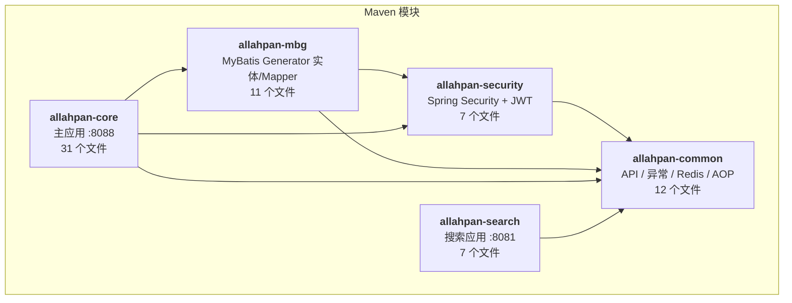
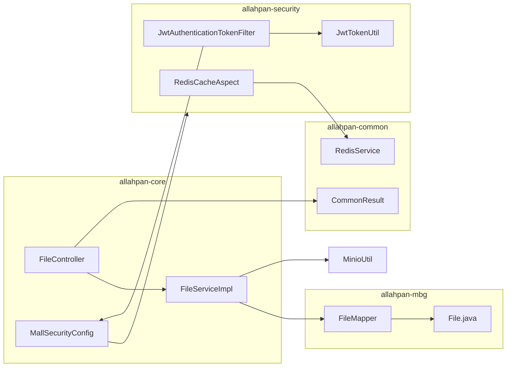

# 01 — 模块依赖全景图

## Maven 模块结构

```
allahpan/                          (root aggregator POM)
├── allahpan-common   (12 files)   工具层：API/异常/Redis/AOP
├── allahpan-security  (7 files)   安全层：JWT + Spring Security + 缓存切面
├── allahpan-mbg       (11 files)  数据层：MyBatis Generator 实体/Mapper/XML
├── allahpan-core      (31 files)  主应用 :8088 — 控制器/服务/配置/组件/任务
└── allahpan-search     (7 files)  搜索应用 :8081 — Spring Data Elasticsearch
```

## 依赖关系图



## 模块职责一览

### allahpan-common（工具层 — 被所有模块依赖）

| 包 | 类 | 职责 |
|---|---|---|
| `common.api` | `CommonResult<T>` | 统一 API 响应包装 `{code, message, data}` |
| `common.api` | `CommonPage<T>` | 分页响应（from PageHelper） |
| `common.api` | `ResultCode` | 枚举：SUCCESS/FAILED/UNAUTHORIZED/FORBIDDEN/... |
| `common.exception` | `ApiException` | 自定义 RuntimeException，携带 ResultCode |
| `common.exception` | `Asserts` | 业务断言工具：`fail()` / `isTrue()` |
| `common.exception` | `GlobalExceptionHandler` | `@ControllerAdvice` 全局异常 → JSON |
| `common.service` | `RedisService` | Redis 操作接口（String/Hash/Set/List） |
| `common.service.impl` | `RedisServiceImpl` | RedisTemplate 实现 |
| `common.config` | `BaseRedisConfig` | RedisTemplate + RedisCacheManager Bean |
| `common.util` | — | —（原 MinioUtil 已移除） |
| `common.domain` | `WebLog` | HTTP 请求日志实体 |
| `common.log` | `WebLogAspect` | `@Aspect` — 所有 Controller 方法自动打日志 |

### allahpan-security（安全层 — 依赖 common）

| 包 | 类 | 职责 |
|---|---|---|
| `security.config` | `SecurityConfig` | Spring Security 配置：无状态 JWT、BCrypt、白名单 URL |
| `security.util` | `JwtTokenUtil` | Hutool JWT 生成/验证/刷新，claims: userId/hasPassword |
| `security.component` | `JwtAuthenticationTokenFilter` | `OncePerRequestFilter` — 从 Header 提取 JWT 注入 SecurityContext |
| `security.component` | `RestAuthenticationEntryPoint` | 401 → JSON（未登录） |
| `security.component` | `RestfulAccessDeniedHandler` | 403 → JSON（无权限） |
| `security.annotation` | `CacheException` | 标记注解 — 控制 Redis 异常是否传播 |
| `security.aspect` | `RedisCacheAspect` | `@Aspect` — 拦截 `*CacheService.*` 方法，默认吞异常 |

### allahpan-mbg（数据层 — 依赖 common + security）

| 类型 | 文件 | 对应表 |
|---|---|---|
| 实体 | `User.java` | `users` (10 字段) |
| 实体 | `File.java` | `files` (16 字段 + BLOB origin_text) |
| 实体 | `FileFavorite.java` | `file_favorites` (4 字段) |
| Example | `UserExample.java` | users 条件构造器 |
| Example | `FileExample.java` | files 条件构造器 |
| Example | `FileFavoriteExample.java` | file_favorites 条件构造器 |
| Mapper | `UserMapper.java` | 标准 CRUD + Example |
| Mapper | `FileMapper.java` | 标准 CRUD + 3 个 BLOBs 变体方法 |
| Mapper | `FileFavoriteMapper.java` | 标准 CRUD |
| XML | `UserMapper.xml` | SQL 映射 |
| XML | `FileMapper.xml` | SQL 映射（含 BLOB 列） |
| XML | `FileFavoriteMapper.xml` | SQL 映射 |
| 工具 | `Generator.java` | MyBatis Generator 代码生成入口 |
| 工具 | `CommentGenerator.java` | 自定义注释生成（Lombok @Data） |

### allahpan-core（主应用 — 依赖 common + security + mbg）

| 层 | 文件 | 职责 |
|---|---|---|
| **入口** | `AllahPanApplication.java` | `@SpringBootApplication` + `@MapperScan` |
| **配置** | `MallSecurityConfig.java` | `UserDetailsService` Bean — email → DB/Cache → AdminUserDetails |
| **配置** | `MinioConfig.java` | MinIO Client Bean（`minio.endpoint/accessKey/secretKey`） |
| **配置** | `RabbitMqConfig.java` | RabbitMQ 拓扑：主队列 + DLX 重试队列 + JSON 转换器 |
| **配置** | `SchedulingConfig.java` | `@EnableScheduling` — 定时任务开关 |
| **控制器** | `AuthController.java` | `/api/auth/send-code`, `/login-by-code`, `/login-by-password` |
| **控制器** | `UserController.java` | `/api/user/set-password`, `/me` |
| **控制器** | `FileController.java` | `/api/file/*` — 16 个端点（含 SSE watch, stream, thumbnail） |
| **控制器** | `SearchController.java` | `/api/search` — 搜索代理（GET 搜索, POST 重建索引） |
| **控制器** | `FavoriteController.java` | `/api/favorite/*` — 收藏/取消/检查/列表 |
| **控制器** | `ShareController.java` | `/api/share/*` — 创建/访问/删除分享 |
| **服务** | `UserService/Impl` | 登录（验证码/密码）、自动注册、设密码 |
| **服务** | `AuthCodeService/Impl` | 验证码生成/验证、三层限流 |
| **服务** | `UserCacheService/Impl` | Redis 用户缓存 get/set/del |
| **服务** | `FileService/Impl` | 文件 CRUD、文件夹树、垃圾站、递归操作 |
| **服务** | `FavoriteService/Impl` | 收藏添加/移除/检查/分页列表 |
| **组件** | `MailService` | QQ 邮箱 SMTP 验证码发送（替换 SmsService） |
| **组件** | `FileProcessSender` | RabbitMQ 生产者：`sendProcess()` + `sendRetry()` |
| **组件** | `FileProcessReceiver` | `@RabbitListener` — 3 阶段流水线消费者 + 最多 3 次重试 |
| **组件** | `MinioUtil` | MinIO 对象存储 I/O（3 个 bucket） |
| **组件** | `SseBroadcaster` | SSE 连接管理 + 事件广播（从 FileController 提取） |
| **组件** | `ThumbnailGenerator` | IMAGE 缩略图生成（缩放 300px），PDF via PDFBox (150 DPI) |
| **组件** | `TextExtractor` | IMAGE→Ollama OCR，PDF/DOCX/DOC/XLSX/XLS/PPTX/PPT/Text via PDFBox + POI |
| **组件** | `OllamaService` | Ollama vision API `/api/chat`，qwen3.5:2b 模型，think=false，num_predict=4096，String.format 构建 JSON |
| **组件** | `EsIndexService/Impl` | ES 索引 HTTP 调用 → search 应用 `:8081` |
| **任务** | `TrashCleanupTask` | `@Scheduled(cron="0 0 3 * * ?")` — 每天 3AM 清理 60 天前垃圾 |
| **领域** | `AdminUserDetails` | Spring Security UserDetails 实现，位于 `com.allahpan.bo` |
| **领域** | `LoginRequest` | 登录请求 DTO（email + code/password） |
| **领域** | `FileUploadResult` | 上传结果 DTO（instant/needUpload） |
| **领域** | `FileProcessMessage` | RabbitMQ 消息 DTO，含 Stage 枚举 + retryCount |

### allahpan-search（搜索应用 — 依赖 common，端口 :8081）

| 层 | 文件 | 职责 |
|---|---|---|
| **入口** | `SearchApplication.java` | `@SpringBootApplication` |
| **控制器** | `EsAdminController.java` | ES 管理接口（索引/删除/搜索） |
| **控制器** | `EsFileController.java` | 文件搜索 API |
| **领域** | `EsFile.java` | Elasticsearch 文档实体 |
| **仓库** | `EsFileRepository.java` | Spring Data Elasticsearch Repository |
| **服务** | `EsFileService/Impl` | ES 文件索引/搜索业务逻辑 |

## 关键跨模块调用链



## 构建顺序

```bash
# 必须按依赖顺序安装
mvn clean install -pl allahpan-common,allahpan-security,allahpan-mbg,allahpan-core -DskipTests

# 然后启动
mvn spring-boot:run -pl allahpan-core
```
