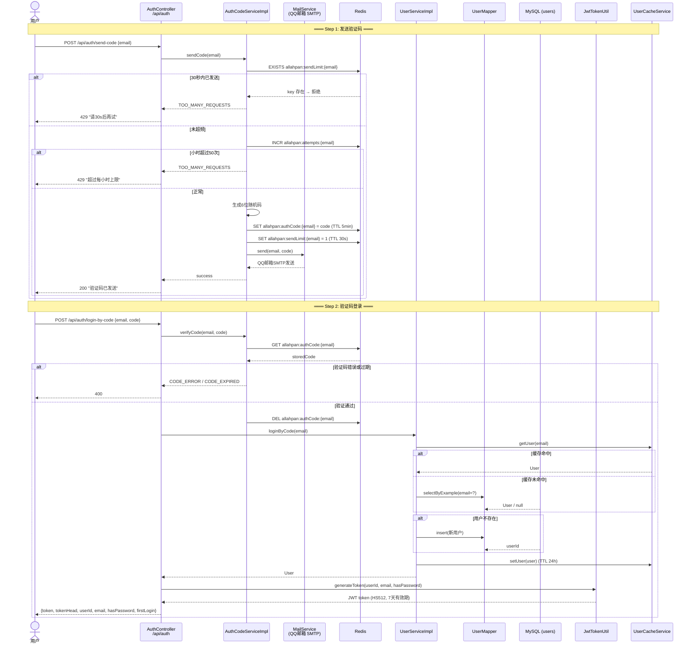
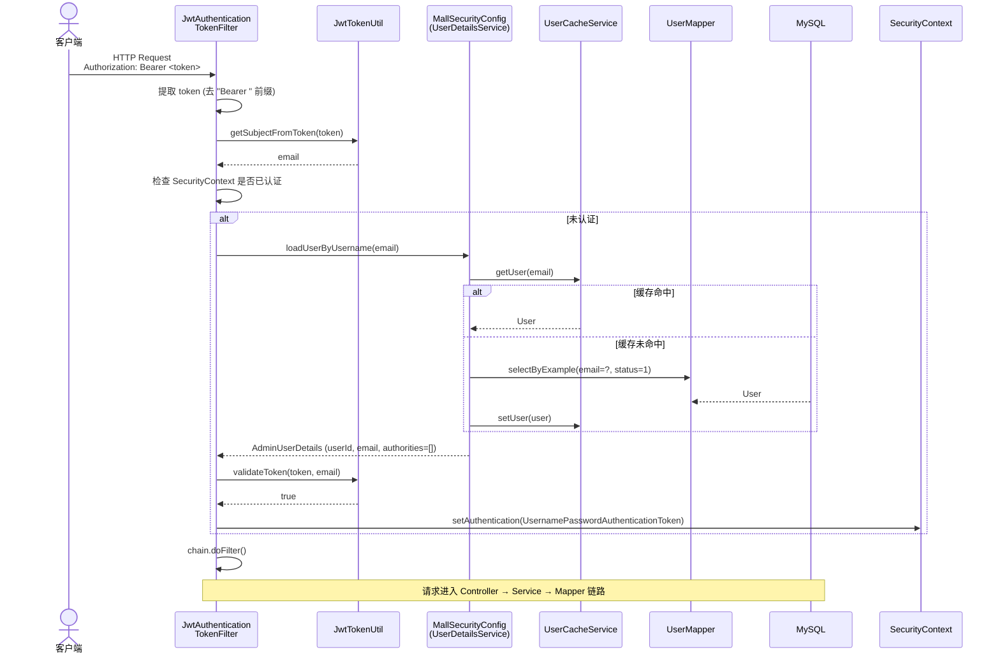
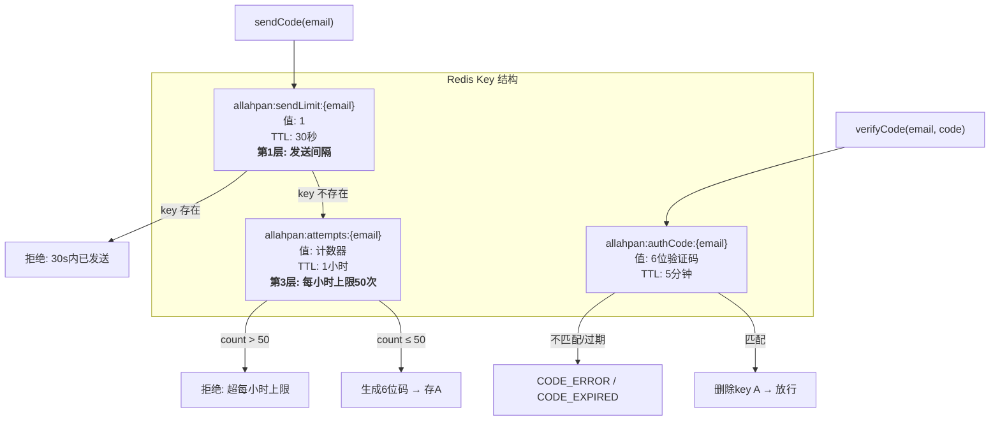

# 02 — 认证流程架构图

## 验证码登录完整链路

## JWT 请求认证流程（后续请求）

## 三层验证码保护

## 关键文件索引

| 步骤 | 文件 | 方法 |
|------|------|------|
| 发送验证码 | `AuthController.java:35` | `sendCode()` |
| 生成/存储验证码 | `AuthCodeServiceImpl.java:28` | `sendCode()` |
| 邮件发送 | `MailService.java` | `send()` (QQ邮箱SMTP) |
| 验证码校验 | `AuthCodeServiceImpl.java:48` | `verifyCode()` |
| 验证码登录 | `UserServiceImpl.java:28` | `loginByCode()` |
| 密码登录 | `UserServiceImpl.java:50` | `loginByPassword()` |
| JWT 生成 | `AuthController.java:75` | `buildLoginResponse()` |
| JWT 工具 | `JwtTokenUtil.java` | `generateToken()` / `validateToken()` |
| 请求过滤器 | `JwtAuthenticationTokenFilter.java:40` | `doFilterInternal()` |
| 用户加载 | `MallSecurityConfig.java:18` | `loadUserByUsername()` |
| 用户详情 | `AdminUserDetails.java` | `getUserId()` / `getUsername()` |
| 缓存读取 | `UserCacheServiceImpl.java:23` | `getUser()` |
| 缓存写入 | `UserCacheServiceImpl.java:30` | `setUser()` |
| 缓存删除 | `UserCacheServiceImpl.java:37` | `delUser()` |
