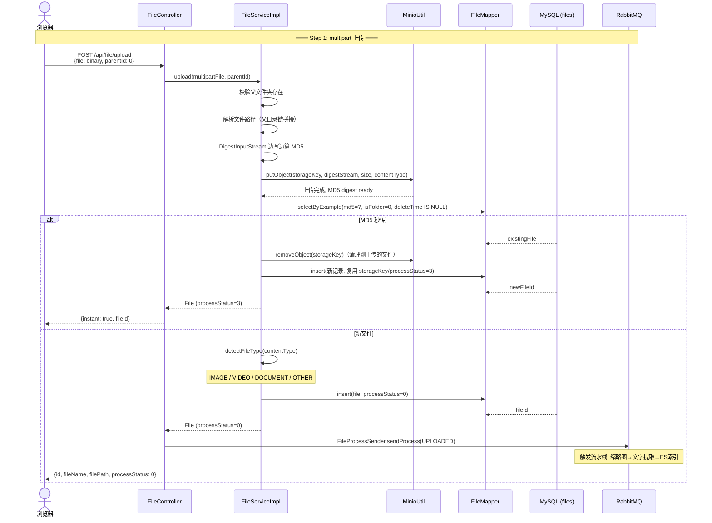
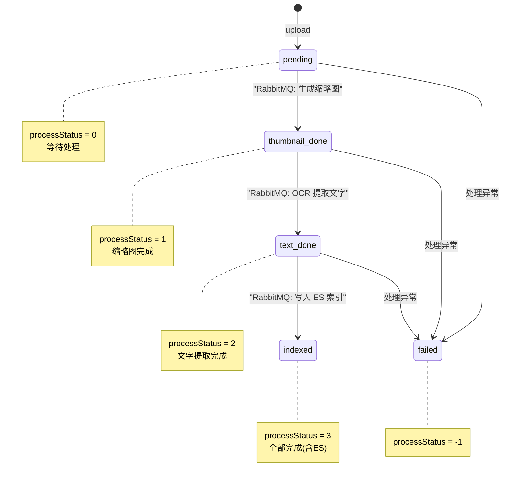
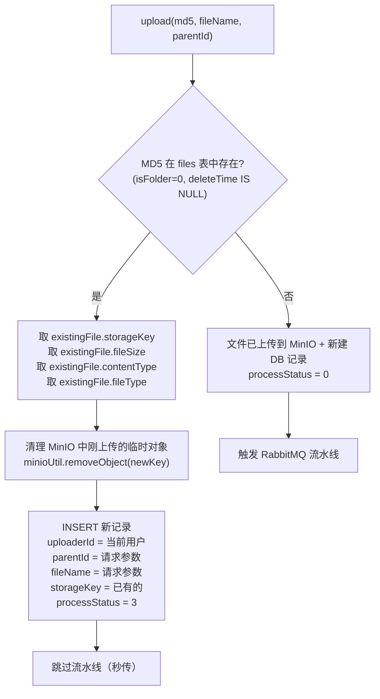
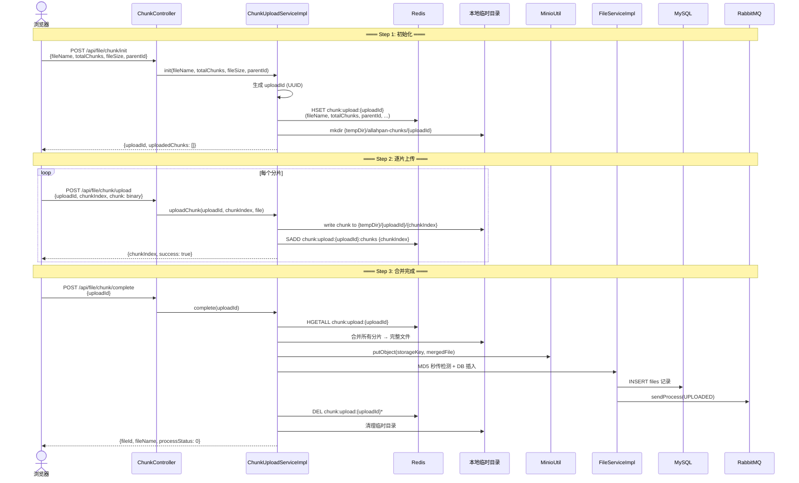

# 03 — 文件上传流程架构图

## MinIO 对象存储

AllahPan 采用 **MinIO 对象存储**：

- **MinIO**: 兼容 S3 的对象存储，3 个 bucket（`allahpan-files`、`allahpan-thumbnails`、`allahpan-trash`）。
- **storageKey**: 用户隔离的对象 key，如 `1/2026/06/{UUID}.png`。
- **秒传**: MD5 去重，相同文件跳过上传直接创建数据库记录（`processStatus=3`）。
- **流式 MD5**: 使用 `DigestInputStream` 边上传边计算 MD5，避免将整个文件加载到内存。

## 完整上传时序



## processStatus 状态机（RabbitMQ 流水线）



> **当前状态**: 文件上传后经 RabbitMQ 流水线: `UPLOADED → THUMBNAILED → TEXT_EXTRACTED → INDEXED`。文件夹和秒传文件直接 `processStatus=3`。
> **缩略图**: IMAGE（缩放 300px）+ PDF（PDFBox 渲染首帧，可配置 DPI，默认 150）。读写均通过 MinIO bucket。
> **文字提取**: IMAGE（Ollama OCR）+ PDF（PDFBox）+ DOCX/DOC/XLSX/XLS/PPTX/PPT（Apache POI）+ 纯文本（UTF-8 读取）。从 MinIO 获取文件流。
> **ES 索引**: 失败降级，不标记 processStatus=-1。
> **基础设施错误**: Ollama/ES/MinIO 不可达时，重试耗尽后降级而非标记失败。
> **重试最多 3 次**，指数退避 30s/60s/120s。

## 上传入口

文件通过 `POST /api/file/upload`（multipart 表单）直接上传到应用服务器。不存在本地文件监控——文件只能通过 Web API 创建，不会从外部文件系统同步。

## storageKey 结构

```
{userId}/{yyyy/MM}/{UUID}{ext}

示例: 1/2026/06/d27fed91-2fed-4e3e-bbcd-ce19dc3410c5.png
      │  │  │    │                                 │
      │  │  │    │                                 └── 原始扩展名
      │  │  │    └── UUID 去重
      │  │  └── 月份
      │  └── 年份
      └── 用户ID (隔离)
```

## 秒传（Instant Upload）流程



## 分片上传流程（大文件）

大文件通过 `ChunkController` 分片上传，支持断点续传：

```
POST /api/file/chunk/init        — 初始化上传会话
POST /api/file/chunk/upload      — 上传分片
POST /api/file/chunk/complete    — 合并分片并完成
GET  /api/file/chunk/status/{uploadId}  — 查询上传进度
```

### 完整分片上传时序



### 断点续传

如果 `uploadId` 已存在（会话未过期），`init` 返回已上传的分片索引列表：

```
GET /api/file/chunk/status/{uploadId}
→ {uploadId, totalChunks, uploadedChunks: [0, 1, 3], ...}
```

前端跳过已上传的分片，只补传缺失部分。

### Redis 会话结构

| Key | 类型 | TTL | 内容 |
|-----|------|-----|------|
| `chunk:upload:{uploadId}` | Hash | 24h | fileName, totalChunks, fileSize, parentId, md5 |
| `chunk:upload:{uploadId}:chunks` | Set | 24h | 已上传的分片索引集合 |

### 定时清理

`ChunkUploadServiceImpl` 使用 `@Scheduled(cron = "0 0 * * * ?")` 每小时清理超过 `allahpan.chunk.expire-hours`（默认 24h）的过期临时目录和 Redis 会话。

## 关键文件索引

| 步骤 | 文件 | 方法 |
|------|------|------|
| 上传端点 | `FileController.java` | `upload()` |
| 流式上传 + MD5 | `FileServiceImpl.java` | `storeAndCalculateMd5()` |
| MinIO 上传 | `MinioUtil.java` | `putObject()` |
| MD5 秒传检测 | `FileServiceImpl.java` | `upload()` |
| 文件记录入库 | `FileServiceImpl.java` | `upload()` |
| 文件类型检测 | `FileServiceImpl.java` | `detectFileType()` |
| 文件夹创建 | `FileServiceImpl.java` | `createFolder()` |
| RabbitMQ 流水线 | `FileProcessReceiver.java` | `handle()` |
| SSE 事件广播 | `SseBroadcaster.java` | `broadcast()` |
| 分片初始化 | `ChunkController.java` | `init()` |
| 分片上传 | `ChunkController.java` | `uploadChunk()` |
| 分片合并 | `ChunkUploadServiceImpl.java` | `complete()` |
| 分片状态 | `ChunkController.java` | `status()` |
| 过期清理 | `ChunkUploadServiceImpl.java` | `@Scheduled(cron="0 0 * * * ?")` |
