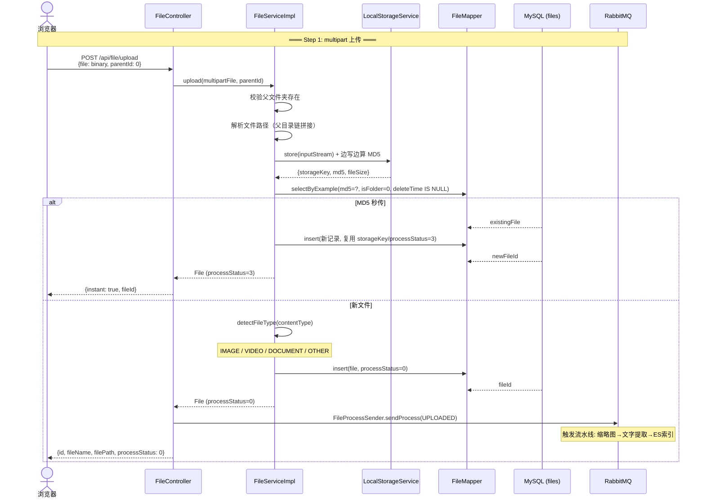
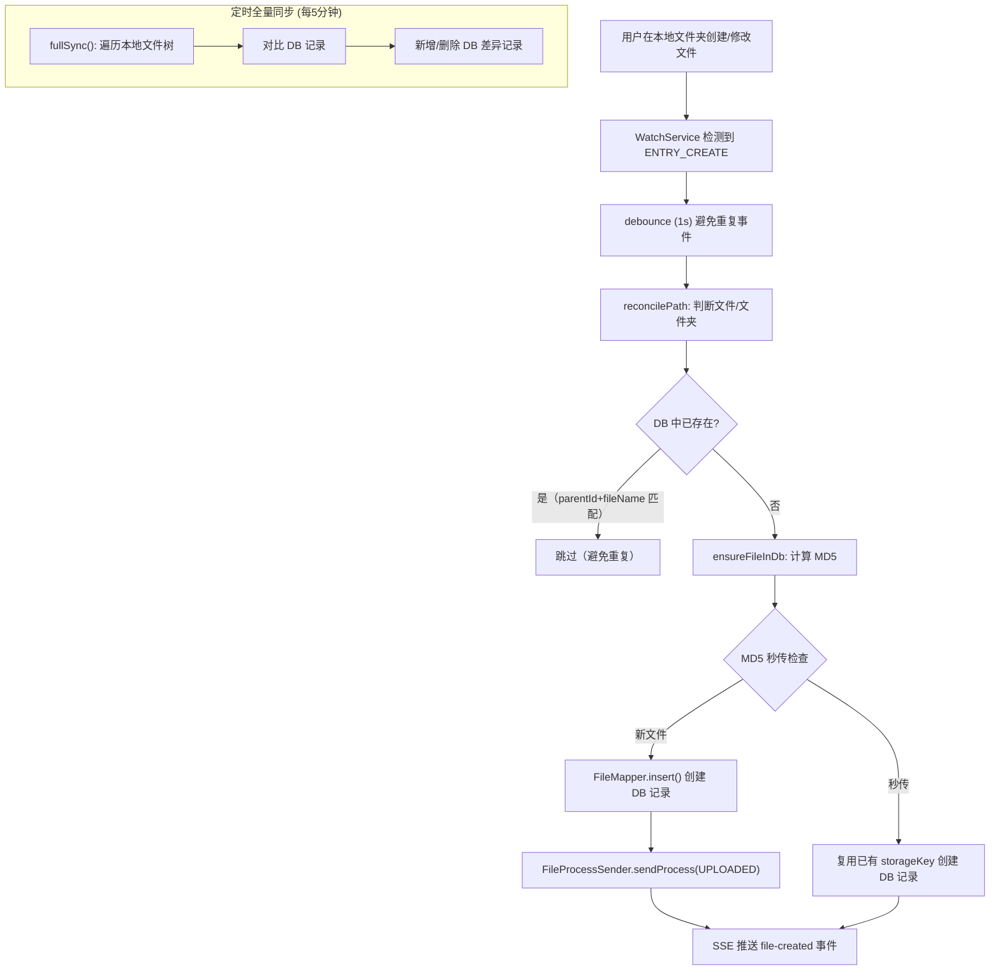
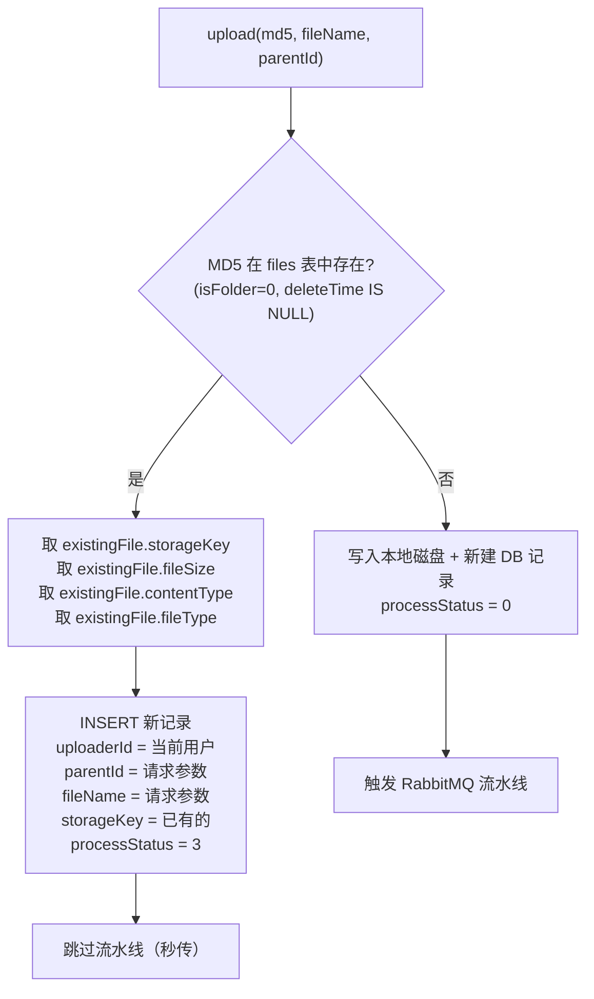

# 03 — 文件上传流程架构图

## 本地存储架构

AllahPan 采用 **本地磁盘直写** 存储：

- **本地磁盘**: 所有上传文件的存储位置（`%USERPROFILE%\AllahPan\{email}\`）。文件通过 multipart 表单直接上传到应用服务器，写入本地文件系统。
- **storageKey**: 用户隔离的本地路径，如 `1/2026/06/{UUID}.png`，相对于用户根目录。
- **秒传**: MD5 去重，相同文件跳过上传直接创建数据库记录（`processStatus=3`）。

## 完整上传时序



## processStatus 状态机（Phase 4 RabbitMQ 流水线）


> **当前状态**: 文件上传后经 RabbitMQ 流水线: `UPLOADED → THUMBNAILED → TEXT_EXTRACTED → INDEXED`。文件夹和秒传文件直接 `processStatus=3`。
> **缩略图**: IMAGE（缩放 300px）+ PDF（PDFBox 渲染首帧，可配置 DPI，默认150）。
> **文字提取**: IMAGE（Ollama OCR）+ PDF（PDFBox）+ DOCX/DOC/XLSX/XLS/PPTX/PPT（Apache POI）+ 纯文本（UTF-8 读取）。
> **ES 索引**: 失败降级，不标记 processStatus=-1。
> **基础设施错误**: Ollama/ES 不可达时，重试耗尽后降级而非标记失败。
> **重试最多 3 次**，指数退避 30s/60s/120s。

## FileSystemWatcher 文件系统事件上传

当用户将文件直接拖入本地 AllahPan 文件夹时，`FileSystemWatcher` 自动发现并同步到数据库：



- **启动时**: 3 秒后执行首次全量同步
- **防重复**: parentId + fileName 二级去重，避免 web 上传镜像到本地时触发重复事件
- **SSE 通知**: 每次变更推送 `file-created` / `file-updated` / `file-deleted` 事件

## storageKey 结构

```
{userId}/{yyyy/MM}/{UUID}{ext}

示例: 1/2026/06/d27fed91-2fed-4e3e-bbcd-ce19dc3410c5.png
      │  │  │    │                                 │
      │  │  │    │                                 └── 原始扩展名
      │  │  │    └── UUID 去重
      │  │  └── 月份
      │  └── 年份
      └── 用户ID (隔离)
```

## 秒传（Instant Upload）流程



## 关键文件索引

| 步骤 | 文件 | 方法 |
|------|------|------|
| 上传端点 | `FileController.java` | `upload()` |
| MD5 秒传检测 | `FileServiceImpl.java` | `upload()` |
| 本地存储写入 | `LocalStorageService.java` | `store()` |
| 文件记录入库 | `FileServiceImpl.java` | `upload()` |
| 文件类型检测 | `FileServiceImpl.java` | `detectFileType()` |
| 文件夹创建 | `FileServiceImpl.java` | `createFolder()` |
| 文件监控 | `FileSystemWatcher.java` | `reconcilePath()`, `fullSync()` |
| 本地文件 I/O | `LocalStorageService.java` | `store()`, `read()`, `delete()` |
| RabbitMQ 流水线 | `FileProcessReceiver.java` | `handle()` |
