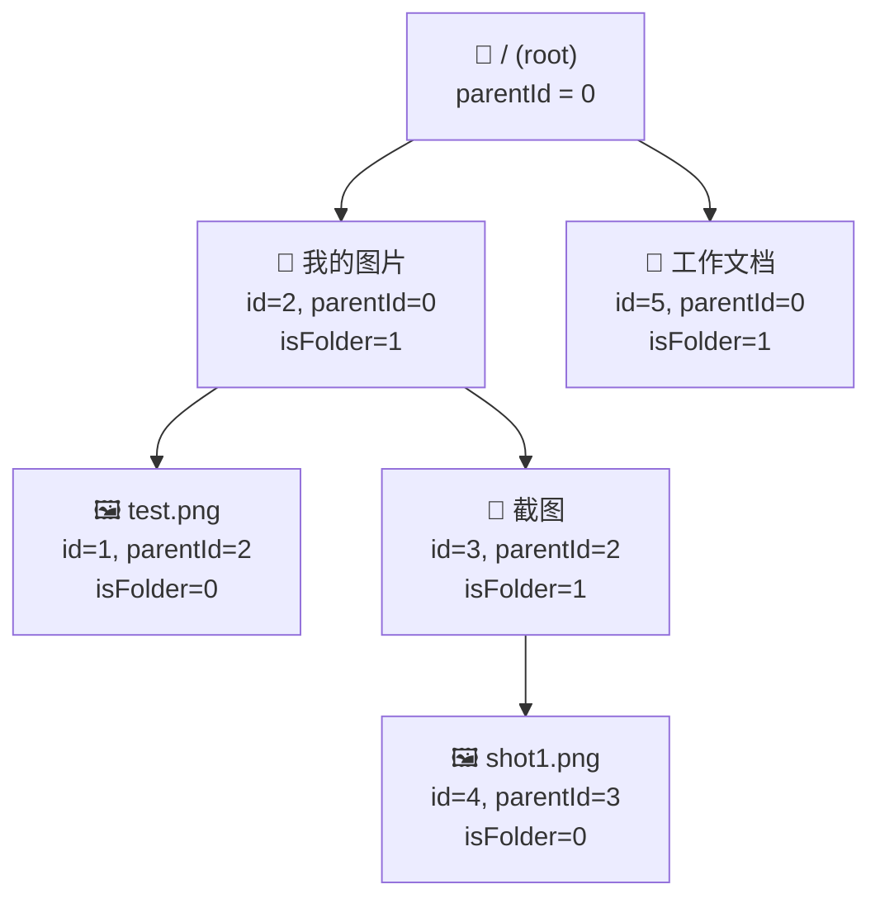
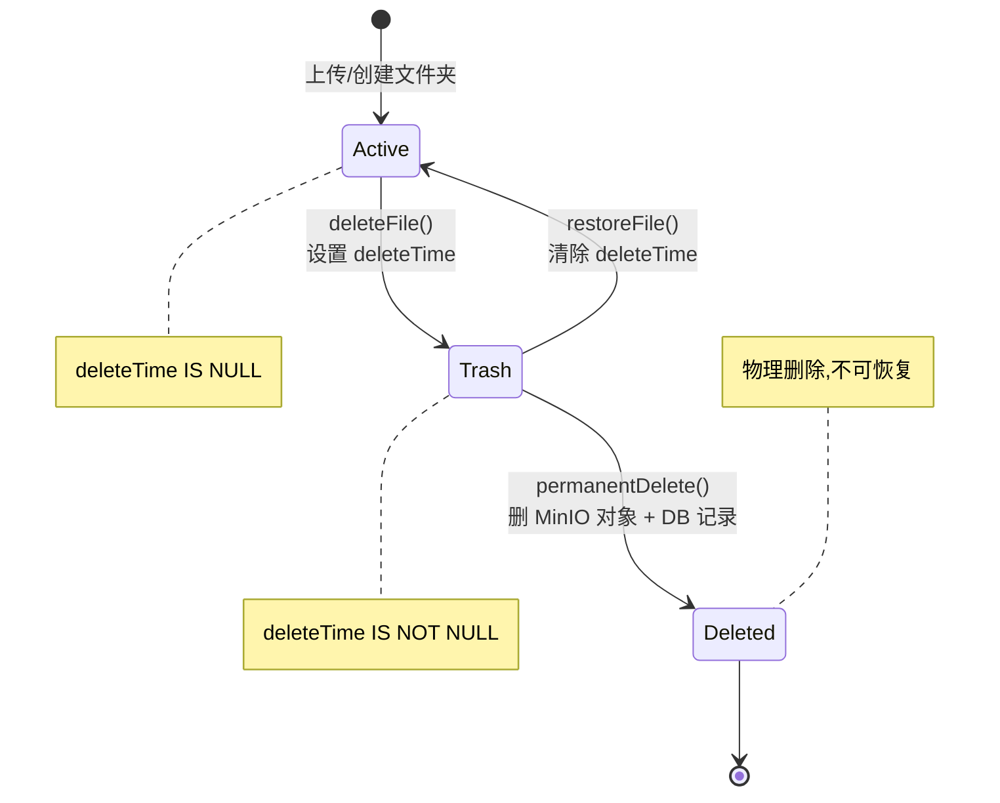
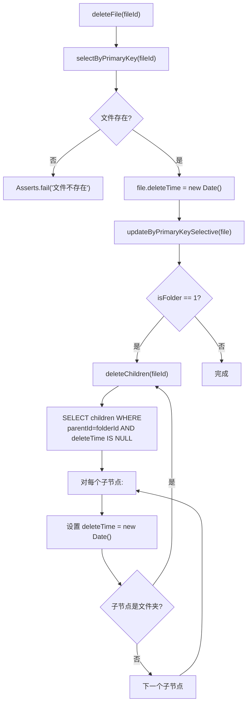
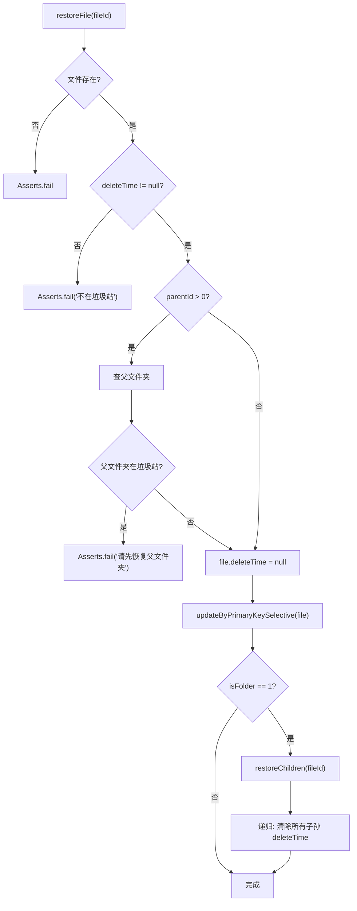
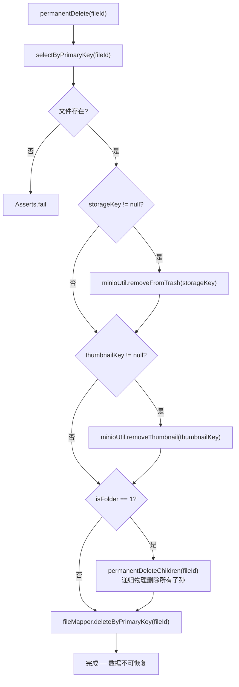
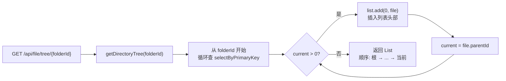
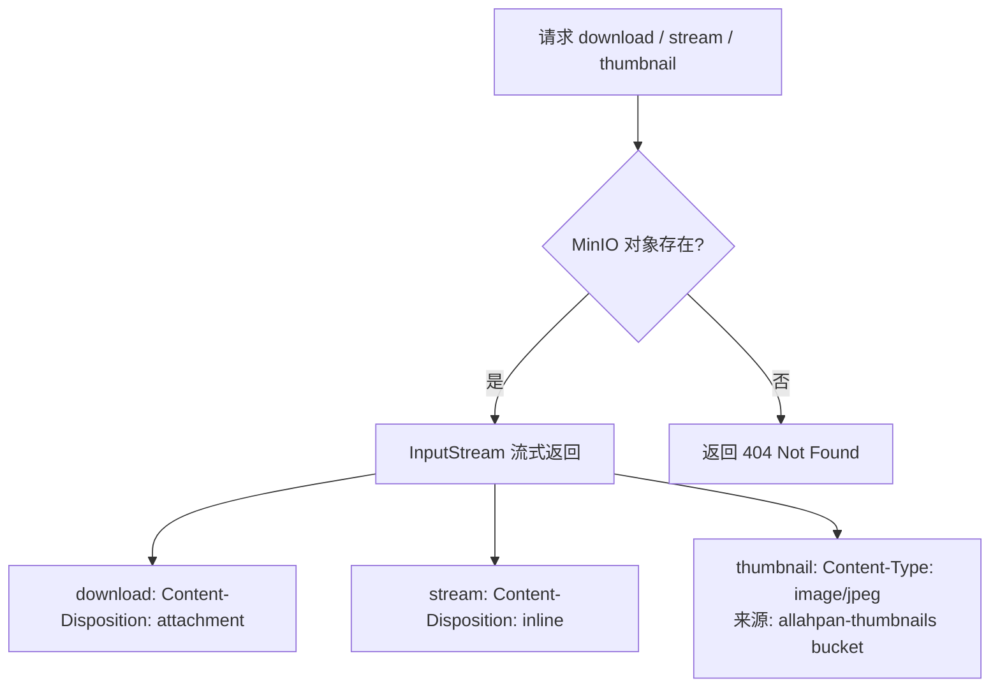
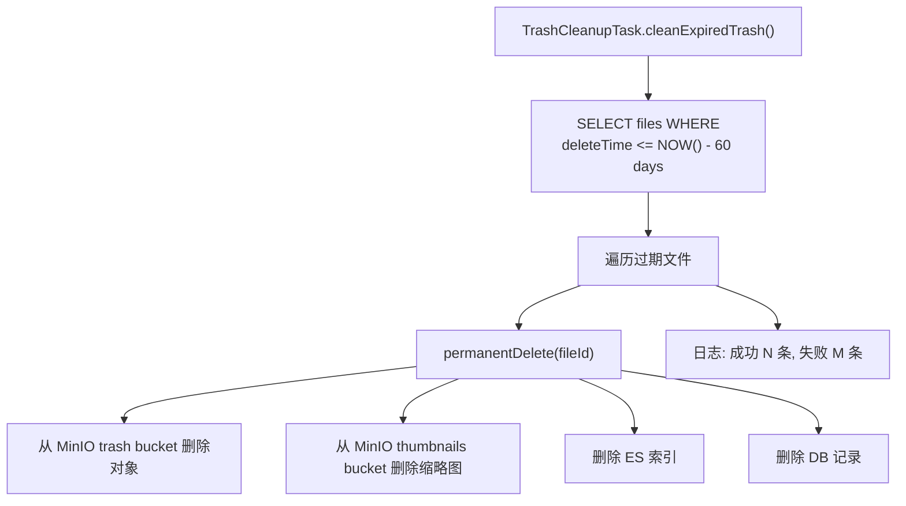
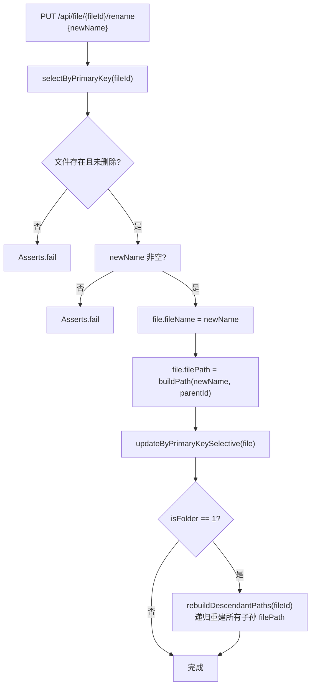
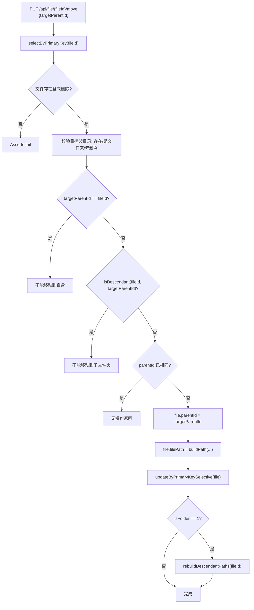

# 04 — 文件管理操作架构图

## 单表树形结构 (parent_id 自引用)



## 文件生命周期状态机



## 软删除流程（deleteFile）



## 垃圾站恢复流程（restoreFile）



## 永久删除流程（permanentDelete）



## 目录树构建（面包屑导航）



示例结果：`[/, 我的图片, 截图]`

## 文件列表排序规则

```sql
SELECT * FROM files
WHERE parent_id = ? AND delete_time IS NULL
ORDER BY is_folder DESC, create_time DESC
```

文件夹优先显示，同类型按创建时间倒序。

## API 端点汇总

| 方法 | 路径 | 功能 | 存储层 |
|------|------|------|--------|
| POST | `/api/file/upload` | 上传（multipart） | MinioUtil.putObject() |
| POST | `/api/file/create-folder` | 创建文件夹 | — |
| GET | `/api/file/list?parentId=` | 文件列表 | — |
| GET | `/api/file/tree/{folderId}` | 目录树 | — |
| GET | `/api/file/{fileId}` | 文件详情 | — |
| GET | `/api/file/{fileId}/download` | 下载 | MinioUtil.getObject() |
| GET | `/api/file/{fileId}/stream` | 内联预览 | MinioUtil.getObject() |
| GET | `/api/file/{fileId}/thumbnail` | 缩略图 | MinioUtil.getThumbnail() |
| GET | `/api/file/watch?token=` | SSE 实时推送 | — |
| DELETE | `/api/file/{fileId}` | 软删除 | MinioUtil.copyToTrash() |
| DELETE | `/api/file/batch` | 批量软删除 | MinioUtil.copyToTrash() |
| GET | `/api/file/trash` | 垃圾站列表 | — |
| PUT | `/api/file/trash/{fileId}/restore` | 恢复 | MinioUtil.restoreFromTrash() |
| DELETE | `/api/file/trash/{fileId}` | 永久删除 | MinioUtil.removeFromTrash() |
| PUT | `/api/file/{fileId}/rename` | 重命名 | — |
| PUT | `/api/file/{fileId}/move` | 移动 | — |

## 下载/预览/缩略图 — MinIO 流式访问



所有文件/缩略图通过 MinIO SDK 读取，无需本地磁盘访问。

## TrashCleanupTask — 定时清理

```
@Scheduled(cron = "0 0 3 * * ?")  // 每天凌晨 3:00
```

自动永久删除垃圾站中超过 60 天的文件：



## 新增操作流程

### 重命名（renameFile）



### 移动（moveFile）



## 关键文件索引

| 功能 | 文件 | 方法 |
|------|------|------|
| 软删除 | `FileServiceImpl.java` | `deleteFile()` |
| 递归软删子节点 | `FileServiceImpl.java` | `deleteChildren()` |
| 垃圾站列表 | `FileServiceImpl.java` | `listTrash()` |
| 恢复 | `FileServiceImpl.java` | `restoreFile()` |
| 递归恢复 | `FileServiceImpl.java` | `restoreChildren()` |
| 永久删除 | `FileServiceImpl.java` | `permanentDelete()` |
| 递归物理删除 | `FileServiceImpl.java` | `permanentDeleteChildren()` |
| 目录树 | `FileServiceImpl.java` | `getDirectoryTree()` |
| 文件列表 | `FileServiceImpl.java` | `listFiles()` |
| 路径构建 | `FileServiceImpl.java` | `buildPath()` |
| 递归重建子孙路径 | `FileServiceImpl.java` | `rebuildDescendantPaths()` |
| 循环检测 | `FileServiceImpl.java` | `isDescendant()` |
| 重命名 | `FileServiceImpl.java` | `renameFile()` |
| 移动 | `FileServiceImpl.java` | `moveFile()` |
| 批量删除 | `FileServiceImpl.java` | `batchDelete()` |
| MinIO 对象 I/O | `MinioUtil.java` | `putObject()`, `getObject()`, `removeObject()`, `copyToTrash()`, `restoreFromTrash()`, `removeFromTrash()`, `putThumbnail()`, `getThumbnail()`, `removeThumbnail()` |
| SSE 广播 | `SseBroadcaster.java` | `broadcast()` |
| 定时清理 | `TrashCleanupTask.java` | `cleanExpiredTrash()` |
