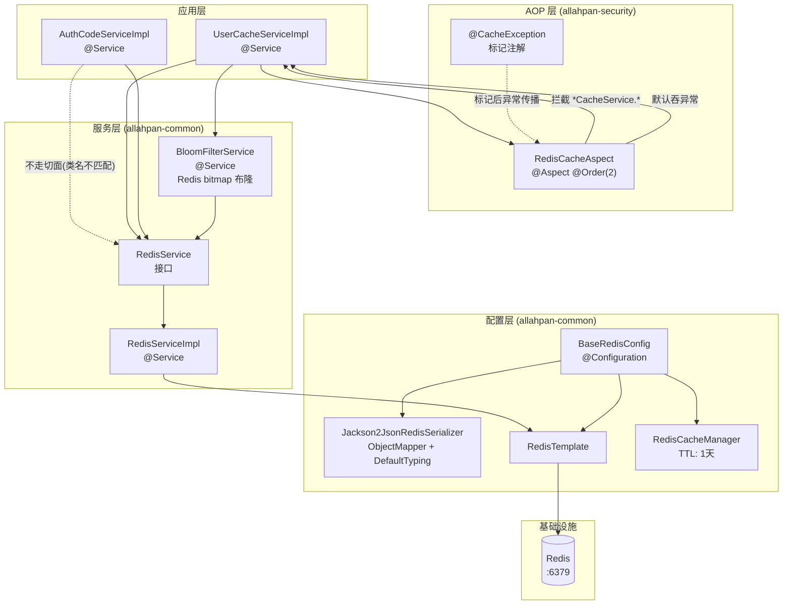
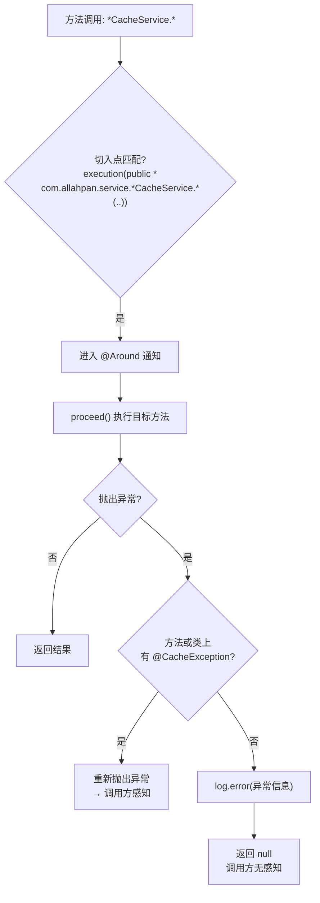
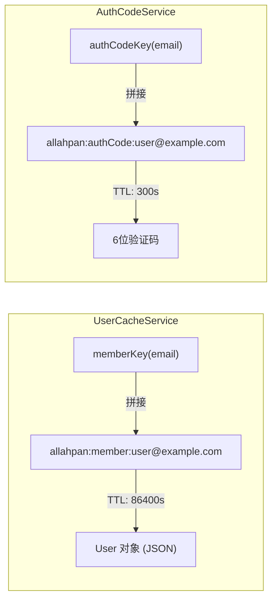
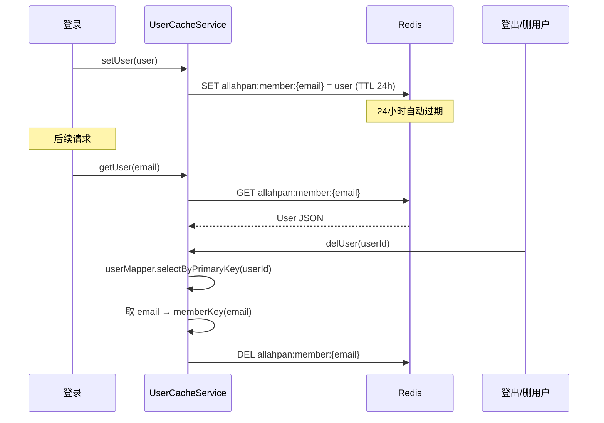

# 05 — 缓存与 AOP 架构图

## Redis 整体架构



## RedisCacheAspect 切面逻辑



**设计意图**: 缓存是加速层，缓存挂了不应影响业务。`*CacheService` 的方法默认 best-effort，加上 `@CacheException` 才传播异常。

## AuthCodeService 不走切面

`AuthCodeServiceImpl` 直接调用 `RedisService`，**不走** `RedisCacheAspect`：

- 类名是 `AuthCodeServiceImpl`，不匹配 `*CacheService` 切点
- 验证码是核心业务，Redis 挂了应该直接报错，不能静默吞异常

## Redis Key 命名空间

```
allahpan                         ← redis.database 配置值
├── allahpan:member:{email}      ← UserCacheService (TTL 24h)
├── allahpan:authCode:{email}    ← AuthCodeService (TTL 5min)
├── allahpan:sendLimit:{email}   ← 发送间隔 (TTL 30s)
└── allahpan:attempts:{email}    ← 小时上限 50 次 (TTL 1h)
```



## 序列化配置

```java
// BaseRedisConfig.java
Jackson2JsonRedisSerializer<Object> serializer = new Jackson2JsonRedisSerializer<>(Object.class);
ObjectMapper mapper = new ObjectMapper();
mapper.setVisibility(PropertyAccessor.ALL, JsonAutoDetect.Visibility.ANY);
mapper.activateDefaultTyping(
    LaissezFaireSubTypeValidator.instance,
    DefaultTyping.NON_FINAL  // 存类型信息, 反序列化时知道具体类
);
```

> **注意**: `activateDefaultTyping` 在 Jackson 2.15+ 已废弃，但序列化功能正常。这可能导致 `redis-cli KEYS *` 看不到预期的简单字符串值（实际存的是 JSON + 类型头）。

## 用户缓存生命周期



## 布隆过滤器 — Redis Bitmap 邮件预检

`BloomFilterService` (位于 `allahpan-common`) 使用 Redis Bitmap 实现布隆过滤器，快速判断邮箱是否**绝对不存在**：

| 参数 | 值 |
|------|-----|
| 预期元素数 | 10000 |
| 误判率 (FPP) | 1% |
| Bitmap 大小 | ~95850 bits (~12 KB) |
| 哈希函数数 | 7 (SHA-256 派生) |
| Redis Key | `{redis.database}:bloom:user:email` |

**查询流程** (在 `UserCacheServiceImpl.getUser()` 中):

```
bloomFilterService.mightContain(email)
  ├── 返回 false → 邮箱绝对不存在 → 直接返回 null（跳过 Redis + MySQL）
  └── 返回 true  → 邮箱可能存在 → 继续正常 Redis → MySQL 流程
```

`BloomFilterInitializer` (`ApplicationRunner`, `@Component`) 在应用启动时：
1. 调用 `bloomFilterService.reset()` 清空位图
2. 分页查询所有用户邮箱 → `bloomFilterService.add(email)` 逐条添加

## 随机 TTL 防缓存雪崩

`UserCacheServiceImpl` 写入缓存时添加随机 TTL 抖动：

```
实际 TTL = 86400s (24h) + ThreadLocalRandom.nextInt(0, 300)
```

0-300 秒的随机偏移避免了大量用户缓存在同一时刻过期导致的 Redis 瞬时高压。

## 分享链接缓存

`ShareServiceImpl` 使用 Redis 存储分享链接（**无 MySQL 表**）：

| Redis Key | 值 | TTL |
|-----------|-----|-----|
| `{redis.database}:share:{code}` | `{fileId, creatorId, expireTime}` (Map) | `expireHours * 3600 + 3600` (最大 168h + 1h buffer) |

- 分享码：8 位随机 hex（`RandomUtil.randomString(8)`）
- 最大有效期：168 小时（7 天）
- 额外 1 小时 buffer 允许过期后短暂访问

## 分片上传 Redis 会话

`ChunkUploadServiceImpl` 使用 Redis 管理分片上传状态：

| Redis Key | 类型 | 内容 |
|-----------|------|------|
| `chunk:upload:{uploadId}` | Hash | fileName, totalChunks, fileSize, parentId, md5 |
| `chunk:upload:{uploadId}:chunks` | Set | 已上传的分片索引集合 |

TTL: `allahpan.chunk.expire-hours`（默认 24h），配合 `@Scheduled(cron="0 0 * * * ?")` 每小时清理过期会话和临时文件。

## 更新后的 Redis Key 命名空间

```
allahpan                                    ← redis.database (默认值)
├── allahpan:member:{email}                 ← UserCacheService (TTL 24h±0-300s)
├── allahpan:authCode:{email}               ← AuthCodeService (TTL 5min)
├── allahpan:sendLimit:{email}              ← 发送间隔 (TTL 30s)
├── allahpan:attempts:{email}               ← 小时上限 50 次 (TTL 1h)
├── allahpan:bloom:user:email               ← BloomFilter bitmap (~12KB)
├── allahpan:share:{code}                   ← ShareService (TTL expireHours+1h, max 168h)
└── chunk:upload:{uploadId}                 ← ChunkUploadService (TTL 24h)
```

## 关键文件索引

| 组件 | 文件 | 关键方法/注解 |
|------|------|--------------|
| Redis 配置 | `BaseRedisConfig.java` | `redisTemplate()`, `redisSerializer()` |
| Redis 接口 | `RedisService.java` | `set/get/del/exists/expire/incr` |
| Redis 实现 | `RedisServiceImpl.java` | 所有 `opsForXxx()` 操作 |
| 缓存切面 | `RedisCacheAspect.java` | `@Around("cacheAspect()")` |
| 异常标记 | `CacheException.java` | `@Target({METHOD, TYPE})` |
| 用户缓存 | `UserCacheServiceImpl.java` | `getUser/setUser/delUser` |
| 验证码缓存 | `AuthCodeServiceImpl.java` | `sendCode/verifyCode` |
| 布隆过滤器 | `BloomFilterService.java` | `mightContain/add/reset` — Redis bitmap |
| 布隆初始化 | `BloomFilterInitializer.java` | `ApplicationRunner` — 启动时加载邮箱 |
| 分享缓存 | `ShareServiceImpl.java` | `createShare/getShare/deleteShare` — Redis-only |
| 分片会话 | `ChunkUploadServiceImpl.java` | Redis Hash+Set — 分片上传状态 |
