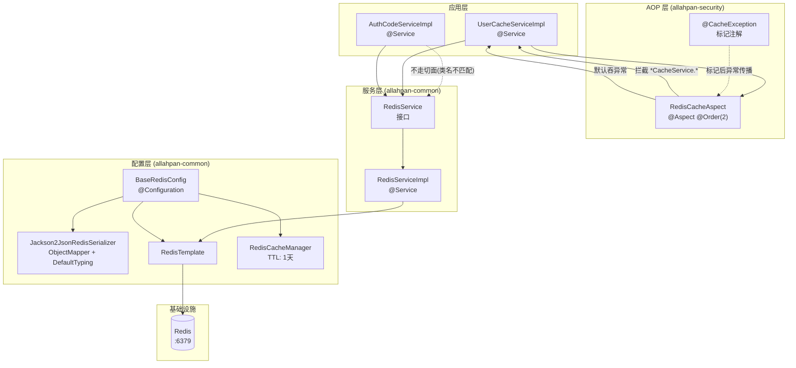
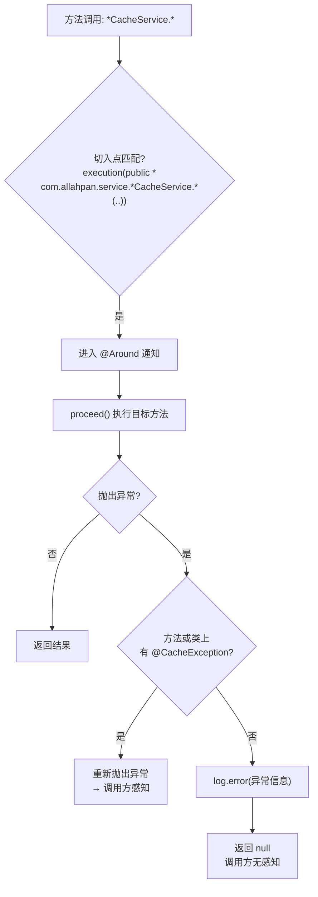
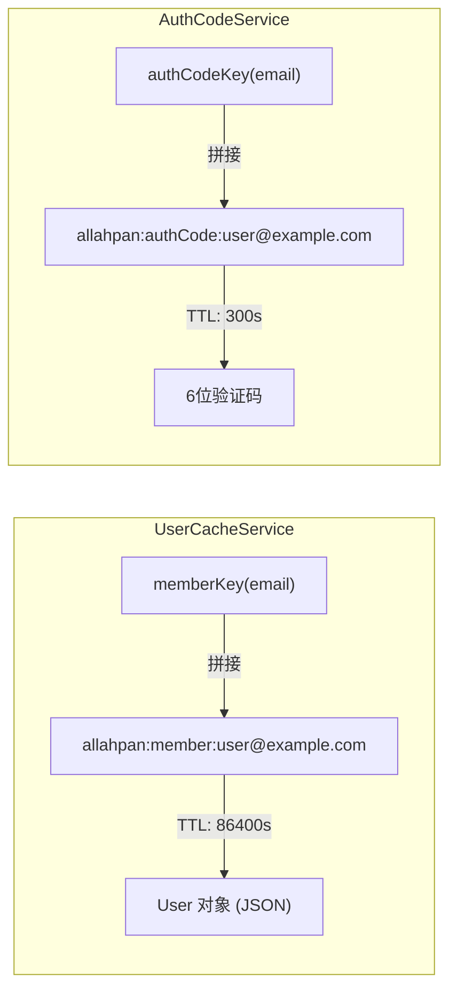
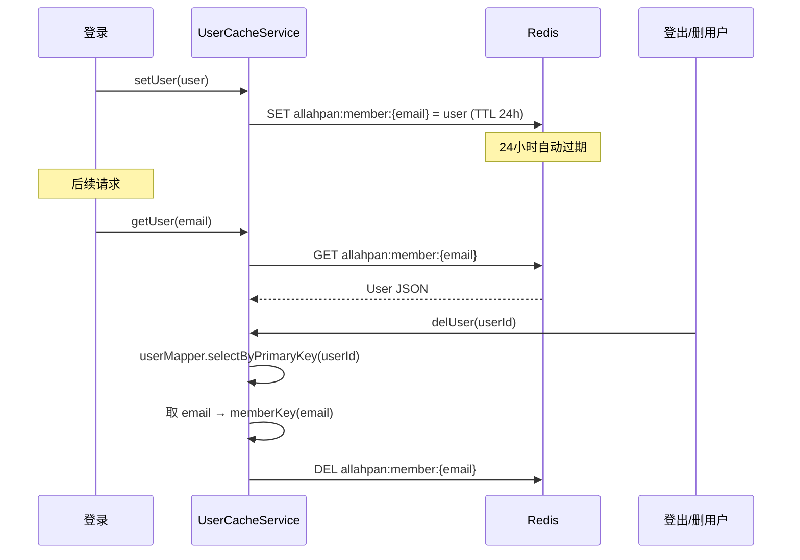

# 05 — 缓存与 AOP 架构图

## Redis 整体架构



## RedisCacheAspect 切面逻辑



**设计意图**: 缓存是加速层，缓存挂了不应影响业务。`*CacheService` 的方法默认 best-effort，加上 `@CacheException` 才传播异常。

## AuthCodeService 不走切面

`AuthCodeServiceImpl` 直接调用 `RedisService`，**不走** `RedisCacheAspect`：

- 类名是 `AuthCodeServiceImpl`，不匹配 `*CacheService` 切点
- 验证码是核心业务，Redis 挂了应该直接报错，不能静默吞异常

## Redis Key 命名空间

```
allahpan                         ← redis.database 配置值
├── allahpan:member:{email}      ← UserCacheService (TTL 24h)
├── allahpan:authCode:{email}    ← AuthCodeService (TTL 5min)
├── allahpan:sendLimit:{email}   ← 发送间隔 (TTL 30s)
└── allahpan:attempts:{email}    ← 小时上限 50 次 (TTL 1h)
```



## 序列化配置

```java
// BaseRedisConfig.java
Jackson2JsonRedisSerializer<Object> serializer = new Jackson2JsonRedisSerializer<>(Object.class);
ObjectMapper mapper = new ObjectMapper();
mapper.setVisibility(PropertyAccessor.ALL, JsonAutoDetect.Visibility.ANY);
mapper.activateDefaultTyping(
    LaissezFaireSubTypeValidator.instance,
    DefaultTyping.NON_FINAL  // 存类型信息, 反序列化时知道具体类
);
```

> **注意**: `activateDefaultTyping` 在 Jackson 2.15+ 已废弃，但序列化功能正常。这可能导致 `redis-cli KEYS *` 看不到预期的简单字符串值（实际存的是 JSON + 类型头）。

## 用户缓存生命周期



## 关键文件索引

| 组件 | 文件 | 关键方法/注解 |
|------|------|--------------|
| Redis 配置 | `BaseRedisConfig.java` | `redisTemplate()`, `redisSerializer()` |
| Redis 接口 | `RedisService.java` | `set/get/del/exists/expire/incr` |
| Redis 实现 | `RedisServiceImpl.java` | 所有 `opsForXxx()` 操作 |
| 缓存切面 | `RedisCacheAspect.java` | `@Around("cacheAspect()")` |
| 异常标记 | `CacheException.java` | `@Target({METHOD, TYPE})` |
| 用户缓存 | `UserCacheServiceImpl.java` | `getUser/setUser/delUser` |
| 验证码缓存 | `AuthCodeServiceImpl.java` | `sendCode/verifyCode` |
