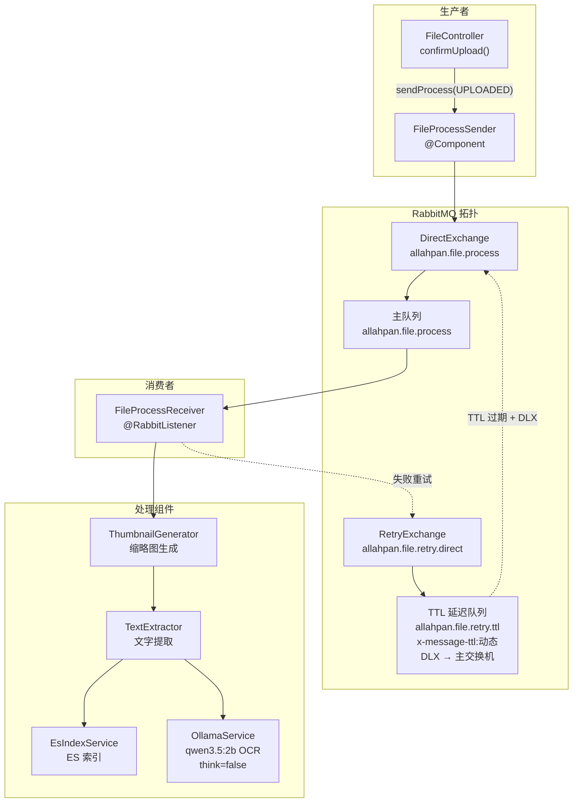
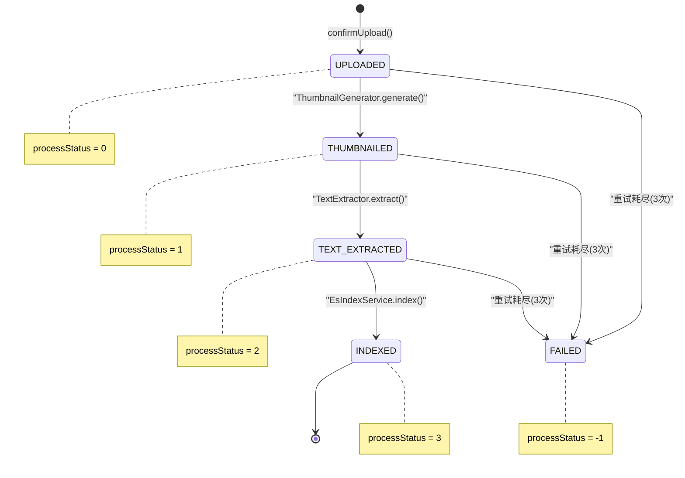
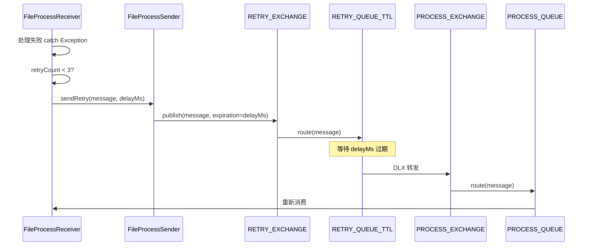
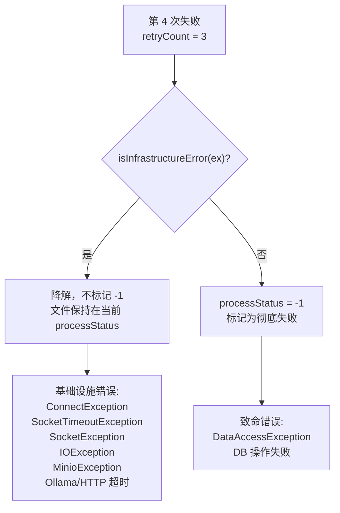

# 06 — 文件上传与处理流水线

**最后更新**: 2026-06-13

---

## 1. 概述

AllahPan 的文件处理采用 **异步流水线** 架构，基于 RabbitMQ 消息队列编排：

```
用户上传 → MinIO 存储 → 缩略图生成 → 文本提取(含AI OCR) → ES 索引 → 完成
```

每个阶段由消息驱动，失败自动重试（指数退避），前端通过 SSE 实时推送进度。

---

## 2. 架构全景



---

## 3. 阶段一：文件上传 (FileController + FileServiceImpl)

### 3.1 入口

```
POST /api/file/upload
Content-Type: multipart/form-data

参数:
  file:     文件本体 (MultipartFile)
  parentId: 目标文件夹 ID (可选, 默认 0=根目录)
```

### 3.2 处理流程

```
FileServiceImpl.upload(file, parentId)
│
├── ① 鉴权
│   从 SecurityContextHolder 获取当前用户 ID
│
├── ② 父目录校验
│   若 parentId > 0，确认 parent 存在且 isFolder=1
│
├── ③ 文件名校验
│   非空、≤255 字符
│
├── ④ 路径计算
│   resolveRelativePath(parentId, fileName)
│   → 从 parent 链回溯源，拼接 "folderA/folderB/file.txt"
│
├── ⑤ 命名冲突解决
│   resolveConflict(relativePath, pid)
│   → 若 MinIO 已有同名对象，追加 " (1)", " (2)" 直到不冲突
│
├── ⑥ MinIO 上传 + MD5 计算
│   storeAndCalculateMd5(stream, path, size, contentType)
│   → DigestInputStream 流式上传，同步计算 MD5（零内存缓冲）
│   → 返回完整文件的 MD5 十六进制串
│
├── ⑦ MD5 去重（秒传）
│   查询同 MD5 的未删除文件
│   ├── 命中 → 删除刚上传的 MinIO 对象
│   │         复用已有文件的 storageKey/contentType/thumbnailKey
│   │         直接标记 processStatus=3 (COMPLETED)
│   └── 未命中 → 继续
│
├── ⑧ 写入 DB
│   INSERT INTO files (uploader_id, parent_id, file_name, file_path,
│     storage_key, file_type, file_size, content_type, md5,
│       is_folder, process_status, create_time)
│   process_status = 0 (PENDING)
│
└── ⑨ 返回 File 实体
```

### 3.3 类型检测

`detectFileType(contentType)` 映射：

| MIME 前缀 | 类型 |
|-----------|------|
| `image/` | `IMAGE` |
| `video/` | `VIDEO` |
| `application/pdf`, `application/msword`, `application/vnd.*`, `text/` | `DOCUMENT` |
| 其他 | `OTHER` |

### 3.4 MD5 去重（秒传）

MD5 相同 + deleteTime IS NULL → 视为同一文件，新记录直接指向已有文件的 storageKey，跳过后续所有处理阶段。

---

## 4. 阶段二：消息发送 (FileController → RabbitMQ)

上传成功后，FileController 立即发送消息：

```java
fileProcessSender.sendProcess(new FileProcessMessage(fileId, Stage.UPLOADED));
```

### 4.1 消息体

```java
public class FileProcessMessage implements Serializable {
    enum Stage { UPLOADED, THUMBNAILED, TEXT_EXTRACTED, INDEXED, FAILED }

    Long fileId;           // 文件 ID
    Stage currentStage;    // 当前处理阶段
    byte  retryCount;      // 重试次数 (0-3)
    String lastError;      // 上次失败错误信息
}
```

### 4.2 RabbitMQ 拓扑

```
主交换机: allahpan.file.process (direct, durable)
主队列:   allahpan.file.process
路由键:   allahpan.file.process

重试交换机: allahpan.file.retry.direct (direct, durable)
重试队列:   allahpan.file.retry.ttl
           ├── x-dead-letter-exchange → 主交换机
           └── x-dead-letter-routing-key → 主路由键
```

序列化: Jackson2Json (Jackson2JsonMessageConverter)

---

## 5. 阶段三：异步处理 (FileProcessReceiver)

`@RabbitListener(queues = "allahpan.file.process")`

### 5.1 处理调度

```
handle(message)
│
├── 查 DB 获取文件记录
│   └── 文件不存在或已删除 → 丢弃消息
│
└── 按 currentStage 分发:
```

### 5.2 Stage: UPLOADED → THUMBNAILED

```
① 生成缩略图
   thumbnailGenerator.generate(file)
   
② 判断是否需要文本提取
   ├── IMAGE / DOCUMENT → sendProcess(Stage.THUMBNAILED)
   └── VIDEO / OTHER    → sendProcess(Stage.TEXT_EXTRACTED) [跳过]
   
③ DB 更新: processStatus = 1

④ SSE 广播: { fileId, parentId, processStatus, thumbnailKey }
```

### 5.3 Stage: THUMBNAILED → TEXT_EXTRACTED

```
① 文本提取
   textExtractor.extract(file)
   
② DB 更新: originText = 提取结果, processStatus = 2

③ sendProcess(Stage.TEXT_EXTRACTED)

④ SSE 广播
```

### 5.4 Stage: TEXT_EXTRACTED → COMPLETED

```
① ES 索引
   esIndexService.index(file)
   → POST localhost:8081/es-admin/files/index
   
② DB 更新: processStatus = 3 (COMPLETED)

③ SSE 广播
```

### 5.5 状态码定义

| 值 | 含义 |
|----|------|
| `0` | PENDING — 等待处理 |
| `1` | THUMBNAIL_GENERATED — 缩略图已生成 |
| `2` | TEXT_EXTRACTED — 文本已提取 |
| `3` | COMPLETED — 全部完成（已索引） |
| `-1` | FAILED — 致命错误，放弃处理 |



### 5.6 失败与重试

```
发生异常
│
├── retryCount < 3
│   ├── retryCount++
│   └── sendRetry(message, 30s × 2^retryCount)
│       即: 30s → 60s → 120s (指数退避)
│       实现: 发送到 retry.ttl 队列（带 TTL），TTL 过期后
│             RabbitMQ 通过 DLX 重新路由到主队列
│
└── retryCount >= 3 (重试耗尽)
    ├── 基础设施异常 (连接被拒/超时/Ollama OCR/缩略图)
    │   → 优雅降级，不标记 FAILED（文件仍可用）
    └── 致命异常 (数据库错误/DataAccessException)
        → processStatus = -1
```

实现方式：TTL + DLX（Dead Letter Exchange）模式。



> `RabbitMqConfig.java` 配置了完整的交换机/队列/绑定关系。重试和主处理共用同一个 `PROCESS_EXCHANGE`，通过 DLX 自动回环。

---

## 6. 缩略图生成 (ThumbnailGenerator)

### 6.1 支持的文件类型

| 类型 | 生成方式 |
|------|----------|
| IMAGE | `ImageIO.read()` → 缩放 |
| PDF | PDFBox 渲染第一页 @ DPI (默认150) → 缩放 |
| 其他 | 不生成 (返回 null) |

### 6.2 缩放规则

- 宽度: 300px
- 高度: 等比例
- 格式: JPEG
- 插值: 双线性
- 输出: UUID.jpg 存入 MinIO thumbnails bucket

---

## 7. 文本提取 (TextExtractor)

### 7.1 支持的格式

| 文件类型 | 库 | 方法 |
|----------|-----|------|
| `image/*` | Ollama (qwen3.5:2b) | AI OCR |
| `application/pdf` | PDFBox 3.0 | PDFTextStripper |
| `.docx` | Apache POI 5.5 | XWPFWordExtractor |
| `.doc` | Apache POI 5.5 | HWPFDocument |
| `.xlsx` | Apache POI 5.5 | XSSFExcelExtractor |
| `.xls` | Apache POI 5.5 | ExcelExtractor |
| `.pptx` | Apache POI 5.5 | XMLSlideShow |
| `.ppt` | Apache POI 5.5 | HSLFSlideShow |
| `text/*` | — | UTF-8 读取 |

### 7.2 Ollama AI OCR

```
流程:
  ① 从 MinIO 读取图片字节
  ② Base64 编码
  ③ POST {ollama.base-url}/api/chat
     模型: qwen3.5:2b (vision)
     参数: stream=false, think=false, num_predict=16384, num_ctx=8192
     
Prompt 策略:
  - 含文字图像 → 逐行提取 + 1-2句概括 + 5-10个搜索标签
  - 无文字图像 → [无文字] + 描述 + 3-5个标签
  
截断: 文本结果截断到 allahpan.text.max-length (默认 10000)
```

### 7.3 通用提取规则

- 所有文本均截断到 `allahpan.text.max-length` (默认 10000)
- 提取失败 → 抛 RuntimeException（触发重试）
- 最终失败 → 返回 null（文件仍可用，仅缺少全文搜索）

---

## 8. ES 索引同步 (EsIndexServiceImpl)

### 8.1 架构

`allahpan-core` 通过 REST 调用 `allahpan-search` (8081) 实现索引：

```
core (EsIndexServiceImpl)
  │
  ├── POST localhost:8081/es-admin/files/index    (索引单文件)
  ├── DELETE localhost:8081/es-admin/files/{id}   (删除单文件)
  └── DELETE localhost:8081/es-admin/files/_all   (清空全部)
  │
  ▼
search (EsFileController)
  │
  ▼
EsFileServiceImpl → Spring Data Elasticsearch → ES 8.11
```

### 8.2 重试与容错

| 层次 | 策略 |
|------|------|
| 单次索引 | 最多重试 3 次，间隔 2s/4s/6s |
| 启动清理 | 轮询 60 次 × 5s = 5 分钟等待搜索服务就绪 |
| 定时对账 | 每 30 分钟全量重建（删除+重新索引所有未删除文件） |

### 8.3 数据流

```json
POST /es-admin/files/index
{
  "fileId": 502,
  "fileName": "report.pdf",
  "fileType": "DOCUMENT",
  "filePath": "/Work/report.pdf",
  "fileSize": 102400,
  "isFolder": false,
  "uploaderId": 4,
  "uploaderName": "张三",
  "originText": "提取的全文内容...",
  "createTime": "2026-06-12T16:06:52.849+00:00"
}
```

---

## 9. SSE 实时推送 (SseBroadcaster)

客户端通过 `GET /api/file/watch?token=xxx` 订阅 SSE 流。

### 9.1 事件类型

| 事件 | 触发时机 | 携带数据 |
|------|---------|---------|
| `file-created` | Controller 上传完成后 | fileId, parentId |
| `file-updated` | 每个处理阶段完成后 | fileId, parentId, processStatus, thumbnailKey, originText |

前端 FileBrowser 收到事件后自动刷新对应目录的文件列表。


---

## 10. 异常分类与处理

| 异常类型 | 判断条件 | 重试耗尽后行为 |
|----------|---------|---------------|
| 基础设施异常 | ConnectException, SocketTimeoutException, Ollama 超时, 图片读取失败 | **优雅降级** — 不标记 FAILED，文件仍可用（缺少缩略图/文本/索引） |
| 致命异常 | DataAccessException (DB)、其他未分类异常 | 标记 processStatus = -1 |



- **基础设施错误**：Ollama/ES/网络不可达、超时时，不标记 -1，文件可正常使用（已生成的缩略图、已提取的文字保持有效）
- **致命错误**：数据库操作失败才标记 -1

---

## 11. 配置速查

| 配置项 | 默认值 | 说明 |
|--------|--------|------|
| `allahpan.text.max-length` | 10000 | 文本提取最大字符数 |
| `allahpan.thumbnail.pdf-dpi` | 150 | PDF 缩略图渲染 DPI |
| `ollama.base-url` | `http://localhost:11434` | Ollama 服务地址 |
| `ollama.model` | `qwen3.5:2b` | OCR 模型 |
| `ollama.timeout` | 120 | OCR 超时（秒） |
| `ollama.num-predict` | 16384 | 最大输出 token 数 |
| `minio.bucketName` | `allahpan-files` | 文件存储桶 |
| `minio.thumbnailBucket` | `allahpan-thumbnails` | 缩略图存储桶 |
| `minio.trashBucket` | `allahpan-trash` | 回收站存储桶 |

---

## 12. 功能完成度

| 功能 | 状态 | 备注 |
|------|------|------|
| IMAGE 缩略图 | ✅ 完成 | 300px 宽等比缩放，JPEG 格式，MinIO 读写 |
| PDF 缩略图 | ✅ 完成 | PDFBox 渲染首帧，可配置 DPI（默认 150） |
| IMAGE OCR | ✅ 完成 | Ollama qwen3.5:2b，think=false，num_predict=16384，timeout=120s |
| PDF 文字提取 | ✅ 完成 | PDFBox PDFTextStripper，跳过加密文件 |
| DOCX 文字提取 | ✅ 完成 | Apache POI XWPFWordExtractor |
| DOC 文字提取 | ✅ 完成 | Apache POI HWPFWordExtractor |
| XLSX 文字提取 | ✅ 完成 | Apache POI XSSFExcelExtractor |
| XLS 文字提取 | ✅ 完成 | Apache POI HSSFExcelExtractor |
| PPTX 文字提取 | ✅ 完成 | Apache POI XSLFPowerPointExtractor |
| PPT 文字提取 | ✅ 完成 | Apache POI PowerPointExtractor + HSLFSlideShow |
| 纯文本提取 | ✅ 完成 | UTF-8 读取，截断至 10000 字符 |
| VIDEO 缩略图 | ❌ TODO | — |
| ES 索引 | ✅ 完成 | HTTP → search :8081，失败降级不标记 -1 |
| ES 删除 | ✅ 完成 | permanentDelete/restore 调用，异常吞没 |
| ES 全量重建 | ✅ 完成 | rebuildAll() 先清空再全量索引 |

---

## 13. 关键文件索引

| 组件 | 文件 | 关键方法 |
|------|------|----------|
| RabbitMQ 配置 | `RabbitMqConfig.java` | 完整拓扑（交换机/队列/绑定/DLX） |
| 消息生产者 | `FileProcessSender.java` | `sendProcess()`, `sendRetry()` |
| 消息消费者 | `FileProcessReceiver.java` | `handle()` — 状态机 + 重试 |
| 消息实体 | `FileProcessMessage.java` | `Stage` 枚举 + `retryCount` |
| 缩略图生成 | `ThumbnailGenerator.java` | `generate()` — IMAGE + PDF done, MinIO 读写 |
| 文字提取 | `TextExtractor.java` | `extract()` — 7 种格式, MinIO 读取 |
| OCR 服务 | `OllamaService.java` | `ocr()` — Ollama vision API |
| ES 索引 | `EsIndexServiceImpl.java` | `index()`, `delete()` — HTTP → :8081，失败降级 |
| MinIO 操作 | `MinioUtil.java` | `getObject()`, `putThumbnail()` — 流水线文件读写 |
| SSE 广播 | `SseBroadcaster.java` | `broadcast()` — 状态变更推送 |
| 文件表更新 | `FileMapper.java` | `updateByPrimaryKeySelective()` / `updateByPrimaryKeyWithBLOBs()` |
