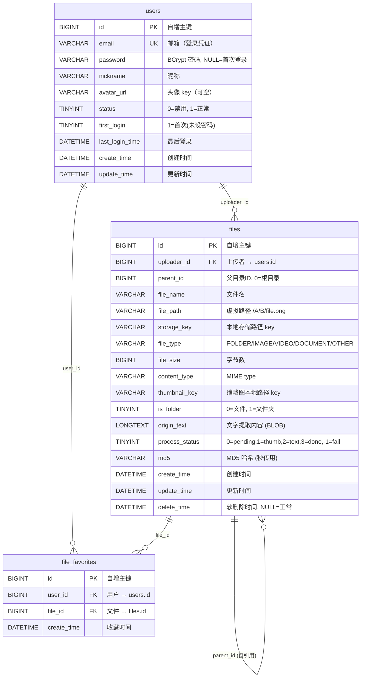
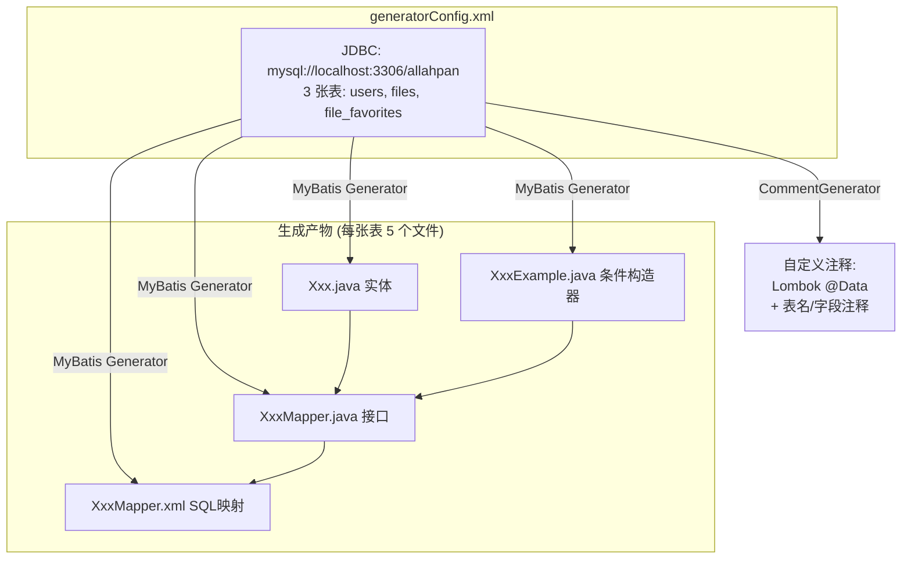
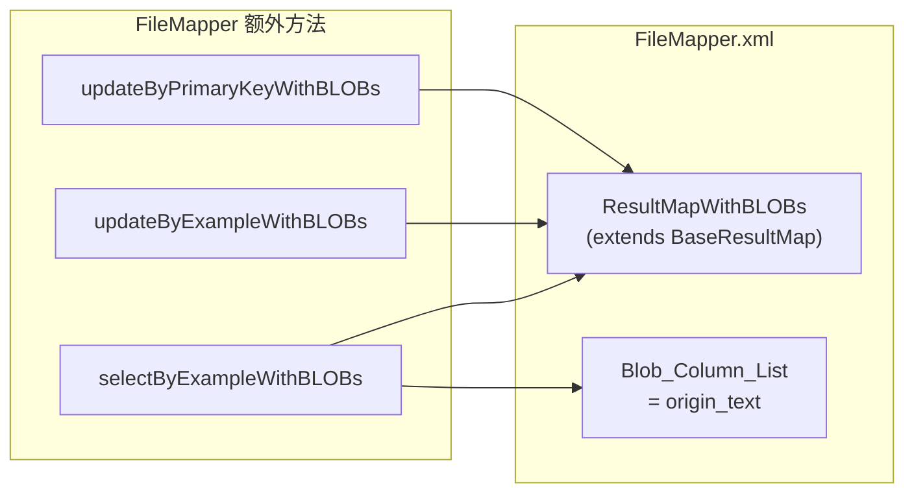

# 07 — 数据模型 ER 图

## 数据库 ER 图



## MyBatis Generator 代码生成关系



## 表 → Java 类映射

| 表名 | 实体 | Mapper | Example | XML | 特殊处理 |
|------|------|--------|---------|-----|----------|
| `users` | `User.java` | `UserMapper.java` | `UserExample.java` | `UserMapper.xml` | — |
| `files` | `File.java` | `FileMapper.java` | `FileExample.java` | `FileMapper.xml` | ⚠️ BLOB 列 `origin_text` |
| `file_favorites` | `FileFavorite.java` | `FileFavoriteMapper.java` | `FileFavoriteExample.java` | `FileFavoriteMapper.xml` | — |

## BLOB 列特殊处理 (origin_text)

`files.origin_text` 是 `LONGTEXT`，MBG 视为 BLOB 类型：



> **⚠️ 陷阱**: `selectByExample()` 和 `updateByPrimaryKey()` **不包含** `origin_text` 列。必须用 `selectByExampleWithBLOBs()` 等三个方法才能读写 `originText` 字段。

## 关键索引

```sql
-- users
PRIMARY KEY (id)
UNIQUE KEY (email)

-- files
PRIMARY KEY (id)
KEY (parent_id)
KEY (md5)              -- 秒传检测
KEY (uploader_id)

-- file_favorites
PRIMARY KEY (id)
UNIQUE KEY (user_id, file_id)  -- 防止重复收藏
```

## processStatus 枚举

| 值 | 含义 | 触发条件 |
|----|------|----------|
| `0` | 等待处理 | `confirmUpload` 后 |
| `1` | 缩略图完成 | RabbitMQ 消费者生成缩略图后 |
| `2` | 文字提取完成 | RabbitMQ OCR 完成后 |
| `3` | 全部完成(已索引) | ES 索引完成后；文件夹/秒传直接设此值 |
| `-1` | 处理失败 | 任何步骤异常 |

## isFolder 枚举

| 值 | 含义 |
|----|------|
| `0` | 文件 |
| `1` | 文件夹 |

## fileType 枚举

| 值 | 判断依据 |
|----|----------|
| `FOLDER` | 文件夹（手动设置） |
| `IMAGE` | contentType 以 `image/` 开头 |
| `VIDEO` | contentType 以 `video/` 开头 |
| `DOCUMENT` | `application/pdf` 或含 `document`/`spreadsheet`/`presentation` 及 `text/` |
| `OTHER` | 其他所有类型 |

## User 状态枚举

| 字段 | 值 | 含义 |
|------|-----|------|
| `status` | `0` | 禁用 |
| `status` | `1` | 正常 |
| `first_login` | `0` | 已设置密码 |
| `first_login` | `1` | 首次登录（未设密码） |

## 关键文件索引

| 文件 | 内容 |
|------|------|
| `init.sql` | 建表 DDL |
| `allahpan-mbg/src/main/resources/generatorConfig.xml` | MBG 生成配置 |
| `allahpan-mbg/src/main/java/.../mbg/Generator.java` | 生成器入口 |
| `allahpan-mbg/src/main/java/.../mbg/CommentGenerator.java` | 自定义注释生成 |
| `allahpan-mbg/src/main/java/.../mbg/model/User.java` | 用户实体 |
| `allahpan-mbg/src/main/java/.../mbg/model/File.java` | 文件实体（含 BLOB） |
| `allahpan-mbg/src/main/java/.../mbg/model/FileFavorite.java` | 收藏实体 |
| `allahpan-mbg/src/main/java/.../mbg/mapper/FileMapper.java` | 文件 Mapper（含 BLOBs 方法） |
