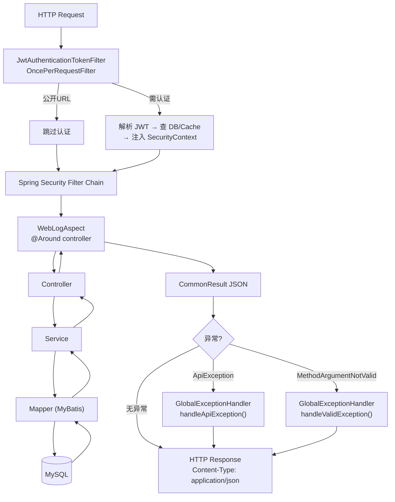
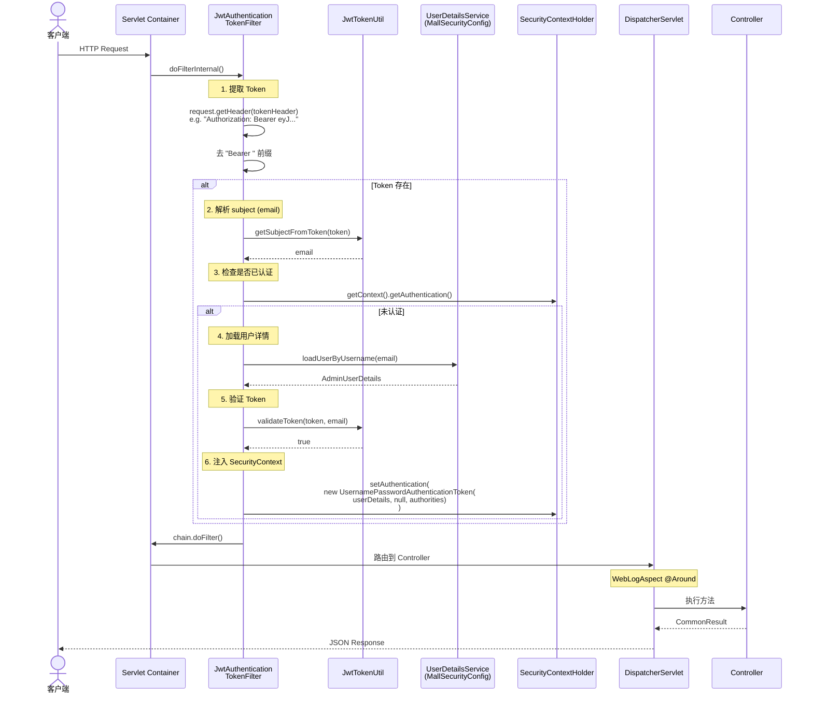
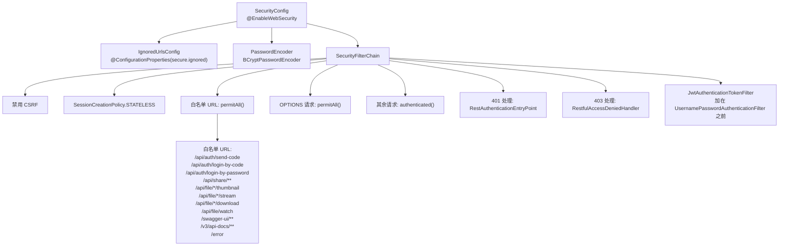
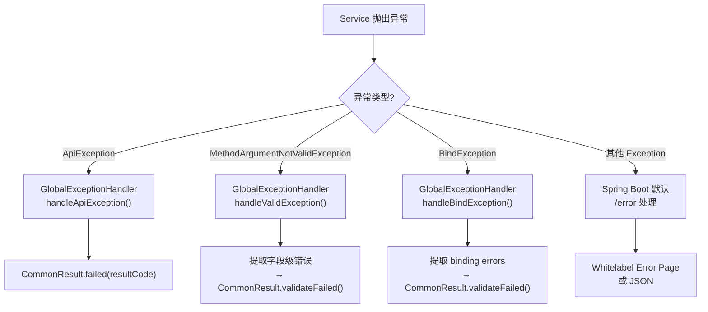

# 07 — 请求处理全链路图

## HTTP 请求 → 响应 完整路径



## Filter Chain 详细流程



## 控制器一览

| 控制器 | 路径前缀 | 端点数 | 关键端点 |
|--------|---------|--------|---------|
| `AuthController` | `/api/auth` | 3 | `send-code`, `login-by-code`, `login-by-password` |
| `UserController` | `/api/user` | 2 | `set-password`, `/me` |
| `FileController` | `/api/file` | 16 | `upload`, `create-folder`, `list`, `tree/{id}`, `getFile`, `download`, `stream`, `thumbnail`, `watch`(SSE), `rename`, `move`, `batch`, `trash`, `restore`, `permanent-delete` |
| `SearchController` | `/api/search` | 2 | GET search（代理转发）, POST rebuild-index |
| `FavoriteController` | `/api/favorite` | 4 | `POST /{fileId}`, `DELETE /{fileId}`, `GET /check/{fileId}`, `GET /list` |
| `ShareController` | `/api/share` | 3 | POST create（需认证）, GET access（公开）, DELETE revoke（需认证） |
| `ChunkController` | `/api/file/chunk` | 4 | `init`, `upload`, `complete`, `status/{uploadId}` — 大文件分片上传 |

> **端点总数**: core 模块共有 ~34 个端点（含 chunk 4 个），search 模块 5 个，合计约 39 个。

## 安全配置



## 异常处理链路



## 响应格式

所有 Controller 返回统一包装为 `CommonResult<T>`:

```json
{
  "code": 200,
  "message": "操作成功",
  "data": { ... }
}
```

错误时：
```json
{
  "code": 401,
  "message": "暂未登录或token过期",
  "data": null
}
```

## WebLogAspect 日志格式

每个 Controller 方法自动输出：
```
URL: /api/file/list, Method: GET, IP: 127.0.0.1,
Class: com.allahpan.controller.FileController,
Method: listFiles, Args: [0],
Result: CommonResult(code=200, ...), Spend: 15ms
```

异常时：
```
URL: /api/file/999, Method: GET, IP: 127.0.0.1,
Class: com.allahpan.controller.FileController,
Method: getFile, Args: [999],
ErrorMessage: 文件不存在, Spend: 8ms
```

## 关键文件索引

| 阶段 | 文件 | 关键方法/配置 |
|------|------|--------------|
| JWT 过滤器 | `JwtAuthenticationTokenFilter.java` | `doFilterInternal()` |
| JWT 工具 | `JwtTokenUtil.java` | `generateToken()`, `validateToken()`, `getSubjectFromToken()` |
| 安全配置 | `SecurityConfig.java` | `filterChain()`, `ignoredUrlsConfig()` |
| 用户加载 | `MallSecurityConfig.java` | `userDetailsService()` |
| 401 处理 | `RestAuthenticationEntryPoint.java` | `commence()` |
| 403 处理 | `RestfulAccessDeniedHandler.java` | `handle()` |
| 日志切面 | `WebLogAspect.java` | `doAround()` |
| 异常处理 | `GlobalExceptionHandler.java` | `handleApiException()`, `handleValidException()` |
| 响应包装 | `CommonResult.java` | `success()`, `failed()`, `unauthorized()`, `forbidden()` |
| 结果码 | `ResultCode.java` | `SUCCESS`, `UNAUTHORIZED`, `FORBIDDEN`, `TOO_MANY_REQUESTS`, ... |
| 断言工具 | `Asserts.java` | `fail()`, `isTrue()` |
| 搜索代理 | `SearchController.java` | `search()` / `rebuildIndex()` — RestTemplate → `:8081` |
| 分享 | `ShareController.java` | `createShare()`, `getShare()`, `deleteShare()` |
| 分片上传 | `ChunkController.java` | `init()`, `uploadChunk()`, `complete()`, `status()` |
| 布隆过滤 | `BloomFilterService.java` | `mightContain(email)` — Redis bitmap 预检 |
| 布隆初始化 | `BloomFilterInitializer.java` | `ApplicationRunner` — 启动时加载用户邮箱 |
| 收藏 | `FavoriteController.java` | `addFavorite()`, `removeFavorite()`, `isFavorited()`, `listFavorites()` |
