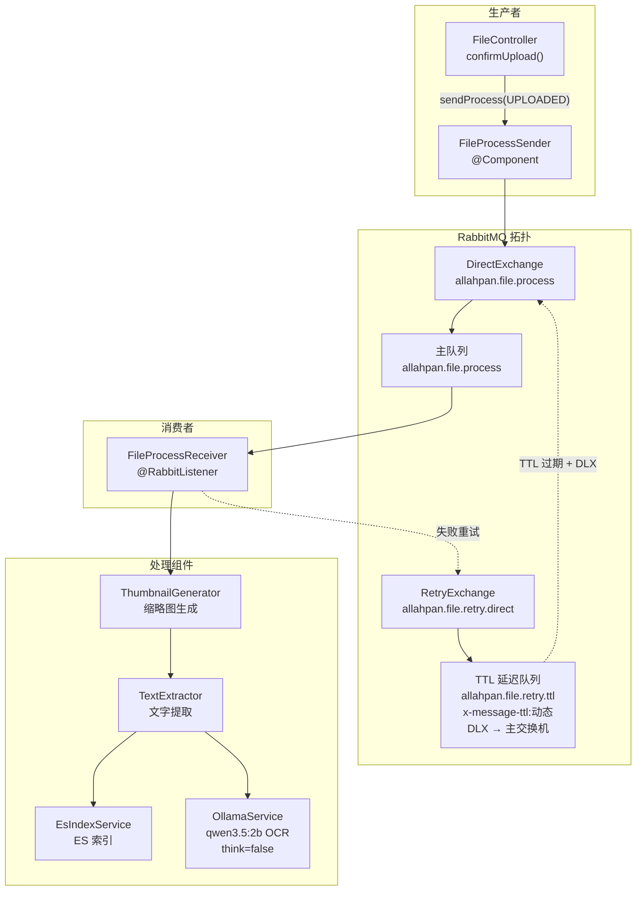
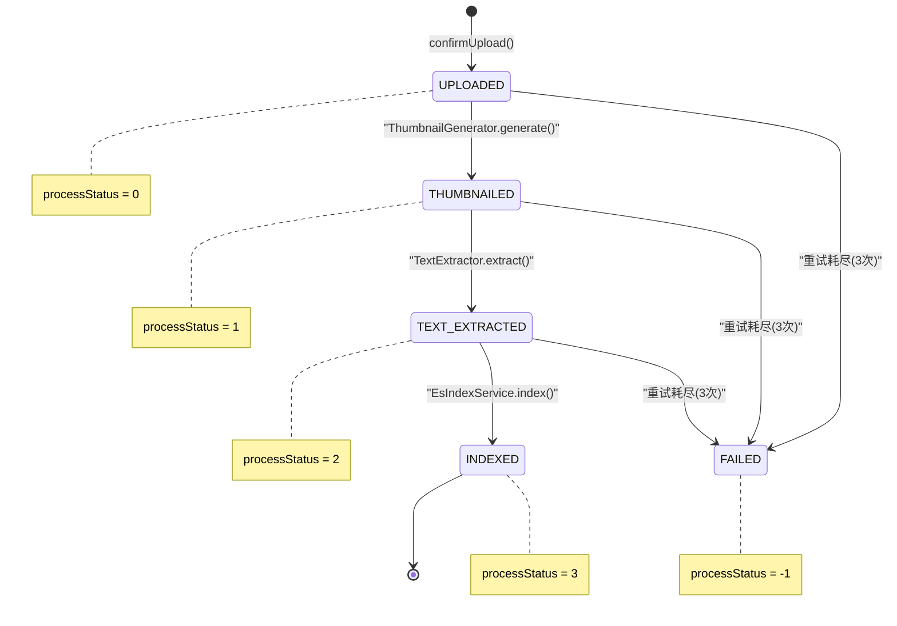
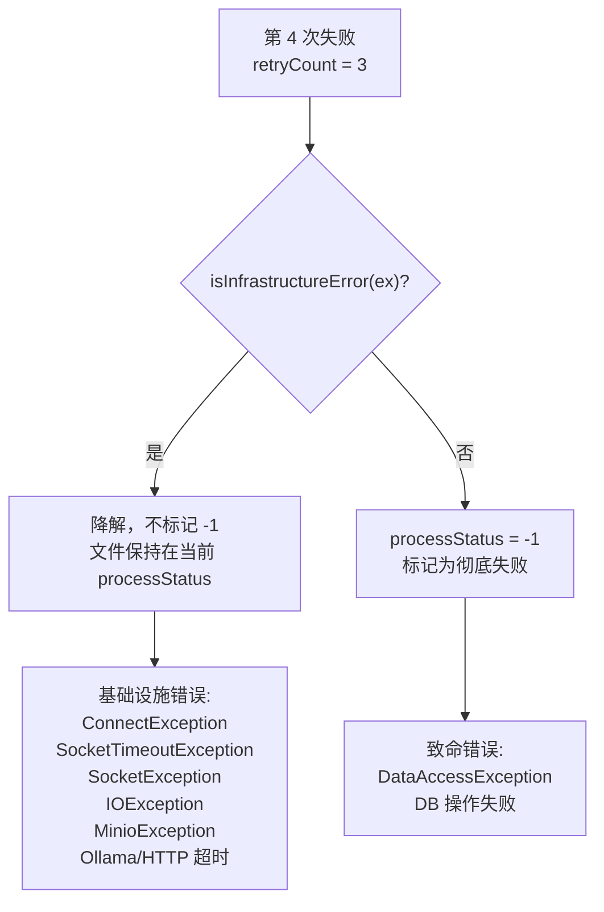
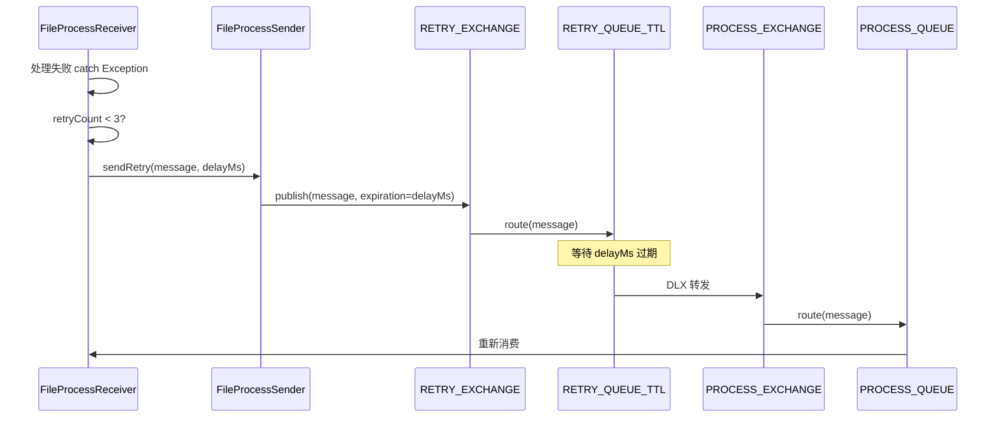

# 08 — RabbitMQ 文件处理流水线

## 概述

文件上传确认后，后端通过 RabbitMQ 消息队列串行处理三个阶段：**缩略图 → OCR 文字提取 → ES 索引**。每个阶段的输出决定下一阶段的输入，失败自动重试 3 次。

## 整体架构



## 状态机



## 阶段详解

### Stage 1: UPLOADED → THUMBNAILED

1. `ThumbnailGenerator.generate(file)` — 根据 fileType 分发:
   - **IMAGE**: 从 MinIO `allahpan-files` bucket 读取原图 → 缩放到 300px 宽 → 上传 JPEG 到 `allahpan-thumbnails` bucket via `MinioUtil.putThumbnail()` → 返回 `thumbnailKey`
   - **PDF**: PDFBox 渲染首帧 → 缩放至宽 300px → JPEG，可配置 DPI（默认 150）
   - **其他**: 跳过，`thumbnailKey` 保持 null
2. 更新 `processStatus = 1`
3. 判断是否需要文字提取（IMAGE/DOCUMENT 类型）:
   - 需要 → 发送 `THUMBNAILED` 消息
   - 不需要 → 直接跳到 `TEXT_EXTRACTED`（跳过文本提取，由下一阶段索引）

### Stage 2: THUMBNAILED → TEXT_EXTRACTED

1. `TextExtractor.extract(file)` — 根据 fileType 分发（从 MinIO 读取文件 via `MinioUtil.getObject()`）:
   - **IMAGE**: `OllamaService.ocr(file)` → 调用 Ollama `/api/chat`，qwen3.5:2b 模型，`think=false`，`num_predict=4096`，base64 图片 → 返回文字（~3.1s / 359 tokens / 699 chars）
   - **PDF**: PDFBox `PDFTextStripper` 提取文字，跳过加密文件
   - **DOCX**: Apache POI `XWPFWordExtractor`
   - **DOC**: Apache POI `HWPFWordExtractor` (旧格式)
   - **XLSX**: Apache POI `XSSFExcelExtractor`
   - **XLS**: Apache POI `HSSFExcelExtractor` (旧格式)
   - **PPTX**: Apache POI `XMLSlideShow` + `XSLFPowerPointExtractor`
   - **PPT**: Apache POI `HSLFSlideShow` + `PowerPointExtractor` (旧格式)
   - **纯文本**: UTF-8 读取文件内容
2. 提取到文字后存入 `file.originText`（LONGTEXT BLOB 列，截断至 maxTextLength=10000 字符）
3. 更新 `processStatus = 2`
4. 发送 `TEXT_EXTRACTED` 消息

> **Ollama 调用注意事项**: 必须用 `String.format` 构建 JSON 请求体，不能传 `Map<String,Object>` 给 Jackson 序列化（会丢失嵌套 `options` 字段）。模型 `qwen3.5:2b`，`num_ctx=8192`，timeout=60s。

### Stage 3: TEXT_EXTRACTED → INDEXED

1. `EsIndexService.index(file)` → POST `http://localhost:8081/es-admin/files/index` → search 应用写入 Elasticsearch
2. **ES 索引失败不标记 processStatus=-1**（降级，文件仍可用），仅记录 WARN 日志
3. 成功则更新 `processStatus = 3`
4. 处理完成

## 错误分级处理

重试耗尽后（第 4 次失败），根据异常类型决定最终行为：



- **基础设施错误**：Ollama/ES/网络不可达、超时时，不标记 -1，文件可正常使用（已生成的缩略图、已提取的文字保持有效）
- **致命错误**：数据库操作失败才标记 -1
- 每个阶段完成后调用 `notifyStatusChange(file)` 推送 SSE 事件

## SSE 状态推送

流水线每完成一个阶段，通过 `SseBroadcaster.broadcast()` 推送 `file-updated` SSE 事件：


SSE 事件数据: `{fileId, parentId, processStatus, thumbnailKey, originText}`

## 重试机制

```
第 1 次失败 → 延迟 30s 重试
第 2 次失败 → 延迟 60s 重试
第 3 次失败 → 延迟 120s 重试
第 4 次失败 → 错误分级处理（见上文）
```

实现方式：TTL + DLX（Dead Letter Exchange）模式。



> `RabbitMqConfig.java` 配置了完整的交换机/队列/绑定关系。重试和主处理共用同一个 `PROCESS_EXCHANGE`，通过 DLX 自动回环。

## 消息实体

`FileProcessMessage`（`com.allahpan.domain`）：

| 字段 | 类型 | 说明 |
|------|------|------|
| `fileId` | `Long` | 文件 ID |
| `currentStage` | `Stage` 枚举 | `UPLOADED` / `THUMBNAILED` / `TEXT_EXTRACTED` / `INDEXED` / `FAILED` |
| `retryCount` | `byte` | 当前重试次数（0~3） |
| `lastError` | `String` | 最后一次错误信息 |

使用 `Jackson2JsonMessageConverter` 序列化为 JSON 传输。

## 已完成 / TODO

| 功能 | 状态 | 备注 |
|------|------|------|
| IMAGE 缩略图 | ✅ 完成 | 300px 宽等比缩放，JPEG 格式，MinIO 读写 |
| PDF 缩略图 | ✅ 完成 | PDFBox 渲染首帧，可配置 DPI（默认 150） |
| IMAGE OCR | ✅ 完成 | Ollama qwen3.5:2b，think=false，num_predict=4096，String.format JSON |
| PDF 文字提取 | ✅ 完成 | PDFBox PDFTextStripper，跳过加密文件 |
| DOCX 文字提取 | ✅ 完成 | Apache POI XWPFWordExtractor |
| DOC 文字提取 | ✅ 完成 | Apache POI HWPFWordExtractor |
| XLSX 文字提取 | ✅ 完成 | Apache POI XSSFExcelExtractor |
| XLS 文字提取 | ✅ 完成 | Apache POI HSSFExcelExtractor |
| PPTX 文字提取 | ✅ 完成 | Apache POI XSLFPowerPointExtractor |
| PPT 文字提取 | ✅ 完成 | Apache POI PowerPointExtractor + HSLFSlideShow |
| 纯文本提取 | ✅ 完成 | UTF-8 读取，截断至 10000 字符 |
| VIDEO 缩略图 | ❌ TODO | — |
| ES 索引 | ✅ 完成 | HTTP → search :8081，失败降级不标记 -1 |
| ES 删除 | ✅ 完成 | permanentDelete/restore 调用，异常吞没 |
| ES 全量重建 | ✅ 完成 | rebuildAll() 先清空再全量索引 |

## 关键文件索引

| 组件 | 文件 | 关键方法 |
|------|------|----------|
| RabbitMQ 配置 | `RabbitMqConfig.java` | 完整拓扑（交换机/队列/绑定/DLX） |
| 消息生产者 | `FileProcessSender.java` | `sendProcess()`, `sendRetry()` |
| 消息消费者 | `FileProcessReceiver.java` | `handle()` — 状态机 + 重试 |
| 消息实体 | `FileProcessMessage.java` | `Stage` 枚举 + `retryCount` |
| 缩略图生成 | `ThumbnailGenerator.java` | `generate()` — IMAGE + PDF done, MinIO 读写 |
| 文字提取 | `TextExtractor.java` | `extract()` — 7 种格式, MinIO 读取 |
| OCR 服务 | `OllamaService.java` | `ocr()` — Ollama vision API, String.format JSON |
| ES 索引 | `EsIndexServiceImpl.java` | `index()`, `delete()` — HTTP → :8081，失败降级 |
| MinIO 操作 | `MinioUtil.java` | `getObject()`, `putThumbnail()` — 流水线文件读写 |
| SSE 广播 | `SseBroadcaster.java` | `broadcast()` — 状态变更推送 |
| 文件表更新 | `FileMapper.java` | `updateByPrimaryKeySelective()` / `updateByPrimaryKeyWithBLOBs()` |
