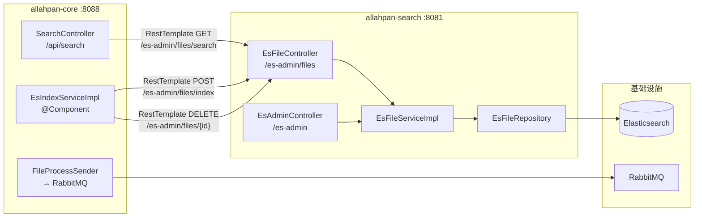

# 08 — 搜索系统架构

**最后更新**: 2026-06-13

---

## 1. 概述

AllahPan 采用 **独立搜索微服务** 架构，搜索服务 (`allahpan-search:8081`) 独立于主应用 (`allahpan-core:8088`) 运行。

```
用户搜索请求
     │
     ▼
┌─────────────────────┐
│  allahpan-web (Vue) │  ← 直接调用 core 的搜索 API
└────────┬────────────┘
         │ GET /api/file/search?keyword=xxx
         ▼
┌─────────────────────┐
│  allahpan-core:8088 │  ← 透传搜索请求
└────────┬────────────┘
         │ GET /api/file/search → RestTemplate
         ▼
┌─────────────────────┐
│  allahpan-search    │  ← Elasticsearch 搜索 + IK 分词
│  :8081 (127.0.0.1)  │
│                     │
│  Spring Data ES     │
│  + ES Client 8.11   │
└────────┬────────────┘
         │
         ▼
┌─────────────────────┐
│  Elasticsearch 8.11 │  ← IK 中文分词 (ik_max_word / ik_smart)
│  :9200              │
└─────────────────────┘
```

---

## 2. 索引设计

### 2.1 索引定义

| 属性 | 值 |
|------|-----|
| 索引名 | `allahpan_files` |
| 分片数 | 1 |
| 副本数 | 0 (单节点开发环境) |

### 2.2 文档模型 (EsFile)

```java
@Document(indexName = "allahpan_files")
public class EsFile {

    @Id
    private Long fileId;                          // 对应 DB files.id

    @Field(type = Text, analyzer = "ik_max_word")  // IK 细粒度分词
    private String fileName;                       // 文件名

    @Field(type = Keyword)
    private String fileType;                       // IMAGE/VIDEO/DOCUMENT/OTHER/FOLDER

    @Field(type = Text, analyzer = "ik_max_word")  // IK 细粒度分词
    private String originText;                     // 提取的全文内容（搜索主战场）

    @Field(type = Text, analyzer = "ik_max_word")
    private String filePath;                       // 虚拟路径

    private Long uploaderId;
    private String uploaderName;                   // 上传者昵称
    private Long fileSize;
    private Boolean isFolder;

    @Field(type = Date)
    private Date createTime;
}
```

### 2.3 字段分析器策略

| 字段 | 类型 | 分析器 | 原因 |
|------|------|--------|------|
| `fileName` | Text + IK | `ik_max_word` | 中文文件名需要细粒度分词搜索 |
| `originText` | Text + IK | `ik_max_word` | 全文内容搜索，需要最多的分词匹配 |
| `filePath` | Text + IK | `ik_max_word` | 路径中包含中文文件夹名 |
| `fileType` | Keyword | — | 精确过滤，不分词 |
| `uploaderName` | Keyword | — | 精确匹配 |

---

## 3. 搜索查询流程

### 3.1 前端调用链

```
SearchBar.vue (用户输入)
  │
  ▼
search.js: searchFiles({ keyword, fileType, pageNum, pageSize })
  │
  ▼
GET /api/search?keyword=xxx&fileType=IMAGE&pageNum=1&pageSize=20
  │
  ▼
SearchController.search()
  │
  ▼
RestTemplate → GET localhost:8081/es-admin/files/search
  │
  ▼
EsFileController.search()
  │
  ▼
EsFileServiceImpl.search()
```

### 3.2 搜索请求构建 (Elasticsearch Java Client)

```java
SearchRequest.of(s -> s
    .index("allahpan_files")
    .query(q -> q.bool(b -> {
        // ① must: 多字段匹配（至少命中一个）
        b.must(m -> m.multiMatch(mm -> mm
            .fields("fileName^10", "originText^5", "originText.char^2")
            .query(keyword)
            .type(TextQueryType.BestFields)));

        // ② should: 文件名命中额外加分 (boost ×50)
        b.should(sh -> sh.match(mt -> mt
            .field("fileName")
            .query(keyword)
            .boost(50.0f)));

        // ③ filter: 文件类型精确过滤（可选）
        if (fileType != null)
            b.filter(f -> f.term(t -> t.field("fileType").value(fileType)));

        return b;
    }))
    // ④ 高亮
    .highlight(h -> h
        .fields("fileName", hf -> hf.numberOfFragments(0)
                .preTags("<mark>").postTags("</mark>"))
        .fields("originText", hf -> hf.numberOfFragments(3).fragmentSize(100)
                .preTags("<mark>").postTags("</mark>"))
        .fields("originText.char", ...))
    // ⑤ 聚合: 按文件类型分组统计
    .aggregations("fileTypes", a -> a
        .terms(t -> t.field("fileType.keyword").size(10)))
    // ⑥ 分页
    .from((pageNum - 1) * pageSize)
    .size(pageSize)
);
```

### 3.3 权重策略

| 字段 | 权重 | 说明 |
|------|------|------|
| `fileName` | ×10 | 文件名匹配优先级最高 |
| `originText` | ×5 | 全文内容匹配次之 |
| `originText.char` | ×2 | 字符级子字段兜底 |
| `fileName` (should) | ×50 | 文件名命中额外 boost，确保标题结果排在前面 |

### 3.4 返回格式

```json
{
  "list": [
    {
      "fileId": 502,
      "fileName": "report.pdf",
      "fileType": "DOCUMENT",
      "filePath": "/Work/report.pdf",
      "uploaderName": "张三",
      "fileSize": 102400,
      "createTime": "2026-06-12T16:06:52.849+00:00",
      "fileNameHighlight": "2025年<mark>财务</mark>报告.pdf",
      "contentSnippets": [
        "本次<mark>财务</mark>报表显示...",
        "...经营活动<mark>财务</mark>指标..."
      ],
      "score": 12.45
    }
  ],
  "totalCount": 42,
  "aggregations": {
    "fileTypes": [
      {"type": "DOCUMENT", "count": 25},
      {"type": "IMAGE", "count": 15},
      {"type": "FOLDER", "count": 2}
    ]
  }
}
```

---

## 4. IK 分词器

### 4.1 安装

通过 Dockerfile 在 ES 8.11 镜像上安装：

```dockerfile
FROM docker.elastic.co/elasticsearch/elasticsearch:8.11.0
COPY elasticsearch-analysis-ik-8.11.0.zip /tmp/
RUN bin/elasticsearch-plugin install --batch file:///tmp/elasticsearch-analysis-ik-8.11.0.zip
```

### 4.2 两种模式

| 模式 | 说明 | 示例输入 | 示例输出 |
|------|------|----------|----------|
| `ik_max_word` | 最细粒度切分，穷尽词汇组合 | "中华人民共和国" | `中华人民共和国` `中华人民` `中华` `华人` `人民共和国` `人民` `共和国` `共和` `国` |
| `ik_smart` | 最粗粒度切分，非复合词 | "中华人民共和国" | `中华人民共和国` |

本系统使用 `ik_max_word`，保证搜索召回率最大。

### 4.3 索引策略

`fileName`、`originText`、`filePath` 三个 Text 字段在建索引时使用 `ik_max_word` 分析，搜索时同样使用 `ik_max_word` 分析查询词，实现中英文混合搜索。

### 4.4 IK 插件 Docker 持久化

IK 插件通过自定义 Docker 镜像预装，容器重建后自动可用：

```
docker/elasticsearch/
├── Dockerfile                              # FROM es:8.11.0, COPY + plugin install
└── elasticsearch-analysis-ik-8.11.0.zip    # 编译好的插件包 (4.6MB)
```

`docker-compose.yml` 中 ES 服务使用 `build`（非 `image`）构建 `allahpan-elasticsearch:8.11.0-ik` 镜像。

---

## 5. 索引管理

### 5.1 初始化

搜索服务启动时 (`EsFileServiceImpl.ensureIndexExists()`):

```
① 删除旧索引 (避免不兼容的 mapping)
② 重新创建索引 allahpan_files
③ 若索引已存在 (resource_already_exists_exception) → 忽略
```

### 5.2 启动对账

core 模块启动后 (`EsIndexServiceImpl.scheduleStartupCleanup()`):

```
轮询 GET localhost:8081/es-admin/files/search?keyword=__health__
  ├── 每 5 秒一次, 最多 60 次 (5 分钟)
  ├── 搜索服务就绪 → 全量重建索引
  └── 5 分钟超时 → 放弃, 后续由定时对账补救
```

### 5.3 定时对账

```java
@Scheduled(fixedDelay = 30 * 60 * 1000, initialDelay = 10 * 60 * 1000)
```

每 30 分钟全量重建索引（删除全部 + 遍历 DB 重新索引所有未删除非文件夹文件），清理 ES 中的孤儿文档。

### 5.4 管理接口 (EsAdminController)

```
POST   /es-admin/rebuild    — 全量重建 (传入文件数据列表)
POST   /es-admin/files/index   — 索引单文件
DELETE /es-admin/files/{id}    — 删除单文件
DELETE /es-admin/files/_all    — 清空全部
GET    /es-admin/files/search  — 搜索
```

### 5.5 API 端点详情

**EsFileController** (`/es-admin/files`):

| 方法 | 路径 | 功能 | 调用方 |
|------|------|------|--------|
| `POST` | `/es-admin/files/index` | 索引单个文件 | `EsIndexServiceImpl` (core) |
| `DELETE` | `/es-admin/files/{fileId}` | 删除单个索引 | `EsIndexServiceImpl` (core) |
| `DELETE` | `/es-admin/files/_all` | 清空所有索引 | `EsIndexServiceImpl.rebuildAll()` (core) |
| `GET` | `/es-admin/files/search` | 搜索文件 | `SearchController` (core) |

搜索参数: `keyword` (必填), `fileType` (可选), `pageNum` (默认 1), `pageSize` (默认 20)。

**EsAdminController** (`/es-admin`):

| 方法 | 路径 | 功能 |
|------|------|------|
| `POST` | `/es-admin/rebuild` | 全量重建索引（接收文件列表 JSON） |

### 5.6 启动时孤儿文档清理

`EsIndexServiceImpl` 通过 `@PostConstruct` 调度启动后 30 秒执行清理：

1. 从 ES 查询所有已索引的 `fileId`
2. 对比 MySQL `files` 表：应存在的（未删除的非文件夹文件）vs 不应存在的（已删除/不存在）
3. 删除 ES 中不应存在的文档
4. 补偿索引 MySQL 中有但 ES 中缺失的文件

这确保了重启后 search 服务恢复时 ES 索引与数据库一致。

---

## 6. 数据流全景

```
                      ┌──────────────────────────────────┐
                      │          数据库 (MySQL)           │
                      │  files 表 (fileName, originText, │
                      │            filePath, fileType...) │
                      └──────────────┬───────────────────┘
                                     │
              ┌──────────────────────┼──────────────────────┐
              │                      │                      │
        [文件上传]             [文件修改]              [文件删除]
              │                      │                      │
              ▼                      ▼                      ▼
      RabbitMQ 流水线        直接调用 index()         直接调用 delete()
      TEXT_EXTRACTED 后          │                      │
              │                  │                      │
              ▼                  │                      │
      EsIndexServiceImpl ────────┴──────────────────────┘
              │
              │ REST (localhost:8081)
              ▼
      EsFileController
              │
              ▼
      EsFileServiceImpl → Spring Data ES → Elasticsearch
```

---

## 7. 模块依赖

```
allahpan-core (8088)
  │
  ├── EsIndexService (接口)
  ├── EsIndexServiceImpl (实现, 通过 RestTemplate 调 search)
  │
  └── 依赖: allahpan-common (仅共用工具类, 无 search 依赖)

allahpan-search (8081, 绑定 127.0.0.1)
  │
  ├── EsFileRepository (Spring Data ES)
  ├── EsFileServiceImpl (搜索逻辑)
  ├── EsFileController (索引管理 + 搜索 API)
  ├── EsAdminController (管理接口)
  │
  └── 依赖: allahpan-common (仅共用工具类, 无 core 依赖)
```

两个模块完全解耦，通过 HTTP 通信。search 模块绑定 `127.0.0.1`，不对外暴露。

### 7.1 搜索模块目录结构 (7 文件)

```
allahpan-search/src/main/java/com/allahpan/search/
├── SearchApplication.java          @SpringBootApplication 入口
├── domain/
│   └── EsFile.java                 ES 文档实体 (@Document indexName: allahpan_files)
├── repository/
│   └── EsFileRepository.java       Spring Data ES Repository<EsFile, Long>
├── service/
│   ├── EsFileService.java          接口: index / delete / search
│   └── impl/
│       └── EsFileServiceImpl.java  实现: ES 索引操作 + 搜索
└── controller/
    ├── EsFileController.java       /es-admin/files — index / delete / search
    └── EsAdminController.java      /es-admin — rebuild 全量重建索引
```

### 7.2 模块间通信



**两条通信路径:**
1. **搜索**: `core:SearchController` → HTTP → `search:EsFileController.search()` → ES 查询
2. **索引/删除**: `core:EsIndexServiceImpl` → HTTP → `search:EsFileController.index()/delete()` → ES 写入

> **实现架构**: `EsFileServiceImpl` 同时使用两种 ES 客户端：
> - `ElasticsearchClient` (Java API Client 8.x) — 用于 `search()`、`deleteAll()`、`ensureIndexExists()` 等需要构建复杂 DSL 查询的操作
> - `EsFileRepository` (Spring Data Elasticsearch) — 用于简单的 `save()` 和 `delete()` 操作

---

## 8. 前端搜索体验

### 8.1 搜索入口

- **全局搜索栏** (`AppHeader.vue`): 顶部常驻，支持跳转到搜索结果页
- **搜索结果页** (`Search.vue`): 展示文件列表 + 高亮片段 + 类型筛选

### 8.2 交互流程

```
用户输入关键词
     │
     ▼
SearchBar.vue (防抖 300ms)
     │
     ▼
router.push('/search?keyword=xxx')
     │
     ▼
Search.vue 加载
  ├── 调用 searchFiles API
  ├── 展示结果列表（文件名高亮 + 内容片段高亮）
  ├── 左侧类型筛选（使用聚合结果）
  └── 分页浏览
```

---

## 9. 配置速查

| 配置项 | 值 | 说明 |
|--------|-----|------|
| ES 索引名 | `allahpan_files` | 自动创建 |
| 分片/副本 | 1/0 | 单节点开发配置 |
| IK 版本 | 8.11.0 | 与 ES 版本一致 |
| 搜索服务端口 | 8081 | 绑定 127.0.0.1 |
| 搜索服务地址 | `http://localhost:8081` | core 通过此地址调用 |
| 定时对账间隔 | 30 分钟 | 清理孤儿文档 |
| 启动清理超时 | 5 分钟 | 轮询等待搜索服务就绪 |

---

## 10. 容错机制

整个搜索链路采用**优雅降级**策略，确保搜索服务不可用时不影响核心文件功能。

### 10.1 search 端容错

`EsFileServiceImpl`:
- **`search()`**: 捕获 `Exception`，检查消息是否包含 `index_not_found_exception` → 返回空结果 `{list: [], totalCount: 0}`，不抛出异常。其他异常重新抛出。
- **`deleteAll()`**: 捕获 `index_not_found_exception` → 返回 `deleted=0`，不抛出异常。
- **聚合字段使用 `fileType.keyword`**: `fileType` 是 `keyword` 类型，ES Java Client 8.x 中 `terms` 聚合必须使用 `.keyword` 子字段，否则触发 `fielddata` 禁用错误。

### 10.2 core 端容错

`EsIndexServiceImpl` 和 `SearchController` 均采用**不崩溃**策略：

- **`EsIndexServiceImpl.index()`**: 捕获所有异常，仅记录 WARN 日志，不重新抛出。pipeline Stage 3 失败不会触发重试，也不会标记 processStatus=-1。
- **`EsIndexServiceImpl.delete()`**: 捕获并吞没所有异常（静默失败），不影响文件删除流程。
- **`EsIndexServiceImpl.rebuildAll()`**: Step 1（DELETE /_all）异常捕获并警告；Step 2（逐条索引）单个文件失败继续处理下一个。
- **`SearchController.search()`**: 捕获 `RestClientException`，返回 `CommonResult.failed("搜索服务暂不可用，请稍后重试")`，不会抛出 500。
- **`SearchController.rebuildIndex()`**: 委托 `esIndexService.rebuildAll()`，内部有容错。

---

## 11. 关键文件索引

| 组件 | 文件 | 职责 |
|------|------|------|
| 搜索入口 | `allahpan-search/.../SearchApplication.java` | `@SpringBootApplication` :8081 |
| ES 文档 | `EsFile.java` | `@Document(indexName="allahpan_files")` |
| ES 仓库 | `EsFileRepository.java` | Spring Data ES Repository |
| ES 服务 | `EsFileServiceImpl.java` | `index()` / `delete()` / `search()` |
| ES 控制器 | `EsFileController.java` | `/es-admin/files/*` |
| 管理控制器 | `EsAdminController.java` | `/es-admin/rebuild` |
| core 搜索代理 | `allahpan-core/.../controller/SearchController.java` | `/api/search` + `/api/search/rebuild-index` |
| core 索引服务 | `allahpan-core/.../component/EsIndexServiceImpl.java` | HTTP 调用 search 服务，容错降级 |
