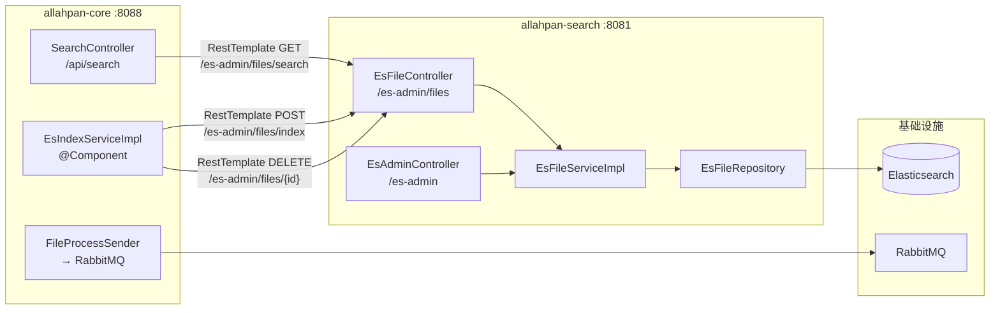

# 09 — 搜索模块

## 概述

`allahpan-search` 是独立的 Spring Boot 应用（端口 **:8081**），通过 Spring Data Elasticsearch 管理文件索引。与 `allahpan-core` 通过 HTTP API 通信，共享 MySQL 数据库获取文件元数据。

## 模块结构 (7 文件)

```
allahpan-search/src/main/java/com/allahpan/search/
├── SearchApplication.java          @SpringBootApplication 入口
├── domain/
│   └── EsFile.java                 ES 文档实体 (@Document indexName: allahpan_files)
├── repository/
│   └── EsFileRepository.java       Spring Data ES Repository<EsFile, Long>
├── service/
│   ├── EsFileService.java          接口: index / delete / search
│   └── impl/
│       └── EsFileServiceImpl.java  实现: ES 索引操作 + 搜索
└── controller/
    ├── EsFileController.java       /es-admin/files — index / delete / search
    └── EsAdminController.java      /es-admin — rebuild 全量重建索引
```

## 与 core 模块的通信



**两条通信路径:**
1. **搜索**: `core:SearchController` → HTTP → `search:EsFileController.search()` → ES 查询
2. **索引/删除**: `core:EsIndexServiceImpl` → HTTP → `search:EsFileController.index()/delete()` → ES 写入

> 注意：`FileProcessReceiver` 在 `TEXT_EXTRACTED` 阶段调用 `EsIndexServiceImpl.index()`，这是异步的（通过 RabbitMQ），不阻塞 HTTP 响应。

## ES 文档结构

`EsFile` — index: `allahpan_files`，1 shard，0 replica：

| 字段 | ES 类型 | 说明 |
|------|---------|------|
| `fileId` | `@Id` (Long) | 与 MySQL `files.id` 一致 |
| `fileName` | `text` (ik_max_word) | 文件名，中文分词 |
| `fileType` | `keyword` | IMAGE / VIDEO / DOCUMENT / OTHER / FOLDER |
| `originText` | `text` (ik_max_word) | OCR 提取文字，全文检索核心 |
| `filePath` | `text` (ik_max_word) | 虚拟路径 `/A/B/file.png` |
| `uploaderId` | `Long` | 上传者 ID |
| `uploaderName` | `keyword` | 上传者昵称 |
| `fileSize` | `Long` | 文件大小（字节） |
| `isFolder` | `Boolean` | 是否文件夹 |
| `createTime` | `date` | 创建时间 |

## API 端点

### EsFileController (`/es-admin/files`)

| 方法 | 路径 | 功能 | 调用方 |
|------|------|------|--------|
| `POST` | `/es-admin/files/index` | 索引单个文件 | `EsIndexServiceImpl` (core) |
| `DELETE` | `/es-admin/files/{fileId}` | 删除单个索引 | `EsIndexServiceImpl` (core) |
| `DELETE` | `/es-admin/files/_all` | 清空所有索引 | `EsIndexServiceImpl.rebuildAll()` (core) |
| `GET` | `/es-admin/files/search` | 搜索文件 | `SearchController` (core) |

搜索参数: `keyword` (必填), `fileType` (可选), `pageNum` (默认 1), `pageSize` (默认 20)。

### EsAdminController (`/es-admin`)

| 方法 | 路径 | 功能 |
|------|------|------|
| `POST` | `/es-admin/rebuild` | 全量重建索引（接收文件列表 JSON） |

## core 端容错机制

`EsIndexServiceImpl` 和 `SearchController` 均采用**不崩溃**策略：

- **`EsIndexServiceImpl.index()`**: 捕获所有异常，仅记录 WARN 日志（"ES 索引失败（搜索服务不可用，文件仍可正常使用）"），不重新抛出。这意味着 pipeline Stage 3 失败**不会触发重试，也不会标记 processStatus=-1**。
- **`EsIndexServiceImpl.delete()`**: 捕获并吞没所有异常（静默失败），不影响文件删除流程。
- **`EsIndexServiceImpl.rebuildAll()`**: Step 1（DELETE /_all）异常捕获并警告；Step 2（逐条索引）单个文件失败继续处理下一个。
- **`SearchController.search()`**: 捕获 `RestClientException`，返回 `CommonResult.failed("搜索服务暂不可用，请稍后重试")`，不会抛出 500。
- **`SearchController.rebuildIndex()`**: 委托 `esIndexService.rebuildAll()`，内部有容错。

## 启动时孤儿文档清理

`EsIndexServiceImpl` 通过 `@PostConstruct` 调度启动后 30 秒执行清理：

1. 从 ES 查询所有已索引的 `fileId`
2. 对比 MySQL `files` 表：应存在的（未删除的非文件夹文件）vs 不应存在的（已删除/不存在）
3. 删除 ES 中不应存在的文档
4. 补偿索引 MySQL 中有但 ES 中缺失的文件

这确保了重启后 search 服务恢复时 ES 索引与数据库一致。

## core 端代理

### SearchController (`/api/search`)

```java
@GetMapping("/api/search")
public CommonResult<?> search(
    @RequestParam String keyword,
    @RequestParam(required = false) String fileType,
    @RequestParam(defaultValue = "1") int pageNum,
    @RequestParam(defaultValue = "20") int pageSize) {
    
    String url = "http://localhost:8081/es-admin/files/search?...";
    return new RestTemplate().getForEntity(url, Map.class);
}
```

> 当前每次请求 `new RestTemplate()`，生产环境应注入 `RestTemplate` Bean 重用连接池。

### EsIndexServiceImpl

```java
public void index(File file) {
    // POST localhost:8081/es-admin/files/index
    // 将 File → Map<String, Object> → JSON → search 服务
}

public void delete(Long fileId) {
    // DELETE localhost:8081/es-admin/files/{fileId}
}
```

## 关键文件索引

| 组件 | 文件 | 职责 |
|------|------|------|
| 搜索入口 | `allahpan-search/.../SearchApplication.java` | `@SpringBootApplication` :8081 |
| ES 文档 | `EsFile.java` | `@Document(indexName="allahpan_files")` |
| ES 仓库 | `EsFileRepository.java` | Spring Data ES Repository |
| ES 服务 | `EsFileServiceImpl.java` | `index()` / `delete()` / `search()` |
| ES 控制器 | `EsFileController.java` | `/es-admin/files/*` |
| 管理控制器 | `EsAdminController.java` | `/es-admin/rebuild` |
| core 搜索代理 | `allahpan-core/.../controller/SearchController.java` | `/api/search` + `/api/search/rebuild-index` |
| core 索引服务 | `allahpan-core/.../component/EsIndexServiceImpl.java` | HTTP 调用 search 服务，容错降级 |
