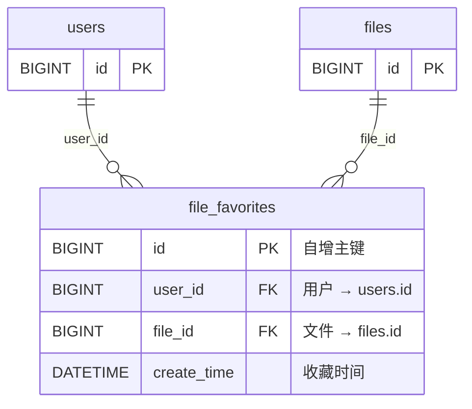
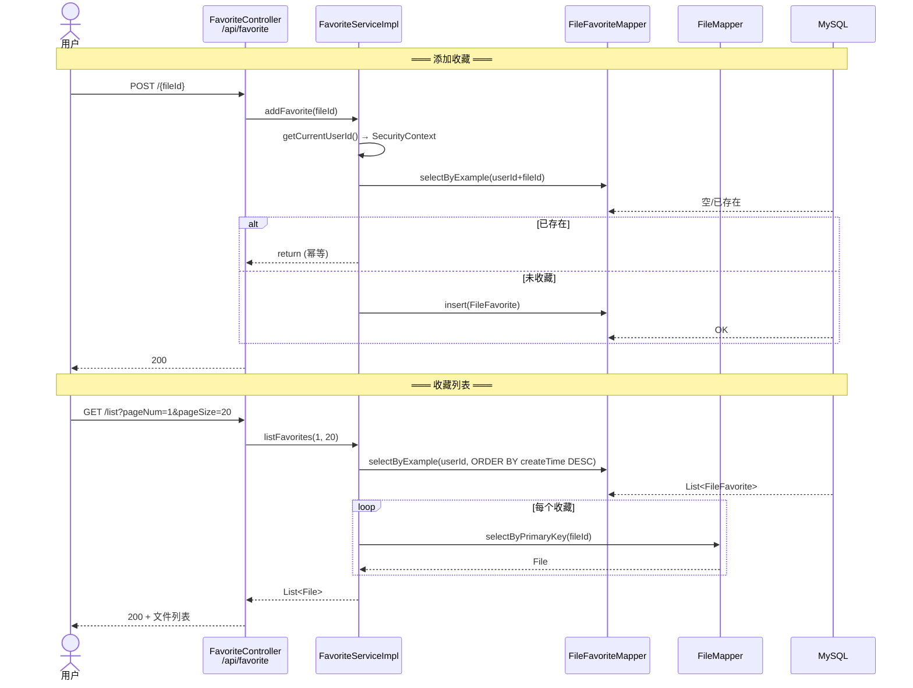

# 10 — 收藏模块

## 概述

收藏模块允许用户收藏文件/文件夹，通过 `file_favorites` 表记录用户-文件关联。实现幂等添加、批量查询文件详情、PageHelper 分页。

## 数据模型



**约束**: `UNIQUE KEY (user_id, file_id)` — 防止重复收藏。

## API 端点

| 方法 | 路径 | 功能 | 返回值 |
|------|------|------|--------|
| `POST` | `/api/favorite/{fileId}` | 收藏文件 | `CommonResult<Void>` |
| `DELETE` | `/api/favorite/{fileId}` | 取消收藏 | `CommonResult<Void>` |
| `GET` | `/api/favorite/check/{fileId}` | 是否已收藏 | `CommonResult<Boolean>` |
| `GET` | `/api/favorite/list?pageNum=1&pageSize=20` | 收藏列表（分页） | `CommonResult<List<File>>` |

## 实现要点

### 1. 幂等添加

```java
// addFavorite() — 已收藏直接返回，不报错
FileFavoriteExample example = new FileFavoriteExample();
example.createCriteria().andUserIdEqualTo(userId).andFileIdEqualTo(fileId);
if (!favoriteMapper.selectByExample(example).isEmpty()) return;
```

### 2. 分页 + 批量查 File

`listFavorites` 分两步：
1. `PageHelper.startPage(pageNum, pageSize)` → 查 `file_favorites` 表（`ORDER BY create_time DESC`）
2. 提取 `fileId` 列表 → `fileIds.stream().map(fileMapper::selectByPrimaryKey)` 批量查文件详情

每个收藏记录单独查 DB（N+1），目前数据量不大，后续可优化为批量查询。

### 3. 用户身份获取

通过 `SecurityContextHolder.getContext().getAuthentication()` 获取当前登录用户：

```java
private Long getCurrentUserId() {
    var auth = SecurityContextHolder.getContext().getAuthentication();
    if (auth != null && auth.getPrincipal() instanceof AdminUserDetails details) {
        return details.getUserId();
    }
    throw new RuntimeException("未登录");
}
```

## 调用链



## 关键文件索引

| 组件 | 文件 | 方法 |
|------|------|------|
| 控制器 | `FavoriteController.java` | 4 个端点，`@RequestMapping("/api/favorite")` |
| 服务接口 | `FavoriteService.java` | `addFavorite`, `removeFavorite`, `isFavorited`, `listFavorites` |
| 服务实现 | `FavoriteServiceImpl.java` | 幂等添加、批量查文件、PageHelper 分页 |
| Mapper | `FileFavoriteMapper.java` | `insert`, `deleteByExample`, `selectByExample` |
| 实体 | `FileFavorite.java` | `userId`, `fileId`, `createTime` |
