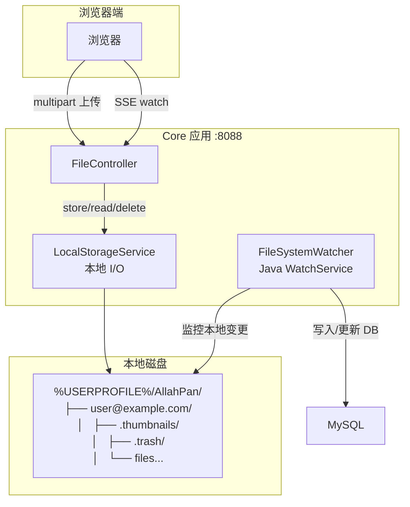
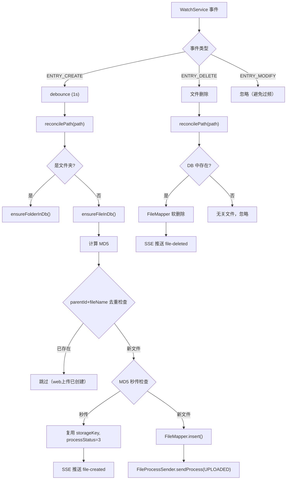

# 11 — 本地存储架构

## 概述

AllahPan 采用 **纯本地磁盘存储**：

- **本地磁盘**: 所有上传文件的存储位置（Windows: `%USERPROFILE%\AllahPan\{email}\`）。文件通过 multipart 表单直接上传到应用服务器，写入本地文件系统。
- **storageKey**: 用户隔离的相对路径，格式 `{userId}/{yyyy/MM}/{UUID}{ext}`，相对于用户根目录。
- **用户隔离**: 每个用户拥有独立的文件目录，通过 `uploaderId` 区分。

## 架构图



## 核心组件

### LocalStorageService

本地文件系统 I/O 操作，提供路径安全保护（防路径遍历）：

| 方法 | 说明 |
|------|------|
| `store(relativePath, InputStream)` | 将流写入本地文件，自动创建父目录 |
| `read(relativePath)` | 读取本地文件为 `InputStream` |
| `delete(relativePath)` | 删除本地文件（文件和空父目录） |
| `resolve(relativePath)` | 解析为绝对 `Path`，校验路径不超出根目录 |
| `resolveThumbnail(thumbnailKey)` | 解析缩略图绝对路径（`.thumbnails/` 子目录） |
| `init()` | `@PostConstruct` 创建根目录 |

根目录: Windows `%USERPROFILE%/AllahPan`，由 `application-dev.yml` 中的 `storage.root-path` 配置。

### FileSystemWatcher

Java 7 `WatchService` 实时监控本地文件变更，自动协调 DB：



**定时全量同步** (`@Scheduled fullSync`, 每 5 分钟):
1. 遍历本地文件树
2. 逐个对比 DB 记录
3. DB 中有但本地无 → 软删除（文件被外部删除）
4. 本地有但 DB 中无 → 创建记录（新文件被外部添加）

**启动时**: 3 秒后执行首次 `fullSync()`。

**防重复**: parentId + fileName 二级去重（`files` 表有 `uk_parent_name_delete` 唯一约束）。

## SSE 实时推送

`GET /api/file/watch?token=<jwt>`

服务端推送事件 (Server-Sent Events)，让前端无需轮询即可接收文件变更：

| 事件 | 触发源 | 数据 |
|------|--------|------|
| `connected` | SSE 连接建立 | `{message: "SSE连接成功"}` |
| `file-created` | FileSystemWatcher 发现新文件 | `{fileId, parentId, fileName}` |
| `file-updated` | Pipeline 阶段完成 / 重命名 / 移动 | `{fileId, parentId, processStatus, thumbnailKey, originText}` |
| `file-deleted` | FileSystemWatcher 检测删除 / 用户删除 | `{fileId, parentId}` |
| `sync-complete` | fullSync 完成 | `{message: "全量同步完成"}` |

实现:
- `FileController.watchFiles()` — 创建 `SseEmitter`，返回 `SseEmitter` 实例
- `FileSystemWatcher.notifyAll()` — 向所有连接的 SSE 客户端广播事件
- `FileProcessReceiver.notifyStatusChange(file)` — 流水线完成时推送 `file-updated`
- JWT 通过 query param 传递（EventSource 不支持自定义 Header），手动校验
- 超时 30 分钟，前端自动重连

## 访问优先级

```
请求文件 → 检查本地磁盘
  ├── 存在 → 直接返回 FileSystemResource（零网络开销）
  │   ├── download: Content-Disposition: attachment
  │   ├── stream: Content-Disposition: inline
  │   └── thumbnail: Content-Type: image/jpeg
  └── 不存在 → HTTP 404 Not Found
```

## 数据一致性保障

- **本地磁盘为唯一存储**: 所有文件直接写入本地文件系统，无外部对象存储依赖
- **定时全量同步**: 每 5 分钟对比磁盘和 DB，修复差异
- **唯一约束**: `files` 表 `uk_parent_name_delete (parent_id, file_name, delete_time)` 防止同目录同名文件重复
- **启动清理**: `EsIndexServiceImpl` 启动后 30 秒清理 ES 孤儿文档

## 关键文件索引

| 组件 | 文件 | 职责 |
|------|------|------|
| 本地存储 | `LocalStorageService.java` | 本地文件 I/O，路径安全 |
| 文件监控 | `FileSystemWatcher.java` | WatchService + DB 协调 + SSE |
| SSE 端点 | `FileController.java` | `watchFiles()` |
| 状态推送 | `FileProcessReceiver.java` | `notifyStatusChange()` |
| 定时清理 | `TrashCleanupTask.java` | 垃圾站过期清理 |
| 配置 | `LocalStorageConfig.java` | 本地存储根目录 |
| 配置 | `application-dev.yml` | `storage.root-path`, `watch-service.debounce-ms` |
