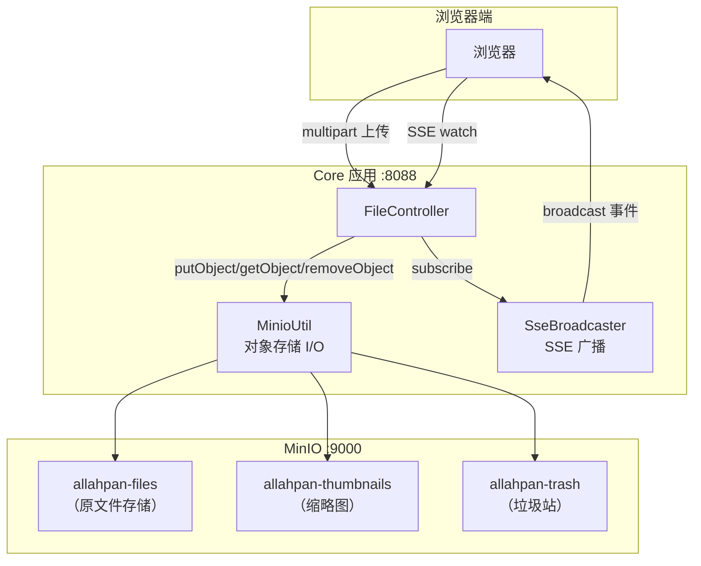
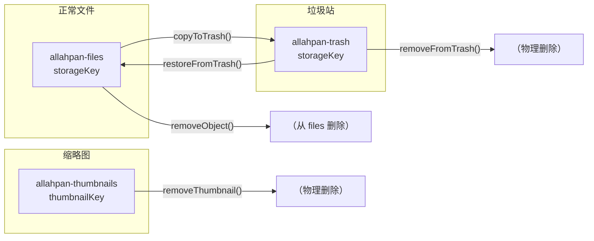

# 11 — MinIO 存储架构

## 概述

AllahPan 采用 **MinIO 对象存储**：

- **MinIO**: 兼容 S3 的对象存储，3 个 bucket 分别存储文件、缩略图和垃圾站。
- **storageKey**: 用户隔离的相对路径，格式 `{userId}/{yyyy/MM}/{UUID}{ext}`，作为 MinIO 对象 key。
- **用户隔离**: 每个用户拥有独立的目录前缀，通过 `uploaderId` 区分。

## 架构图



## 核心组件

### MinioConfig

`@Configuration` 类，创建 `MinioClient` Bean：

```java
@Bean
public MinioClient minioClient() {
    return MinioClient.builder()
            .endpoint(endpoint)        // http://localhost:9000
            .credentials(accessKey, secretKey)
            .build();
}
```

配置项来自 `application-dev.yml`：`minio.endpoint`、`minio.accessKey`、`minio.secretKey`。

### MinioUtil

对象存储 I/O 操作，封装三个 bucket 的访问：

| 方法 | Bucket | 说明 |
|------|--------|------|
| `putObject(key, data, size, contentType)` | files | 上传文件对象 |
| `getObject(key)` | files | 下载文件流 |
| `statObject(key)` | files | 获取对象元数据 |
| `objectExists(key)` | files | 检查对象是否存在 |
| `removeObject(key)` | files | 删除文件对象 |
| `putThumbnail(key, data, size, contentType)` | thumbnails | 上传缩略图 |
| `getThumbnail(key)` | thumbnails | 下载缩略图流 |
| `removeThumbnail(key)` | thumbnails | 删除缩略图 |
| `copyToTrash(key)` | files → trash | 软删除：复制到垃圾站 |
| `restoreFromTrash(key)` | trash → files | 恢复：复制回文件桶 |
| `removeFromTrash(key)` | trash | 物理删除：从垃圾站删除 |
| `copyObject(sourceKey, destKey)` | files → files | 桶内复制（用于 rename/move） |
| `listObjectNames(bucket)` | * | 列出桶内所有对象名（用于孤儿扫描） |

**Bucket 初始化** (`@PostConstruct`): 启动时自动检查并创建 3 个 bucket（`allahpan-files`、`allahpan-thumbnails`、`allahpan-trash`）。

**Storage Key 结构**:

```
{userId}/{yyyy/MM}/{UUID}{ext}

示例: 1/2026/06/d27fed91-2fed-4e3e-bbcd-ce19dc3410c5.png
      │  │  │    │                                 │
      │  │  │    │                                 └── 原始扩展名
      │  │  │    └── UUID 去重
      │  │  └── 月份
      │  └── 年份
      └── 用户ID (隔离)
```

### SseBroadcaster

管理 SSE 长连接，从 `FileController` 中提取，避免 `FileProcessReceiver` 跨层依赖 REST 控制器：

- **`subscribe()`**: 创建 `SseEmitter`（无限超时），加入 `CopyOnWriteArrayList`。自动在完成/超时/错误时移除。
- **`broadcast(eventName, data)`**: 遍历所有 emitter 发送命名事件，移除断开的连接。

| 事件 | 触发源 | 数据 |
|------|--------|------|
| `connected` | SSE 连接建立 | `{message: "SSE连接成功"}` |
| `file-created` | FileController.upload() | `{fileId, parentId, fileName}` |
| `file-updated` | Pipeline 阶段完成 / rename / move | `{fileId, parentId, processStatus, thumbnailKey, originText}` |
| `file-deleted` | 用户删除操作 | `{fileId, parentId}` |

## 下载/预览/缩略图访问

```
请求文件 → MinioUtil.getObject(storageKey) → InputStream
  ├── download: Content-Disposition: attachment
  ├── stream: Content-Disposition: inline
  └── thumbnail: MinioUtil.getThumbnail(thumbnailKey) → Content-Type: image/jpeg
```

## 垃圾站模型



## docker-compose MinIO 服务

```yaml
minio:
  image: minio/minio
  container_name: minio
  ports:
    - "9000:9000"    # API
    - "9001:9001"    # Console
  environment:
    MINIO_ROOT_USER: minioadmin
    MINIO_ROOT_PASSWORD: minioadmin
  volumes:
    - minio-data:/data
  command: server /data --console-address ":9001"
  restart: unless-stopped
```

## 关键文件索引

| 组件 | 文件 | 职责 |
|------|------|------|
| MinIO 配置 | `MinioConfig.java` | 创建 MinioClient Bean |
| MinIO 操作 | `MinioUtil.java` | 对象存储 I/O |
| SSE 广播 | `SseBroadcaster.java` | SSE emitter 管理 + 事件广播 |
| 文件上传 | `FileController.java` | `upload()` multipart 上传 |
| 文件服务 | `FileServiceImpl.java` | 上传/下载/删除/重命名/移动 |
| 流水线状态推送 | `FileProcessReceiver.java` | 处理完成时广播 `file-updated` |
| 定时清理 | `TrashCleanupTask.java` | 垃圾站过期清理（60天） |
| 孤儿清理 | `MinioOrphanCleanupTask.java` | 每日 4:00 双向扫描 3 个 bucket，清理无 DB 引用的 MinIO 对象 |

## MinioOrphanCleanupTask — 孤儿对象清理

`@Scheduled(cron = "0 0 4 * * ?")` 每天凌晨 4 点执行双向一致性扫描：

1. **MinIO → DB**: 遍历 3 个 bucket 的所有对象名（`listObjectNames()`），对比 DB 中所有 `storageKey`/`thumbnailKey` 引用。MinIO 中存在但 DB 无引用的对象 → 删除。
2. **DB → MinIO**: 分页遍历 DB 中所有 `storageKey`/`thumbnailKey`，调用 `statObject()` 检查是否存在。DB 有记录但 MinIO 无对应对象 → 记录 WARN 日志。
3. 使用 `getBucketName()`/`getThumbnailBucket()`/`getTrashBucket()` 获取配置的 bucket 名称。

## 生产部署

生产环境通过 **Nginx (:88) + Cloudflare Tunnel (cloudflared)** 对外暴露，MinIO 不直接对外服务：

```
公网 → Cloudflare Edge (SSL) → cloudflared → localhost:88 (nginx) → /api/* → :8088
```

详见 [00-project-overview.md](00-project-overview.md) 第 8.1 节。
