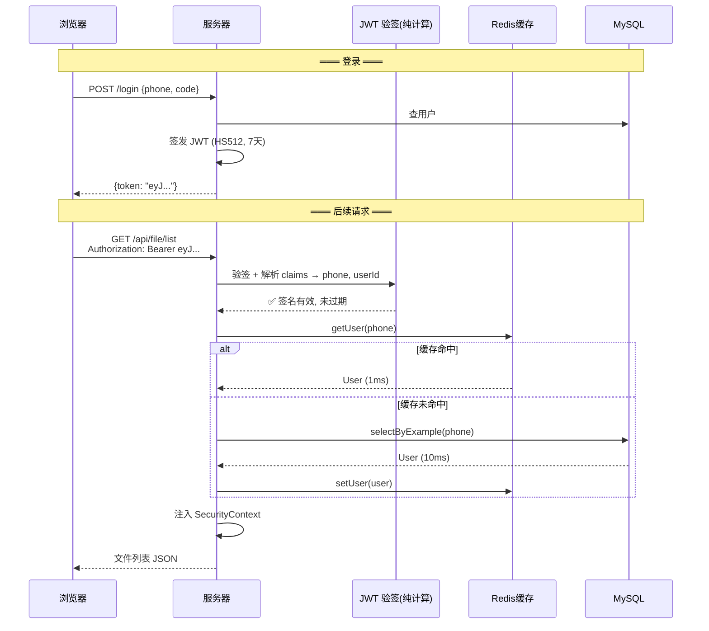

# Q1: 什么是无状态 JWT，在我的项目里有什么用？

## 一句话回答

**无状态 JWT** 是指服务端不存储任何会话信息，所有认证数据都编码在 JWT token 自身中，每次请求携带 token 即可独立完成认证——不需要查数据库的 session 表。

## 传统 Session vs 无状态 JWT

```
传统 Session（有状态）:
  用户登录 → 服务器生成 sessionId → 存 Redis/DB → 返回 cookie
  后续请求 → 浏览器发 cookie → 服务器查 session 表 → 获取用户信息
  问题: 每次请求都要查 Redis/DB，服务重启丢失所有 session

无状态 JWT:
  用户登录 → 服务器签发 JWT (含 userId/phone) → 返回 token
  后续请求 → 浏览器发 Authorization: Bearer <token> → 服务器验签 → 直接拿到用户信息
  优势: 不需查任何存储，纯计算验证，水平扩展无状态同步问题
```

## 在我项目里的具体实现

### 1. 配置层：关闭 Session

```java
// SecurityConfig.java
http.sessionManagement()
    .sessionCreationPolicy(SessionCreationPolicy.STATELESS);  // ← 关键：不创建 HTTP Session
```

`STATELESS` 意味着 Spring Security 不会调用 `request.getSession()`，不会创建 `JSESSIONID` cookie。

### 2. JWT 内容：自包含用户信息

```java
// JwtTokenUtil.java — 签发时把关键信息打入 token
JWT.create()
    .setPayload("user_id", userId)        // 用户ID
    .setPayload("hasPassword", hasPassword) // 是否已设密码
    .setSubject(phone)                     // 手机号
    .setExpiresAt(new Date(now + 7天))     // 过期时间
    .setKey(secret.getBytes())             // HS512 签名
    .sign();
```

Token 自身携带了 `userId`、`phone`、`hasPassword`，任何服务拿到 token 就能解析出这些信息，不需要查任何存储。

### 3. 请求认证：过滤器提取

```java
// JwtAuthenticationTokenFilter.java — 每个请求执行一次
String token = request.getHeader("Authorization");  // 取 "Bearer xxx"
token = token.substring(tokenHead.length());         // 去 "Bearer " 前缀
String phone = jwtTokenUtil.getSubjectFromToken(token); // 解析 phone
AdminUserDetails details = userDetailsService.loadUserByUsername(phone); // 查用户
jwtTokenUtil.validateToken(token, phone);  // 验签 + 验过期
SecurityContextHolder.getContext().setAuthentication(...); // 注入上下文
```

**等一下——这里查了 DB/Cache 啊，还算无状态吗？**

好问题。严格的纯无状态 JWT 在 token 里放所有信息，连 DB 都不用查。但我们的项目做了一次折中：

- **验签**（纯计算，无状态）——保证 token 没被篡改
- **查用户**（查 Cache/DB）——保证用户没被禁用/删除

这个折中的原因是：token 签发后 7 天内有效，但用户可能在第 3 天被管理员禁用。如果完全不查 DB，禁用的用户还能继续用 4 天——这是一个安全风险。查 DB 只需一次 Redis 缓存命中（通常 < 1ms），换来的是实时的用户状态控制。

## 架构图



## 为什么选择无状态 JWT？

| 考量 | Session 方案 | JWT 方案（我们的选择） |
|------|-------------|----------------------|
| 水平扩展 | 需要共享 Redis session | 天然支持，任何实例都能验签 |
| 服务重启 | session 丢失，用户需重新登录 | token 不变，继续使用 |
| 每次请求开销 | 必查 Redis/DB | 验签纯 CPU，偶尔查缓存 |
| 主动失效 | 删 session 即可 | 需要黑名单机制（我们没做，用查 DB 折中） |
| 移动端/桌面端 | Cookie 支持差 | Header 传递，通用性强 |

## 关键文件

| 组件 | 文件 | 角色 |
|------|------|------|
| Session 关闭 | `SecurityConfig.java:40` | `SessionCreationPolicy.STATELESS` |
| Token 签发 | `JwtTokenUtil.java:30` | `generateToken()` — HS512 签名 |
| Token 验证 | `JwtTokenUtil.java:50` | `validateToken()` — 验签+验过期 |
| 过滤器 | `JwtAuthenticationTokenFilter.java:40` | 每个请求提取 token → 认证 |
| 用户加载 | `MallSecurityConfig.java:18` | `loadUserByUsername()` — Cache→DB |
