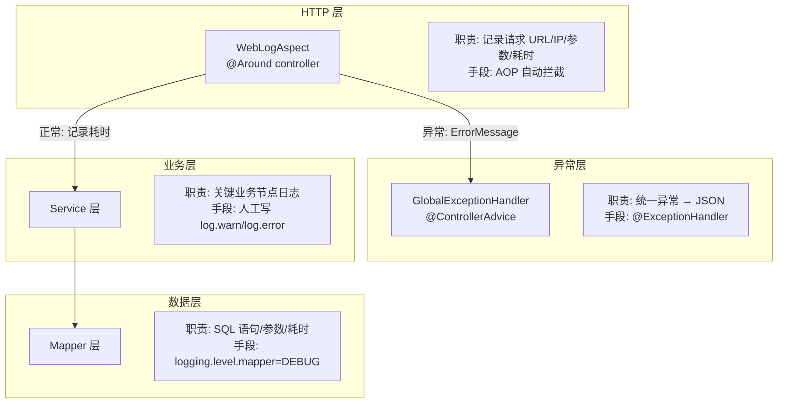

# Q2: 为什么 WebLogAspect 只给 Controller 切面打日志？Service 和其他层的日志怎么办？

## 一句话回答

`WebLogAspect` 的职责是**记录 HTTP 请求入口日志**（URL、IP、参数、耗时），不是做全链路追踪。Service/Mapper 层的日志由 **SLF4J 框架**（`log.info`/`log.debug`）和 **MyBatis 日志级别**覆盖，各有各的机制。

## WebLogAspect 的设计意图

```java
// WebLogAspect.java
@Pointcut("execution(public * com.allahpan..controller..*.*(..))")
public void controllerPointcut() {}

@Around("controllerPointcut()")
public Object doAround(ProceedingJoinPoint pjp) throws Throwable {
    // 记录: URL, Method, IP, 类名, 方法名, 参数, 耗时, 异常
}
```

它做的事情很明确：**给每个 HTTP 请求拍一张快照**。

```
URL: /api/file/list, Method: GET, IP: 127.0.0.1,
Class: com.allahpan.controller.FileController, Method: listFiles,
Args: [0], Result: CommonResult(...), Spend: 15ms
```

这跟 Nginx 的 access log、Spring 的 `HttpTraceFilter` 是同一层的东西——**入口日志**。

## 为什么不需要给 Service/Mapper 也加 AOP？

### 原则：入口日志一条就够了

```
一个 HTTP 请求进来:
  Controller.listFiles()          ← WebLogAspect 在这里记录
    → Service.listFiles()         ← 如果也切面？冗余
      → Mapper.selectByExample()  ← 如果也切面？更冗余
```

从 Controller 日志的 `Spend: 15ms` 已经能看出整条链路的耗时。如果 Service 和 Mapper 也各打一条，一个请求产生 3+ 条日志，反而淹没关键信息。

### 那 Service 层出错怎么定位？

**1. 异常堆栈天然带调用链**

```java
// 代码里主动打日志
// FileServiceImpl.java
public void permanentDelete(Long fileId) {
    File file = fileMapper.selectByPrimaryKey(fileId);
    Asserts.isTrue(file != null, "文件不存在");  // ← 抛异常
    // ...
    try {
        minioUtil.deleteObject(file.getStorageKey());
    } catch (Exception e) {
        log.warn("删除 MinIO 文件失败: {}", file.getStorageKey(), e); // ← 显式日志
    }
}
```

Service 层不靠 AOP，靠**人在关键位置主动写 `log.warn`/`log.error`**。AOP 不知道哪里是"关键位置"，人知道。

**2. GlobalExceptionHandler 兜底所有异常**

```java
// GlobalExceptionHandler.java
@ExceptionHandler(ApiException.class)
public CommonResult<Object> handleApiException(ApiException e) {
    // → 返回 {code: 500, message: "操作失败"}
}

@ExceptionHandler(Exception.class) // 注意：这里没显式声明，但 WebLogAspect 已经在
                                    // controller 层 catch 了异常并记录到 ErrorMessage
```

**3. MyBatis SQL 日志**

`application-dev.yml` 里加一行就能看到所有 SQL：

```yaml
logging:
  level:
    com.allahpan.mbg.mapper: DEBUG   # 打印所有 SQL + 参数 + 耗时
```

输出示例：
```
==>  Preparing: SELECT id, file_name, ... FROM files WHERE parent_id = ? AND delete_time IS NULL
==> Parameters: 0(Long)
<==      Total: 5, Spend: 3ms
```

## 各层的日志策略总览



## 如果要加 Service 层切面怎么做？

如果将来需要更细粒度的监控（比如统计每个 Service 方法的调用次数和耗时），可以再加一个切面：

```java
@Aspect
@Component
@Order(1)
public class ServiceProfilerAspect {
    @Around("execution(public * com.allahpan.service..*.*(..))")
    public Object profile(ProceedingJoinPoint pjp) throws Throwable {
        long start = System.currentTimeMillis();
        try {
            return pjp.proceed();
        } finally {
            long elapsed = System.currentTimeMillis() - start;
            if (elapsed > 1000) {  // 只记录慢方法
                log.warn("SLOW: {}.{} took {}ms",
                    pjp.getTarget().getClass().getSimpleName(),
                    pjp.getSignature().getName(),
                    elapsed);
            }
        }
    }
}
```

但目前项目规模不需要——Controller 日志 + 异常堆栈 + MyBatis DEBUG 日志已经足够定位问题。

## 关键文件

| 组件 | 文件 | 角色 |
|------|------|------|
| Controller 切面 | `WebLogAspect.java` | HTTP 入口日志（AOP 自动） |
| 全局异常 | `GlobalExceptionHandler.java` | 异常 → JSON（AOP 自动） |
| Service 日志 | `FileServiceImpl.java:238` | 关键操作手动 `log.warn` |
| MyBatis SQL | `application-dev.yml` (加配置) | `logging.level.mapper=DEBUG` |
